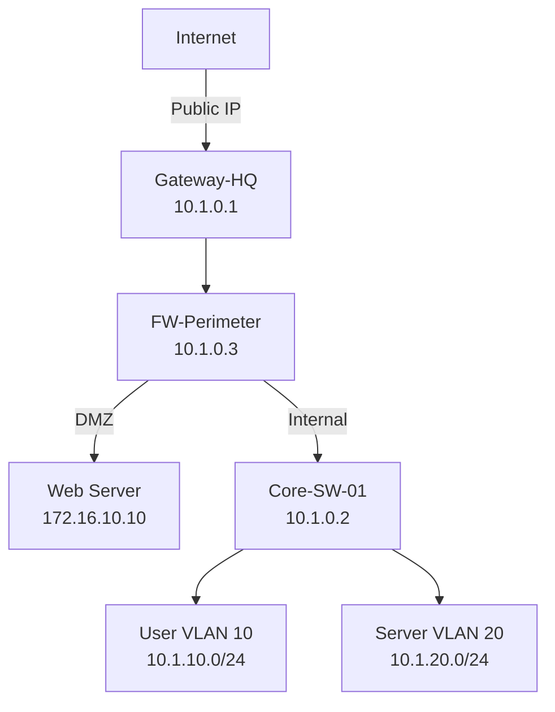

**ISMS-IMP-A.8.20-21-22-S2 – Network Architecture Documentation**
**Assessment Specification with User Completion Guide**
### ISO/IEC 27001:2022 Control A.8.20: Networks Security

---

**Document Control**

| Attribute | Value |
|-----------|-------|
| **Document ID** | ISMS-IMP-A.8.20-21-22-S2 |
| **Version** | 1.0 |
| **Assessment Area** | Network Topology & Architecture Documentation |
| **Related Policy** | ISMS-POL-A.8.20-21-22, Section 2.1 (Network Infrastructure Security - A.8.20), Section 2.3 (Network Segmentation - A.8.22), Section 4.2 (Implementation Resources) |
| **Purpose** | Define standards and procedures for creating, maintaining, and validating network architecture documentation including topology diagrams, security zones, and trust boundaries |
| **Target Audience** | Network Architects, Network Engineers, Security Engineers, IT Operations, System Administrators, Auditors |
| **Assessment Type** | Technical Documentation & Architecture Validation |
| **Review Cycle** | Quarterly or After Major Network Architecture Changes |
| **Total Sheets** | 9 |
| **Date** | [Date] |

### Version History

| Version | Date | Changes | Author |
|---------|------|---------|--------|
| 1.0 | [Date] | Initial implementation guidance for network architecture documentation | ISMS Implementation Team |

---

# PART I: USER COMPLETION GUIDE
**Audience:** Security assessors, Control owners, Compliance officers

---

# Purpose and Scope

## Purpose

This document provides **practical, step-by-step guidance** for creating and maintaining comprehensive network architecture documentation for [Organization]. Proper documentation is essential for:

- **Control A.8.20 (Network Security)**: Understanding network topology to implement perimeter controls, access controls, and monitoring
- **Control A.8.22 (Network Segregation)**: Visualizing security zones, trust boundaries, and segmentation architecture
- **Operational Requirements**: Troubleshooting, capacity planning, change management, disaster recovery
- **Audit and Compliance**: Demonstrating network security controls to auditors


Without accurate, up-to-date documentation, network security cannot be effectively managed or assessed.

## Scope

This guidance covers:

- **Documentation types** (logical topology, physical topology, security zones, data flow diagrams)
- **Diagram standards** (symbols, color coding, layering approaches)
- **Documentation tools** (Visio, draw.io, Lucidchart, diagram-as-code)
- **Automated diagram generation** (config parsing, infrastructure-as-code)
- **IP Address Management (IPAM)** (subnet allocation, VLAN-to-subnet mapping)
- **Change management** (documentation update triggers, version control, approval workflows)


## Applicability

This guidance is **technology-agnostic** and applies to:

- Traditional networks (physical routers, switches, firewalls)
- Software-defined networks (SDN, SD-WAN)
- Cloud environments (AWS VPCs, Azure VNets, GCP VPCs)
- Hybrid architectures (on-premise + cloud, interconnected via VPN/DirectConnect)


## Who Should Use This Guidance

- Network architects designing network documentation standards
- Network engineers maintaining network diagrams
- Security teams documenting security zones and trust boundaries
- ISMS implementers preparing documentation for A.8.20/8.22 assessments
- Auditors verifying network documentation completeness and accuracy


---

# Process Overview

## Documentation Workflow

```
┌─────────────────────────────────────────────────────────────────┐
│              NETWORK DOCUMENTATION PROCESS                       │
└─────────────────────────────────────────────────────────────────┘

Phase 1: Documentation Planning
├─ Define documentation types needed (logical, physical, security zones)
├─ Select documentation tools (Visio, draw.io, diagram-as-code)
├─ Establish documentation standards (symbols, colors, templates)
└─ Assign documentation ownership (who maintains what)

Phase 2: Initial Documentation Creation
├─ Create logical topology diagram (Layer 3 view)
├─ Create physical topology diagram (Layer 1/2 view)
├─ Create security zone diagram (trust boundaries, segmentation)
├─ Create data flow diagrams (application traffic flows)
└─ Document IP addressing scheme (IPAM)

Phase 3: Documentation Review and Validation
├─ Technical review (verify accuracy against running configs)
├─ Peer review (other network engineers validate)
├─ Security review (verify security zones are correctly represented)
└─ Management approval (sign-off on architecture)

Phase 4: Documentation Publication
├─ Store in centralized repository (SharePoint, Confluence, Git)
├─ Implement access controls (who can view, who can edit)
├─ Version control (track changes over time)
└─ Communicate availability to stakeholders

Phase 5: Ongoing Maintenance
├─ Update triggers (network changes → documentation updates)
├─ Periodic review (quarterly verification)
├─ Version control (maintain change history)
└─ Decommissioning (archive obsolete documentation)
```

## Key Principles

- **Accuracy**: Documentation must reflect the actual network state (not aspirational or outdated)
- **Completeness**: All network segments, devices, services, and connections must be documented
- **Clarity**: Diagrams should be understandable by technical and non-technical audiences
- **Consistency**: Use standardized symbols, colors, and formats across all diagrams
- **Currency**: Documentation must be updated promptly when the network changes (within 5 business days)
- **Version Control**: Maintain history of changes (who, what, when, why)


---

# Prerequisites and Tools

## Required Access and Permissions

- **Network access**: Ability to access network devices to verify configurations
- **Documentation repository access**: Ability to create/edit documents in centralized storage
- **Source data access**: Access to network discovery data (from IMP-S1), configuration backups, IPAM systems


## Recommended Documentation Tools

### Traditional Diagram Tools

| Tool | Type | Pros | Cons | License | Best For |
|------|------|------|------|---------|----------|
| **Microsoft Visio** | Desktop app | Industry standard, extensive stencils, Microsoft integration | Expensive (~$300/user), Windows-only | Commercial | Enterprise with Microsoft licenses |
| **draw.io / diagrams.net** | Web-based or desktop | Free, cloud-based, integrates with Google Drive/OneDrive | Fewer templates than Visio | Free | Budget-conscious organizations |
| **Lucidchart** | Web-based | Collaborative, real-time editing, cloud-based | Subscription-based (~$10/month) | Commercial | Teams needing collaboration |
| **Dia** | Desktop (Linux/Mac/Windows) | Free, open-source | Clunky UI, limited stencils | Open-source | Linux environments |

### Diagram-as-Code Tools (Infrastructure-as-Code Approach)

| Tool | Language/Format | Pros | Cons | Best For |
|------|-----------------|------|------|----------|
| **D2 (Declarative Diagramming)** | D2 language | Simple syntax, version control friendly, renders to SVG/PNG | Limited stencils | Infrastructure-as-code teams |
| **Mermaid** | Markdown-like syntax | Embeds in Markdown/documentation, GitHub/GitLab support | Limited for complex diagrams | Documentation in Git repositories |
| **Graphviz (dot)** | DOT language | Powerful, automatic layout, scriptable | Steep learning curve, less visually appealing | Automated diagram generation |
| **Terraform Graph** | HCL (Terraform) | Auto-generates from Terraform code | Only for Terraform-managed infrastructure | Cloud infrastructure (IaC) |
| **PlantUML** | PlantUML syntax | Wide adoption, sequence diagrams, activity diagrams | Not specialized for network diagrams | Software architecture + networks |

### IP Address Management (IPAM) Tools

| Tool | Type | Features | License |
|------|------|----------|---------|
| **NetBox** | Web-based, open-source | IPAM, DCIM, device inventory, REST API, version control | Open-source (Apache 2.0) |
| **phpIPAM** | Web-based, open-source | IPAM, subnet calculator, IP scanner integration | Open-source (GPL) |
| **SolarWinds IPAM** | Commercial | Advanced features, integrates with DHCP/DNS, reporting | Commercial (expensive) |
| **Infoblox** | Commercial appliance | Enterprise-grade, IPAM + DDI (DNS, DHCP, IPAM) | Commercial (very expensive) |
| **Excel / Google Sheets** | Spreadsheet | Simple, universally accessible, no cost | Manual, no automation, error-prone | Small networks, budget constraints |

## Symbol Standards and Stencils

**Common Symbol Standards**:

- **Cisco Network Topology Icons**: Industry standard for routers, switches, firewalls
  - Download: Cisco website offers official Visio/PowerPoint stencils
  - Usage: Free for documentation purposes
- **AWS Architecture Icons**: For AWS cloud resources
  - Download: aws.amazon.com/architecture/icons
- **Azure Architecture Icons**: For Azure cloud resources
  - Download: docs.microsoft.com/azure/architecture/icons
- **GCP Architecture Icons**: For GCP cloud resources
  - Download: cloud.google.com/icons


**Generic Symbols** (for vendor-agnostic diagrams):

- Router: Circle with arrows
- Switch: Rectangle with multiple ports
- Firewall: Brick wall icon
- Server: Tower or rack icon
- Cloud: Cloud shape (generic)
- Network segment: Cylinder or line


---

# Step-by-Step Procedures

## Phase 1: Documentation Planning

### Define Documentation Types Needed

**Required Documentation Types** (per ISO 27001:2022):

1. **Logical Topology Diagram** (Layer 3):

   - Shows IP addressing, routing, VLANs, subnets
   - Focus: How data flows logically
   - Example: Router → Firewall → Switch → Subnet


2. **Physical Topology Diagram** (Layer 1/2):

   - Shows physical connections, cable types, port assignments
   - Focus: Physical infrastructure
   - Example: Device in Rack A, Port 1 → Device in Rack B, Port 5


3. **Security Zone Diagram** (A.8.22 requirement):

   - Shows security zones, trust boundaries, inter-zone traffic controls
   - Focus: Segmentation architecture
   - Example: DMZ → Internal → Management zones with firewall between each


4. **Data Flow Diagrams**:

   - Shows application-level traffic flows
   - Focus: How applications communicate across the network
   - Example: Web User → Load Balancer → Web Servers → Database


**Optional Documentation Types** (for complex environments):

- High-Availability Diagrams (failover paths, redundancy)
- Capacity Planning Diagrams (bandwidth utilization, growth projections)
- Disaster Recovery Diagrams (backup links, failover sites)


### Establish Documentation Standards

**Standard Template**:

Every network diagram should include:

1. **Title Block** (typically in corner):

   - Document Title: "Logical Network Topology - Corporate HQ"
   - Document ID: NET-DOC-001
   - Version: 1.2
   - Date: [Date]
   - Author: Jane Smith
   - Approved By: Network Manager
   - Classification: Internal / Confidential


2. **Legend** (explain symbols and colors):

   - Symbol key (router, switch, firewall, server, cloud)
   - Color key (security zones: Red = DMZ, Blue = Internal, Green = Management)


3. **Notes Section**:

   - IP addressing scheme notes
   - VLAN numbering notes
   - Caveats or exceptions


**Color Coding Standards** (for security zones):

| Zone Type | Color | Example |
|-----------|-------|---------|
| **Internet / Untrusted** | Red | Public internet, partner networks |
| **DMZ / Perimeter** | Orange | Public-facing web servers, email gateways |
| **Internal / Trusted** | Blue | Corporate LAN, internal servers |
| **Management** | Green | Device management interfaces, jump hosts |
| **Guest** | Yellow | Guest WiFi, contractor access |
| **Restricted / Highly Secure** | Purple | Payment systems, HR databases |

**Layering Approach**:

- **Layer 1 (Highest Level)**: Overview diagram (entire organization network on one page)
- **Layer 2 (Mid Level)**: Per-site diagrams (HQ, Branch Office A, Branch Office B)
- **Layer 3 (Detailed)**: Per-segment diagrams (Data Center, User Networks, DMZ)


---

## Phase 2: Creating Logical Topology Diagrams

### Gather Source Data

**Inputs** (from IMP-S1 Network Discovery):

- Network device inventory (routers, switches, firewalls)
- IP addressing scheme (subnets, VLAN-to-subnet mappings)
- Routing information (static routes, dynamic routing protocols)
- Inter-device connections (which port connects to which device)


**Configuration Files** (backup configs from network devices):

- Router/Switch configs: Interface IPs, VLAN assignments, routing tables
- Firewall configs: Security zones, rules, NAT translations


### Create Logical Topology Diagram

**Tool**: Use Visio, draw.io, or diagram-as-code tool.

**Step-by-Step (Example: Using draw.io)**:

1. **Open draw.io** (web: app.diagrams.net or desktop app)

2. **Select Template**: "Network Diagram" template (or start blank)

3. **Add Title Block** (text box in upper-right corner):
   ```
   Title: Logical Network Topology - Corporate HQ
   Doc ID: NET-DOC-001
   Version: 1.0
   Date: [Date]
   Author: [Your Name]
   Classification: Internal
   ```

4. **Add Internet Connection** (top of diagram):

   - Cloud symbol: "Internet"
   - Line down to...


5. **Add Perimeter Router**:

   - Cisco router symbol: "Gateway-HQ" (10.1.0.1)
   - Label: Management IP, Model


6. **Add Perimeter Firewall**:

   - Firewall symbol: "FW-Perimeter" (10.1.0.3)
   - Note interfaces: Outside (public IP), Inside (10.1.0.3)


7. **Add DMZ** (orange box):

   - Label: "DMZ (172.16.10.0/24)"
   - Inside: Add server symbols for web servers, mail servers
   - Lines from firewall to DMZ servers


8. **Add Core Switch**:

   - Switch symbol: "Core-SW-01" (10.1.0.2)
   - Lines from firewall to core switch


9. **Add VLANs/Subnets** (as separate boxes branching from switch):

   - Blue box: "User VLAN 10 (10.1.10.0/24)"
   - Blue box: "Server VLAN 20 (10.1.20.0/24)"
   - Green box: "Management VLAN 100 (192.168.100.0/24)"


10. **Add Network Services** (as server icons):

    - DNS Server (10.1.0.10)
    - DHCP Server (10.1.0.20)
    - NTP Server (10.1.0.30)


11. **Add Cloud Resources** (if applicable):

    - AWS VPC symbol: "AWS Production VPC (10.100.0.0/16)"
    - VPN tunnel line from firewall to AWS VPC


12. **Add Legend** (bottom-left corner):
    ```
    LEGEND
    Symbols:
    [Router icon] = Router
    [Switch icon] = Switch
    [Firewall icon] = Firewall
    [Server icon] = Server
    [Cloud icon] = Cloud/Internet

    Colors:
    Orange = DMZ
    Blue = Internal
    Green = Management
    ```

13. **Review and Refine**:

    - Align objects (use alignment tools)
    - Ensure lines are orthogonal (straight, 90-degree angles)
    - Add labels to all connections (interface names, bandwidths)


14. **Export**:

    - File → Export as → PNG (for presentations)
    - File → Export as → PDF (for documentation)
    - Save source file: `.drawio` format (for future editing)


**Example Logical Topology** (text-based for reference):

```
                    [Internet]
                        |
                  [Gateway-HQ]
                   (10.1.0.1)
                        |
                  [FW-Perimeter]
                   (10.1.0.3)
                    /      \
                   /        \
            [DMZ]             [Core-SW-01]
       (172.16.10.0/24)       (10.1.0.2)
         /    |    \              |
    [Web]  [Mail] [DNS]          |
                              ┌───┴────┐
                              |        |
                         [VLAN 10]  [VLAN 20]
                       (10.1.10.0/24) (10.1.20.0/24)
                        Users         Servers
```

---

## Phase 3: Creating Security Zone Diagrams (A.8.22)

### Identify Security Zones

**Security Zone Definition** (from IMP-S5 and ISMS-POL-A.8.20-21-22, Section 2.3):

- A security zone is a logical grouping of network segments with similar trust levels
- Traffic between zones is controlled by firewalls/ACLs


**Common Zones**:
1. **Internet/Untrusted**: Public internet, partner networks
2. **DMZ**: Public-facing services (web, email, DNS)
3. **Internal**: Corporate LAN, trusted users
4. **Restricted**: High-security systems (payment, HR, legal)
5. **Management**: Device management interfaces
6. **Guest**: Guest WiFi, temporary access

### Create Security Zone Diagram

**Tool**: Use same tool as logical topology (Visio, draw.io).

**Procedure**:

1. **Draw Zone Boundaries**:

   - Use colored rectangles to represent zones
   - Color-code per standards (DMZ = Orange, Internal = Blue, etc.)


2. **Add Zone Labels**:

   - Zone Name: "DMZ"
   - Trust Level: "Semi-Trusted"
   - Networks: "172.16.10.0/24"
   - Purpose: "Public-facing web services"


3. **Add Firewalls Between Zones**:

   - Firewall icon at zone boundary
   - Label with firewall name and management IP


4. **Add Inter-Zone Traffic Policies**:

   - Arrows between zones showing allowed traffic
   - Green arrow = Allowed
   - Red X = Denied
   - Label arrows with protocols/ports (e.g., "HTTPS (443)")


5. **Add Legend**:
   ```
   LEGEND
   Colors:
   Red = Untrusted (Internet)
   Orange = DMZ (Semi-Trusted)
   Blue = Internal (Trusted)
   Green = Management
   Purple = Restricted

   Arrows:
   Green → = Traffic Allowed
   Red X = Traffic Denied
   ```

**Example Security Zone Diagram** (text-based):

```
┌─────────────────────────────────────────────────────────┐
│  Internet (Untrusted) - Red                             │
└────────────────┬────────────────────────────────────────┘
                 │ [Firewall]
                 ↓
┌─────────────────────────────────────────────────────────┐
│  DMZ (Semi-Trusted) - Orange                            │
│  - Web Servers (172.16.10.0/24)                         │
└────────────────┬────────────────────────────────────────┘
                 │ [Firewall]
                 ↓ (HTTPS: 443 allowed, SSH: 22 denied)
┌─────────────────────────────────────────────────────────┐
│  Internal (Trusted) - Blue                              │
│  - User Network (10.1.10.0/24)                          │
│  - Server Network (10.1.20.0/24)                        │
└────────────────┬────────────────────────────────────────┘
                 │ [Firewall]
                 ↓ (All traffic denied except SSH from jump host)
┌─────────────────────────────────────────────────────────┐
│  Management (High Security) - Green                     │
│  - Device Management (192.168.100.0/24)                 │
└─────────────────────────────────────────────────────────┘
```

---

## Phase 4: Implementing IP Address Management (IPAM)

### IPAM Documentation Requirements

**Minimum IPAM Documentation**:

- **Subnet Allocation Table**: Which subnets are allocated, to what purpose
- **VLAN-to-Subnet Mapping**: Which VLAN corresponds to which subnet
- **DHCP Scope Documentation**: DHCP ranges within each subnet
- **Reserved IP Addresses**: Statically assigned IPs (devices, services)


### Create Subnet Allocation Table

**Format**: Excel/Google Sheets or NetBox.

**Example Subnet Allocation Table**:

| Subnet | VLAN ID | Network Name | Purpose | Gateway | DHCP Range | Reserved IPs | Location | Notes |
|--------|---------|--------------|---------|---------|-----------|--------------|----------|-------|
| 10.1.10.0/24 | 10 | User-Network | Corporate user workstations | 10.1.10.1 | 10.1.10.100 - 10.1.10.200 | 10.1.10.1 (gateway), 10.1.10.10 (printer) | HQ | WiFi + wired |
| 10.1.20.0/24 | 20 | Server-Network | Internal servers | 10.1.20.1 | N/A (static IPs only) | 10.1.20.10-50 (various servers) | HQ Data Center | No DHCP |
| 10.1.30.0/24 | 30 | VoIP | IP phones | 10.1.30.1 | 10.1.30.50 - 10.1.30.200 | 10.1.30.1 (gateway), 10.1.30.10 (call manager) | HQ | QoS enabled |
| 172.16.10.0/24 | 50 | DMZ | Public-facing services | 172.16.10.1 | N/A | 172.16.10.10 (web), 172.16.10.20 (mail) | HQ DMZ | Isolated from internal |
| 192.168.100.0/24 | 100 | Management | Device management | 192.168.100.1 | N/A | 192.168.100.2-50 (network devices) | HQ | Admin access only |
| 10.2.0.0/24 | 210 | Branch-A | Branch Office A users | 10.2.0.1 | 10.2.0.50 - 10.2.0.200 | 10.2.0.1 (gateway) | Branch Office A | MPLS link |
| 10.100.0.0/16 | N/A | AWS-VPC | AWS production environment | 10.100.0.1 | N/A (cloud DHCP) | Various (EC2 instances) | AWS us-east-1 | Cloud subnets managed in AWS |

### Using NetBox for IPAM

**NetBox Setup** (if using NetBox):

1. **Install NetBox** (Docker recommended):
   ```bash
   git clone https://github.com/netbox-community/netbox-docker.git
   cd netbox-docker
   docker-compose up -d
   ```

2. **Access NetBox**: http://localhost:8000 (default: admin/admin)

3. **Add Sites**:

   - Organization → Sites → Add
   - Site Name: "Corporate HQ"
   - Site Name: "Branch Office A"


4. **Add IP Prefixes** (subnets):

   - IPAM → Prefixes → Add
   - Prefix: 10.1.10.0/24
   - VLAN: 10 (create VLAN first)
   - Site: Corporate HQ
   - Description: User Network


5. **Add IP Addresses**:

   - IPAM → IP Addresses → Add
   - IP Address: 10.1.10.10
   - Status: Active
   - Description: Printer 1


6. **Add Devices**:

   - Devices → Devices → Add
   - Device Name: Core-SW-01
   - Device Role: Switch
   - Site: Corporate HQ
   - Primary IP: 192.168.100.2


7. **Associate IPs with Devices**:

   - Go to device → Interfaces → Assign IP addresses to interfaces


**NetBox API** (for automation):
```bash
# Query all prefixes via API
curl -X GET "http://localhost:8000/api/ipam/prefixes/" \
  -H "Authorization: Token YOUR_API_TOKEN" \
  -H "Accept: application/json"
```

---

## Phase 5: Diagram-as-Code Approaches

### Using D2 (Declarative Diagramming)

**Installation**:
```bash
# macOS
brew install d2

# Linux
curl -fsSL https://d2lang.com/install.sh | sh

# Windows: Download from d2lang.com
```

**Example D2 Script** (network_topology.d2):
```d2
title: Logical Network Topology - Corporate HQ {
  near: top-center
}

internet: Internet {
  shape: cloud
  style.fill: "#FF0000"
}

gateway: Gateway-HQ\n10.1.0.1 {
  shape: circle
}

firewall: FW-Perimeter\n10.1.0.3 {
  shape: rectangle
  style.fill: "#FFA500"
}

dmz: DMZ\n172.16.10.0/24 {
  shape: rectangle
  style.fill: "#FFA500"
  
  webserver: Web Server
  mailserver: Mail Server
}

core_switch: Core-SW-01\n10.1.0.2 {
  shape: hexagon
}

user_vlan: User VLAN 10\n10.1.10.0/24 {
  shape: rectangle
  style.fill: "#0000FF"
}

server_vlan: Server VLAN 20\n10.1.20.0/24 {
  shape: rectangle
  style.fill: "#0000FF"
}

# Connections
internet -> gateway: Public IP
gateway -> firewall: 1 Gbps
firewall -> dmz: DMZ Interface
firewall -> core_switch: Internal Interface
core_switch -> user_vlan: VLAN 10
core_switch -> server_vlan: VLAN 20
```

**Generate Diagram**:
```bash
d2 network_topology.d2 network_topology.svg
# Output: network_topology.svg (can embed in documentation)
```

**Benefits**:

- Version control friendly (plain text file)
- Easy to update (edit text file, regenerate)
- Can be automated (generate from network discovery data)


### Using Mermaid (GitHub/Markdown-Friendly)

**Example Mermaid Diagram** (in Markdown file):

````markdown
# Network Topology


````

**Rendering**: GitHub, GitLab, and many documentation tools auto-render Mermaid.

---

## Phase 6: Change Management and Version Control

### Documentation Update Triggers

**When to Update Documentation**:

- ✅ New device added to network (router, switch, firewall, server)
- ✅ Device removed/decommissioned
- ✅ IP address changes (subnet changes, re-addressing)
- ✅ VLAN changes (new VLAN created, VLAN deleted)
- ✅ Firewall rule changes (affecting inter-zone traffic)
- ✅ New network segment added (new office, new cloud VPC)
- ✅ Significant configuration changes (routing protocol changes, VPN tunnels)


**Update Timeline**: Within **5 business days** of network change.

### Version Control (Using Git)

**For Diagram-as-Code** (D2, Mermaid):

1. **Initialize Git Repository**:
   ```bash
   mkdir network-docs
   cd network-docs
   git init
   ```

2. **Add Documentation Files**:
   ```bash
   git add network_topology.d2
   git commit -m "Initial network topology diagram"
   ```

3. **Update and Commit**:
   ```bash
   # Edit network_topology.d2 to add new device
   git add network_topology.d2
   git commit -m "Added new firewall FW-02 to DMZ"
   git push origin main
   ```

4. **View History**:
   ```bash
   git log --oneline
   # Shows all changes to documentation over time
   ```

**For Binary Formats** (Visio, PDF):

- Store in SharePoint/Confluence with versioning enabled
- Document version in filename: `Network_Topology_v1.2_2026-01-08.pdf`
- Maintain change log in separate document


---

# Automation Opportunities

## Automated Diagram Generation from Configs

**Tools**:

- **NetBox**: Generate topology diagrams from device relationships
- **Network Weathermap**: Auto-generate network maps from monitoring data
- **Commercial tools**: SolarWinds Network Topology Mapper, NetBrain


**Example: Parse Cisco Config to Generate Diagram**:

```python
#!/usr/bin/env python3
"""
Parse Cisco switch config and generate D2 diagram

Usage:
    python3 config_to_diagram.py switch_config.txt > topology.d2
"""

import re
import sys

def parse_interfaces(config):
    """Extract interface information from config."""
    interfaces = []
    current_interface = None
    
    for line in config.splitlines():
        # Match interface lines
        if line.startswith("interface "):
            current_interface = line.split()[1]
            interfaces.append({"name": current_interface, "ip": None, "vlan": None})
        
        # Match IP addresses
        if line.strip().startswith("ip address"):
            parts = line.strip().split()
            if len(interfaces) > 0:
                interfaces[-1]["ip"] = parts[2]  # IP address
        
        # Match VLAN assignments
        if line.strip().startswith("switchport access vlan"):
            vlan = line.strip().split()[-1]
            if len(interfaces) > 0:
                interfaces[-1]["vlan"] = vlan
    
    return interfaces

def generate_d2_diagram(hostname, interfaces):
    """Generate D2 diagram from interface data."""
    print(f"title: {hostname} Interface Diagram {{")
    print(f"  near: top-center")
    print(f"}}")
    print()
    print(f"{hostname}: {hostname} {{")
    print(f"  shape: hexagon")
    print(f"}}")
    print()
    
    for intf in interfaces:
        if intf["ip"]:
            node_name = intf["name"].replace("/", "_")
            print(f"{node_name}: {intf['name']}\\n{intf['ip']} {{")
            print(f"  shape: rectangle")
            print(f"}}")
            print(f"{hostname} -> {node_name}: VLAN {intf['vlan'] or 'N/A'}")
            print()

def main():
    if len(sys.argv) != 2:
        print("Usage: python3 config_to_diagram.py <config_file>")
        sys.exit(1)
    
    config_file = sys.argv[1]
    with open(config_file, "r") as f:
        config = f.read()
    
    # Extract hostname
    hostname_match = re.search(r"hostname (.+)", config)
    hostname = hostname_match.group(1) if hostname_match else "Switch"
    
    interfaces = parse_interfaces(config)
    generate_d2_diagram(hostname, interfaces)

if __name__ == "__main__":
    main()
```

**Usage**:
```bash
python3 config_to_diagram.py switch_config.txt > switch_topology.d2
d2 switch_topology.d2 switch_topology.svg
```

---

# Integration with Other Processes

## Integration with IMP-S1 (Network Discovery)

- Network discovery provides input data for documentation
- Discovered devices → added to topology diagrams
- Discovered IP ranges → added to IPAM


## Integration with IMP-S5 (Segmentation Implementation)

- Security zone diagrams inform segmentation implementation
- Segmentation changes → update security zone diagrams


## Integration with Change Management

- Network changes (RFC) → trigger documentation updates
- Documentation updates reviewed and approved as part of RFC process


---

# Quality Assurance

## Documentation Quality Checklist

- [ ] All network devices documented (from discovery)
- [ ] IP addressing accurate (verified against running configs)
- [ ] VLAN-to-subnet mappings correct
- [ ] Security zones clearly defined and color-coded
- [ ] Firewall placement and inter-zone traffic policies shown
- [ ] Legend included (symbols, colors explained)
- [ ] Title block complete (title, version, date, author, classification)
- [ ] Version control implemented (file versions tracked)
- [ ] Centralized storage (SharePoint, Confluence, Git)
- [ ] Access controls configured (only authorized personnel can edit)


---

# Common Pitfalls and Solutions

## Pitfall: Documentation Becomes Outdated

**Cause**: Network changes frequently; documentation not updated.

**Solution**:

- Implement mandatory documentation update in change management process
- Automated alerts when devices are added (NAC systems can notify)
- Quarterly documentation review (verify against actual network state)


## Pitfall: Diagrams Are Too Complex

**Cause**: Trying to show everything on one diagram.

**Solution**:

- Use layered approach (high-level → mid-level → detailed)
- Create multiple diagrams (logical, physical, security zones)
- Focus each diagram on specific audience (executive vs. engineer)


## Pitfall: Inconsistent Symbols/Colors

**Cause**: Multiple people create diagrams without standards.

**Solution**:

- Establish and publish documentation standards (Section 4.1.2)
- Provide templates (Visio/draw.io templates with pre-defined symbols/colors)
- Peer review all new diagrams before publication


---

# Documentation Requirements

## Mandatory Documentation Artifacts

**Per ISO 27001:2022 A.8.20 and A.8.22**:

- [ ] Logical network topology diagram
- [ ] Security zone diagram (with trust boundaries)
- [ ] IP addressing scheme (IPAM documentation)
- [ ] Firewall rule documentation (separate document, but related)
- [ ] Physical topology diagram (for physical security assessment)


## Documentation Storage and Access

**Centralized Storage**:

- Store in: SharePoint, Confluence, Git repository, ISMS document repository
- Path: `ISMS/Network_Security/Documentation/`


**Access Controls**:

- View: All IT staff
- Edit: Network architects, network engineers only
- Approve: Network manager, security manager


---

# Continuous Improvement

## Metrics to Track

- **Documentation Currency**: Days since last update (target: <30 days)
- **Diagram Accuracy**: % of devices in diagrams vs. actual network (target: 100%)
- **Update Compliance**: % of network changes with documentation updates (target: 100%)


## Periodic Review

- **Quarterly**: Verify diagrams match actual network state
- **Annually**: Full documentation refresh (regenerate all diagrams from scratch)


---

# Appendix

## Example D2 Script (Complete Network)

See Section 4.5.1 for detailed example.

## Visio Templates

**Download Cisco Icons**: https://www.cisco.com/c/en/us/about/brand-center/network-topology-icons.html

**Download Cloud Icons**:

- AWS: https://aws.amazon.com/architecture/icons/
- Azure: https://docs.microsoft.com/azure/architecture/icons/
- GCP: https://cloud.google.com/icons


## Documentation Review Checklist

Use this checklist for quarterly reviews:

| Check | Item | Status |
|-------|------|--------|
| ☐ | All devices from discovery in diagrams | |
| ☐ | IP addresses accurate | |
| ☐ | VLANs correctly documented | |
| ☐ | Security zones clearly defined | |
| ☐ | Firewall placement correct | |
| ☐ | Legends and title blocks complete | |
| ☐ | Version control up-to-date | |

---

# Document Revision History

| Version | Date | Author | Changes |
|---------|------|--------|---------|
| 1.0 | [Date] | ISMS Implementation Team | Initial release |

---

**END OF DOCUMENT**

---

# PART II: TECHNICAL SPECIFICATION
**Audience:** Workbook developers, Python script maintainers, Technical reviewers

**Note:** This section provides technical specifications for the assessment workbook generation and maintenance. Users completing the assessment should refer to Part I above.

---

# Purpose and Scope

## Purpose

This document provides **practical, step-by-step guidance** for creating and maintaining comprehensive network architecture documentation for [Organization]. Proper documentation is essential for:

- **Control A.8.20 (Network Security)**: Understanding network topology to implement perimeter controls, access controls, and monitoring
- **Control A.8.22 (Network Segregation)**: Visualizing security zones, trust boundaries, and segmentation architecture
- **Operational Requirements**: Troubleshooting, capacity planning, change management, disaster recovery
- **Audit and Compliance**: Demonstrating network security controls to auditors


Without accurate, up-to-date documentation, network security cannot be effectively managed or assessed.

## Scope

This guidance covers:

- **Documentation types** (logical topology, physical topology, security zones, data flow diagrams)
- **Diagram standards** (symbols, color coding, layering approaches)
- **Documentation tools** (Visio, draw.io, Lucidchart, diagram-as-code)
- **Automated diagram generation** (config parsing, infrastructure-as-code)
- **IP Address Management (IPAM)** (subnet allocation, VLAN-to-subnet mapping)
- **Change management** (documentation update triggers, version control, approval workflows)


## Applicability

This guidance is **technology-agnostic** and applies to:

- Traditional networks (physical routers, switches, firewalls)
- Software-defined networks (SDN, SD-WAN)
- Cloud environments (AWS VPCs, Azure VNets, GCP VPCs)
- Hybrid architectures (on-premise + cloud, interconnected via VPN/DirectConnect)


## Who Should Use This Guidance

- Network architects designing network documentation standards
- Network engineers maintaining network diagrams
- Security teams documenting security zones and trust boundaries
- ISMS implementers preparing documentation for A.8.20/8.22 assessments
- Auditors verifying network documentation completeness and accuracy


---

# Process Overview

## Documentation Workflow

```
┌─────────────────────────────────────────────────────────────────┐
│              NETWORK DOCUMENTATION PROCESS                       │
└─────────────────────────────────────────────────────────────────┘

Phase 1: Documentation Planning
├─ Define documentation types needed (logical, physical, security zones)
├─ Select documentation tools (Visio, draw.io, diagram-as-code)
├─ Establish documentation standards (symbols, colors, templates)
└─ Assign documentation ownership (who maintains what)

Phase 2: Initial Documentation Creation
├─ Create logical topology diagram (Layer 3 view)
├─ Create physical topology diagram (Layer 1/2 view)
├─ Create security zone diagram (trust boundaries, segmentation)
├─ Create data flow diagrams (application traffic flows)
└─ Document IP addressing scheme (IPAM)

Phase 3: Documentation Review and Validation
├─ Technical review (verify accuracy against running configs)
├─ Peer review (other network engineers validate)
├─ Security review (verify security zones are correctly represented)
└─ Management approval (sign-off on architecture)

Phase 4: Documentation Publication
├─ Store in centralized repository (SharePoint, Confluence, Git)
├─ Implement access controls (who can view, who can edit)
├─ Version control (track changes over time)
└─ Communicate availability to stakeholders

Phase 5: Ongoing Maintenance
├─ Update triggers (network changes → documentation updates)
├─ Periodic review (quarterly verification)
├─ Version control (maintain change history)
└─ Decommissioning (archive obsolete documentation)
```

## Key Principles

- **Accuracy**: Documentation must reflect the actual network state (not aspirational or outdated)
- **Completeness**: All network segments, devices, services, and connections must be documented
- **Clarity**: Diagrams should be understandable by technical and non-technical audiences
- **Consistency**: Use standardized symbols, colors, and formats across all diagrams
- **Currency**: Documentation must be updated promptly when the network changes (within 5 business days)
- **Version Control**: Maintain history of changes (who, what, when, why)


---

# Prerequisites and Tools

## Required Access and Permissions

- **Network access**: Ability to access network devices to verify configurations
- **Documentation repository access**: Ability to create/edit documents in centralized storage
- **Source data access**: Access to network discovery data (from IMP-S1), configuration backups, IPAM systems


## Recommended Documentation Tools

### Traditional Diagram Tools

| Tool | Type | Pros | Cons | License | Best For |
|------|------|------|------|---------|----------|
| **Microsoft Visio** | Desktop app | Industry standard, extensive stencils, Microsoft integration | Expensive (~$300/user), Windows-only | Commercial | Enterprise with Microsoft licenses |
| **draw.io / diagrams.net** | Web-based or desktop | Free, cloud-based, integrates with Google Drive/OneDrive | Fewer templates than Visio | Free | Budget-conscious organizations |
| **Lucidchart** | Web-based | Collaborative, real-time editing, cloud-based | Subscription-based (~$10/month) | Commercial | Teams needing collaboration |
| **Dia** | Desktop (Linux/Mac/Windows) | Free, open-source | Clunky UI, limited stencils | Open-source | Linux environments |

### Diagram-as-Code Tools (Infrastructure-as-Code Approach)

| Tool | Language/Format | Pros | Cons | Best For |
|------|-----------------|------|------|----------|
| **D2 (Declarative Diagramming)** | D2 language | Simple syntax, version control friendly, renders to SVG/PNG | Limited stencils | Infrastructure-as-code teams |
| **Mermaid** | Markdown-like syntax | Embeds in Markdown/documentation, GitHub/GitLab support | Limited for complex diagrams | Documentation in Git repositories |
| **Graphviz (dot)** | DOT language | Powerful, automatic layout, scriptable | Steep learning curve, less visually appealing | Automated diagram generation |
| **Terraform Graph** | HCL (Terraform) | Auto-generates from Terraform code | Only for Terraform-managed infrastructure | Cloud infrastructure (IaC) |
| **PlantUML** | PlantUML syntax | Wide adoption, sequence diagrams, activity diagrams | Not specialized for network diagrams | Software architecture + networks |

### IP Address Management (IPAM) Tools

| Tool | Type | Features | License |
|------|------|----------|---------|
| **NetBox** | Web-based, open-source | IPAM, DCIM, device inventory, REST API, version control | Open-source (Apache 2.0) |
| **phpIPAM** | Web-based, open-source | IPAM, subnet calculator, IP scanner integration | Open-source (GPL) |
| **SolarWinds IPAM** | Commercial | Advanced features, integrates with DHCP/DNS, reporting | Commercial (expensive) |
| **Infoblox** | Commercial appliance | Enterprise-grade, IPAM + DDI (DNS, DHCP, IPAM) | Commercial (very expensive) |
| **Excel / Google Sheets** | Spreadsheet | Simple, universally accessible, no cost | Manual, no automation, error-prone | Small networks, budget constraints |

## Symbol Standards and Stencils

**Common Symbol Standards**:

- **Cisco Network Topology Icons**: Industry standard for routers, switches, firewalls
  - Download: Cisco website offers official Visio/PowerPoint stencils
  - Usage: Free for documentation purposes
- **AWS Architecture Icons**: For AWS cloud resources
  - Download: aws.amazon.com/architecture/icons
- **Azure Architecture Icons**: For Azure cloud resources
  - Download: docs.microsoft.com/azure/architecture/icons
- **GCP Architecture Icons**: For GCP cloud resources
  - Download: cloud.google.com/icons


**Generic Symbols** (for vendor-agnostic diagrams):

- Router: Circle with arrows
- Switch: Rectangle with multiple ports
- Firewall: Brick wall icon
- Server: Tower or rack icon
- Cloud: Cloud shape (generic)
- Network segment: Cylinder or line


---

# Step-by-Step Procedures

## Phase 1: Documentation Planning

### Define Documentation Types Needed

**Required Documentation Types** (per ISO 27001:2022):

1. **Logical Topology Diagram** (Layer 3):

   - Shows IP addressing, routing, VLANs, subnets
   - Focus: How data flows logically
   - Example: Router → Firewall → Switch → Subnet


2. **Physical Topology Diagram** (Layer 1/2):

   - Shows physical connections, cable types, port assignments
   - Focus: Physical infrastructure
   - Example: Device in Rack A, Port 1 → Device in Rack B, Port 5


3. **Security Zone Diagram** (A.8.22 requirement):

   - Shows security zones, trust boundaries, inter-zone traffic controls
   - Focus: Segmentation architecture
   - Example: DMZ → Internal → Management zones with firewall between each


4. **Data Flow Diagrams**:

   - Shows application-level traffic flows
   - Focus: How applications communicate across the network
   - Example: Web User → Load Balancer → Web Servers → Database


**Optional Documentation Types** (for complex environments):

- High-Availability Diagrams (failover paths, redundancy)
- Capacity Planning Diagrams (bandwidth utilization, growth projections)
- Disaster Recovery Diagrams (backup links, failover sites)


### Establish Documentation Standards

**Standard Template**:

Every network diagram should include:

1. **Title Block** (typically in corner):

   - Document Title: "Logical Network Topology - Corporate HQ"
   - Document ID: NET-DOC-001
   - Version: 1.2
   - Date: [Date]
   - Author: Jane Smith
   - Approved By: Network Manager
   - Classification: Internal / Confidential


2. **Legend** (explain symbols and colors):

   - Symbol key (router, switch, firewall, server, cloud)
   - Color key (security zones: Red = DMZ, Blue = Internal, Green = Management)


3. **Notes Section**:

   - IP addressing scheme notes
   - VLAN numbering notes
   - Caveats or exceptions


**Color Coding Standards** (for security zones):

| Zone Type | Color | Example |
|-----------|-------|---------|
| **Internet / Untrusted** | Red | Public internet, partner networks |
| **DMZ / Perimeter** | Orange | Public-facing web servers, email gateways |
| **Internal / Trusted** | Blue | Corporate LAN, internal servers |
| **Management** | Green | Device management interfaces, jump hosts |
| **Guest** | Yellow | Guest WiFi, contractor access |
| **Restricted / Highly Secure** | Purple | Payment systems, HR databases |

**Layering Approach**:

- **Layer 1 (Highest Level)**: Overview diagram (entire organization network on one page)
- **Layer 2 (Mid Level)**: Per-site diagrams (HQ, Branch Office A, Branch Office B)
- **Layer 3 (Detailed)**: Per-segment diagrams (Data Center, User Networks, DMZ)


---

## Phase 2: Creating Logical Topology Diagrams

### Gather Source Data

**Inputs** (from IMP-S1 Network Discovery):

- Network device inventory (routers, switches, firewalls)
- IP addressing scheme (subnets, VLAN-to-subnet mappings)
- Routing information (static routes, dynamic routing protocols)
- Inter-device connections (which port connects to which device)


**Configuration Files** (backup configs from network devices):

- Router/Switch configs: Interface IPs, VLAN assignments, routing tables
- Firewall configs: Security zones, rules, NAT translations


### Create Logical Topology Diagram

**Tool**: Use Visio, draw.io, or diagram-as-code tool.

**Step-by-Step (Example: Using draw.io)**:

1. **Open draw.io** (web: app.diagrams.net or desktop app)

2. **Select Template**: "Network Diagram" template (or start blank)

3. **Add Title Block** (text box in upper-right corner):
   ```
   Title: Logical Network Topology - Corporate HQ
   Doc ID: NET-DOC-001
   Version: 1.0
   Date: [Date]
   Author: [Your Name]
   Classification: Internal
   ```

4. **Add Internet Connection** (top of diagram):

   - Cloud symbol: "Internet"
   - Line down to...


5. **Add Perimeter Router**:

   - Cisco router symbol: "Gateway-HQ" (10.1.0.1)
   - Label: Management IP, Model


6. **Add Perimeter Firewall**:

   - Firewall symbol: "FW-Perimeter" (10.1.0.3)
   - Note interfaces: Outside (public IP), Inside (10.1.0.3)


7. **Add DMZ** (orange box):

   - Label: "DMZ (172.16.10.0/24)"
   - Inside: Add server symbols for web servers, mail servers
   - Lines from firewall to DMZ servers


8. **Add Core Switch**:

   - Switch symbol: "Core-SW-01" (10.1.0.2)
   - Lines from firewall to core switch


9. **Add VLANs/Subnets** (as separate boxes branching from switch):

   - Blue box: "User VLAN 10 (10.1.10.0/24)"
   - Blue box: "Server VLAN 20 (10.1.20.0/24)"
   - Green box: "Management VLAN 100 (192.168.100.0/24)"


10. **Add Network Services** (as server icons):

    - DNS Server (10.1.0.10)
    - DHCP Server (10.1.0.20)
    - NTP Server (10.1.0.30)


11. **Add Cloud Resources** (if applicable):

    - AWS VPC symbol: "AWS Production VPC (10.100.0.0/16)"
    - VPN tunnel line from firewall to AWS VPC


12. **Add Legend** (bottom-left corner):
    ```
    LEGEND
    Symbols:
    [Router icon] = Router
    [Switch icon] = Switch
    [Firewall icon] = Firewall
    [Server icon] = Server
    [Cloud icon] = Cloud/Internet

    Colors:
    Orange = DMZ
    Blue = Internal
    Green = Management
    ```

13. **Review and Refine**:

    - Align objects (use alignment tools)
    - Ensure lines are orthogonal (straight, 90-degree angles)
    - Add labels to all connections (interface names, bandwidths)


14. **Export**:

    - File → Export as → PNG (for presentations)
    - File → Export as → PDF (for documentation)
    - Save source file: `.drawio` format (for future editing)


**Example Logical Topology** (text-based for reference):

```
                    [Internet]
                        |
                  [Gateway-HQ]
                   (10.1.0.1)
                        |
                  [FW-Perimeter]
                   (10.1.0.3)
                    /      \
                   /        \
            [DMZ]             [Core-SW-01]
       (172.16.10.0/24)       (10.1.0.2)
         /    |    \              |
    [Web]  [Mail] [DNS]          |
                              ┌───┴────┐
                              |        |
                         [VLAN 10]  [VLAN 20]
                       (10.1.10.0/24) (10.1.20.0/24)
                        Users         Servers
```

---

## Phase 3: Creating Security Zone Diagrams (A.8.22)

### Identify Security Zones

**Security Zone Definition** (from IMP-S5 and Policy S4):

- A security zone is a logical grouping of network segments with similar trust levels
- Traffic between zones is controlled by firewalls/ACLs


**Common Zones**:
1. **Internet/Untrusted**: Public internet, partner networks
2. **DMZ**: Public-facing services (web, email, DNS)
3. **Internal**: Corporate LAN, trusted users
4. **Restricted**: High-security systems (payment, HR, legal)
5. **Management**: Device management interfaces
6. **Guest**: Guest WiFi, temporary access

### Create Security Zone Diagram

**Tool**: Use same tool as logical topology (Visio, draw.io).

**Procedure**:

1. **Draw Zone Boundaries**:

   - Use colored rectangles to represent zones
   - Color-code per standards (DMZ = Orange, Internal = Blue, etc.)


2. **Add Zone Labels**:

   - Zone Name: "DMZ"
   - Trust Level: "Semi-Trusted"
   - Networks: "172.16.10.0/24"
   - Purpose: "Public-facing web services"


3. **Add Firewalls Between Zones**:

   - Firewall icon at zone boundary
   - Label with firewall name and management IP


4. **Add Inter-Zone Traffic Policies**:

   - Arrows between zones showing allowed traffic
   - Green arrow = Allowed
   - Red X = Denied
   - Label arrows with protocols/ports (e.g., "HTTPS (443)")


5. **Add Legend**:
   ```
   LEGEND
   Colors:
   Red = Untrusted (Internet)
   Orange = DMZ (Semi-Trusted)
   Blue = Internal (Trusted)
   Green = Management
   Purple = Restricted

   Arrows:
   Green → = Traffic Allowed
   Red X = Traffic Denied
   ```

**Example Security Zone Diagram** (text-based):

```
┌─────────────────────────────────────────────────────────┐
│  Internet (Untrusted) - Red                             │
└────────────────┬────────────────────────────────────────┘
                 │ [Firewall]
                 ↓
┌─────────────────────────────────────────────────────────┐
│  DMZ (Semi-Trusted) - Orange                            │
│  - Web Servers (172.16.10.0/24)                         │
└────────────────┬────────────────────────────────────────┘
                 │ [Firewall]
                 ↓ (HTTPS: 443 allowed, SSH: 22 denied)
┌─────────────────────────────────────────────────────────┐
│  Internal (Trusted) - Blue                              │
│  - User Network (10.1.10.0/24)                          │
│  - Server Network (10.1.20.0/24)                        │
└────────────────┬────────────────────────────────────────┘
                 │ [Firewall]
                 ↓ (All traffic denied except SSH from jump host)
┌─────────────────────────────────────────────────────────┐
│  Management (High Security) - Green                     │
│  - Device Management (192.168.100.0/24)                 │
└─────────────────────────────────────────────────────────┘
```

---

## Phase 4: Implementing IP Address Management (IPAM)

### IPAM Documentation Requirements

**Minimum IPAM Documentation**:

- **Subnet Allocation Table**: Which subnets are allocated, to what purpose
- **VLAN-to-Subnet Mapping**: Which VLAN corresponds to which subnet
- **DHCP Scope Documentation**: DHCP ranges within each subnet
- **Reserved IP Addresses**: Statically assigned IPs (devices, services)


### Create Subnet Allocation Table

**Format**: Excel/Google Sheets or NetBox.

**Example Subnet Allocation Table**:

| Subnet | VLAN ID | Network Name | Purpose | Gateway | DHCP Range | Reserved IPs | Location | Notes |
|--------|---------|--------------|---------|---------|-----------|--------------|----------|-------|
| 10.1.10.0/24 | 10 | User-Network | Corporate user workstations | 10.1.10.1 | 10.1.10.100 - 10.1.10.200 | 10.1.10.1 (gateway), 10.1.10.10 (printer) | HQ | WiFi + wired |
| 10.1.20.0/24 | 20 | Server-Network | Internal servers | 10.1.20.1 | N/A (static IPs only) | 10.1.20.10-50 (various servers) | HQ Data Center | No DHCP |
| 10.1.30.0/24 | 30 | VoIP | IP phones | 10.1.30.1 | 10.1.30.50 - 10.1.30.200 | 10.1.30.1 (gateway), 10.1.30.10 (call manager) | HQ | QoS enabled |
| 172.16.10.0/24 | 50 | DMZ | Public-facing services | 172.16.10.1 | N/A | 172.16.10.10 (web), 172.16.10.20 (mail) | HQ DMZ | Isolated from internal |
| 192.168.100.0/24 | 100 | Management | Device management | 192.168.100.1 | N/A | 192.168.100.2-50 (network devices) | HQ | Admin access only |
| 10.2.0.0/24 | 210 | Branch-A | Branch Office A users | 10.2.0.1 | 10.2.0.50 - 10.2.0.200 | 10.2.0.1 (gateway) | Branch Office A | MPLS link |
| 10.100.0.0/16 | N/A | AWS-VPC | AWS production environment | 10.100.0.1 | N/A (cloud DHCP) | Various (EC2 instances) | AWS us-east-1 | Cloud subnets managed in AWS |

### Using NetBox for IPAM

**NetBox Setup** (if using NetBox):

1. **Install NetBox** (Docker recommended):
   ```bash
   git clone https://github.com/netbox-community/netbox-docker.git
   cd netbox-docker
   docker-compose up -d
   ```

2. **Access NetBox**: http://localhost:8000 (default: admin/admin)

3. **Add Sites**:

   - Organization → Sites → Add
   - Site Name: "Corporate HQ"
   - Site Name: "Branch Office A"


4. **Add IP Prefixes** (subnets):

   - IPAM → Prefixes → Add
   - Prefix: 10.1.10.0/24
   - VLAN: 10 (create VLAN first)
   - Site: Corporate HQ
   - Description: User Network


5. **Add IP Addresses**:

   - IPAM → IP Addresses → Add
   - IP Address: 10.1.10.10
   - Status: Active
   - Description: Printer 1


6. **Add Devices**:

   - Devices → Devices → Add
   - Device Name: Core-SW-01
   - Device Role: Switch
   - Site: Corporate HQ
   - Primary IP: 192.168.100.2


7. **Associate IPs with Devices**:

   - Go to device → Interfaces → Assign IP addresses to interfaces


**NetBox API** (for automation):
```bash
# Query all prefixes via API
curl -X GET "http://localhost:8000/api/ipam/prefixes/" \
  -H "Authorization: Token YOUR_API_TOKEN" \
  -H "Accept: application/json"
```

---

## Phase 5: Diagram-as-Code Approaches

### Using D2 (Declarative Diagramming)

**Installation**:
```bash
# macOS
brew install d2

# Linux
curl -fsSL https://d2lang.com/install.sh | sh

# Windows: Download from d2lang.com
```

**Example D2 Script** (network_topology.d2):
```d2
title: Logical Network Topology - Corporate HQ {
  near: top-center
}

internet: Internet {
  shape: cloud
  style.fill: "#FF0000"
}

gateway: Gateway-HQ\n10.1.0.1 {
  shape: circle
}

firewall: FW-Perimeter\n10.1.0.3 {
  shape: rectangle
  style.fill: "#FFA500"
}

dmz: DMZ\n172.16.10.0/24 {
  shape: rectangle
  style.fill: "#FFA500"
  
  webserver: Web Server
  mailserver: Mail Server
}

core_switch: Core-SW-01\n10.1.0.2 {
  shape: hexagon
}

user_vlan: User VLAN 10\n10.1.10.0/24 {
  shape: rectangle
  style.fill: "#0000FF"
}

server_vlan: Server VLAN 20\n10.1.20.0/24 {
  shape: rectangle
  style.fill: "#0000FF"
}

# Connections
internet -> gateway: Public IP
gateway -> firewall: 1 Gbps
firewall -> dmz: DMZ Interface
firewall -> core_switch: Internal Interface
core_switch -> user_vlan: VLAN 10
core_switch -> server_vlan: VLAN 20
```

**Generate Diagram**:
```bash
d2 network_topology.d2 network_topology.svg
# Output: network_topology.svg (can embed in documentation)
```

**Benefits**:

- Version control friendly (plain text file)
- Easy to update (edit text file, regenerate)
- Can be automated (generate from network discovery data)


### Using Mermaid (GitHub/Markdown-Friendly)

**Example Mermaid Diagram** (in Markdown file):

````markdown
# Network Topology


````

**Rendering**: GitHub, GitLab, and many documentation tools auto-render Mermaid.

---

## Phase 6: Change Management and Version Control

### Documentation Update Triggers

**When to Update Documentation**:

- ✅ New device added to network (router, switch, firewall, server)
- ✅ Device removed/decommissioned
- ✅ IP address changes (subnet changes, re-addressing)
- ✅ VLAN changes (new VLAN created, VLAN deleted)
- ✅ Firewall rule changes (affecting inter-zone traffic)
- ✅ New network segment added (new office, new cloud VPC)
- ✅ Significant configuration changes (routing protocol changes, VPN tunnels)


**Update Timeline**: Within **5 business days** of network change.

### Version Control (Using Git)

**For Diagram-as-Code** (D2, Mermaid):

1. **Initialize Git Repository**:
   ```bash
   mkdir network-docs
   cd network-docs
   git init
   ```

2. **Add Documentation Files**:
   ```bash
   git add network_topology.d2
   git commit -m "Initial network topology diagram"
   ```

3. **Update and Commit**:
   ```bash
   # Edit network_topology.d2 to add new device
   git add network_topology.d2
   git commit -m "Added new firewall FW-02 to DMZ"
   git push origin main
   ```

4. **View History**:
   ```bash
   git log --oneline
   # Shows all changes to documentation over time
   ```

**For Binary Formats** (Visio, PDF):

- Store in SharePoint/Confluence with versioning enabled
- Document version in filename: `Network_Topology_v1.2_2026-01-08.pdf`
- Maintain change log in separate document


---

# Automation Opportunities

## Automated Diagram Generation from Configs

**Tools**:

- **NetBox**: Generate topology diagrams from device relationships
- **Network Weathermap**: Auto-generate network maps from monitoring data
- **Commercial tools**: SolarWinds Network Topology Mapper, NetBrain


**Example: Parse Cisco Config to Generate Diagram**:

```python
#!/usr/bin/env python3
"""
Parse Cisco switch config and generate D2 diagram

Usage:
    python3 config_to_diagram.py switch_config.txt > topology.d2
"""

import re
import sys

def parse_interfaces(config):
    """Extract interface information from config."""
    interfaces = []
    current_interface = None
    
    for line in config.splitlines():
        # Match interface lines
        if line.startswith("interface "):
            current_interface = line.split()[1]
            interfaces.append({"name": current_interface, "ip": None, "vlan": None})
        
        # Match IP addresses
        if line.strip().startswith("ip address"):
            parts = line.strip().split()
            if len(interfaces) > 0:
                interfaces[-1]["ip"] = parts[2]  # IP address
        
        # Match VLAN assignments
        if line.strip().startswith("switchport access vlan"):
            vlan = line.strip().split()[-1]
            if len(interfaces) > 0:
                interfaces[-1]["vlan"] = vlan
    
    return interfaces

def generate_d2_diagram(hostname, interfaces):
    """Generate D2 diagram from interface data."""
    print(f"title: {hostname} Interface Diagram {{")
    print(f"  near: top-center")
    print(f"}}")
    print()
    print(f"{hostname}: {hostname} {{")
    print(f"  shape: hexagon")
    print(f"}}")
    print()
    
    for intf in interfaces:
        if intf["ip"]:
            node_name = intf["name"].replace("/", "_")
            print(f"{node_name}: {intf['name']}\\n{intf['ip']} {{")
            print(f"  shape: rectangle")
            print(f"}}")
            print(f"{hostname} -> {node_name}: VLAN {intf['vlan'] or 'N/A'}")
            print()

def main():
    if len(sys.argv) != 2:
        print("Usage: python3 config_to_diagram.py <config_file>")
        sys.exit(1)
    
    config_file = sys.argv[1]
    with open(config_file, "r") as f:
        config = f.read()
    
    # Extract hostname
    hostname_match = re.search(r"hostname (.+)", config)
    hostname = hostname_match.group(1) if hostname_match else "Switch"
    
    interfaces = parse_interfaces(config)
    generate_d2_diagram(hostname, interfaces)

if __name__ == "__main__":
    main()
```

**Usage**:
```bash
python3 config_to_diagram.py switch_config.txt > switch_topology.d2
d2 switch_topology.d2 switch_topology.svg
```

---

# Integration with Other Processes

## Integration with IMP-S1 (Network Discovery)

- Network discovery provides input data for documentation
- Discovered devices → added to topology diagrams
- Discovered IP ranges → added to IPAM


## Integration with IMP-S5 (Segmentation Implementation)

- Security zone diagrams inform segmentation implementation
- Segmentation changes → update security zone diagrams


## Integration with Change Management

- Network changes (RFC) → trigger documentation updates
- Documentation updates reviewed and approved as part of RFC process


---

# Quality Assurance

## Documentation Quality Checklist

- [ ] All network devices documented (from discovery)
- [ ] IP addressing accurate (verified against running configs)
- [ ] VLAN-to-subnet mappings correct
- [ ] Security zones clearly defined and color-coded
- [ ] Firewall placement and inter-zone traffic policies shown
- [ ] Legend included (symbols, colors explained)
- [ ] Title block complete (title, version, date, author, classification)
- [ ] Version control implemented (file versions tracked)
- [ ] Centralized storage (SharePoint, Confluence, Git)
- [ ] Access controls configured (only authorized personnel can edit)


---

# Common Pitfalls and Solutions

## Pitfall: Documentation Becomes Outdated

**Cause**: Network changes frequently; documentation not updated.

**Solution**:

- Implement mandatory documentation update in change management process
- Automated alerts when devices are added (NAC systems can notify)
- Quarterly documentation review (verify against actual network state)


## Pitfall: Diagrams Are Too Complex

**Cause**: Trying to show everything on one diagram.

**Solution**:

- Use layered approach (high-level → mid-level → detailed)
- Create multiple diagrams (logical, physical, security zones)
- Focus each diagram on specific audience (executive vs. engineer)


## Pitfall: Inconsistent Symbols/Colors

**Cause**: Multiple people create diagrams without standards.

**Solution**:

- Establish and publish documentation standards (Section 4.1.2)
- Provide templates (Visio/draw.io templates with pre-defined symbols/colors)
- Peer review all new diagrams before publication


---

# Documentation Requirements

## Mandatory Documentation Artifacts

**Per ISO 27001:2022 A.8.20 and A.8.22**:

- [ ] Logical network topology diagram
- [ ] Security zone diagram (with trust boundaries)
- [ ] IP addressing scheme (IPAM documentation)
- [ ] Firewall rule documentation (separate document, but related)
- [ ] Physical topology diagram (for physical security assessment)


## Documentation Storage and Access

**Centralized Storage**:

- Store in: SharePoint, Confluence, Git repository, ISMS document repository
- Path: `ISMS/Network_Security/Documentation/`


**Access Controls**:

- View: All IT staff
- Edit: Network architects, network engineers only
- Approve: Network manager, security manager


---

# Continuous Improvement

## Metrics to Track

- **Documentation Currency**: Days since last update (target: <30 days)
- **Diagram Accuracy**: % of devices in diagrams vs. actual network (target: 100%)
- **Update Compliance**: % of network changes with documentation updates (target: 100%)


## Periodic Review

- **Quarterly**: Verify diagrams match actual network state
- **Annually**: Full documentation refresh (regenerate all diagrams from scratch)


---

# Appendix

## Example D2 Script (Complete Network)

See Section 4.5.1 for detailed example.

## Visio Templates

**Download Cisco Icons**: https://www.cisco.com/c/en/us/about/brand-center/network-topology-icons.html

**Download Cloud Icons**:

- AWS: https://aws.amazon.com/architecture/icons/
- Azure: https://docs.microsoft.com/azure/architecture/icons/
- GCP: https://cloud.google.com/icons


## Documentation Review Checklist

Use this checklist for quarterly reviews:

| Check | Item | Status |
|-------|------|--------|
| ☐ | All devices from discovery in diagrams | |
| ☐ | IP addresses accurate | |
| ☐ | VLANs correctly documented | |
| ☐ | Security zones clearly defined | |
| ☐ | Firewall placement correct | |
| ☐ | Legends and title blocks complete | |
| ☐ | Version control up-to-date | |

---

# Document Revision History

| Version | Date | Author | Changes |
|---------|------|--------|---------|
| 1.0 | [Date] | ISMS Implementation Team | Initial release |

---

**END OF SPECIFICATION**

---

*"In attempting to construct such machines we should not be irreverently usurping His power of creating souls, any more than we are in the procreation of children."*
— Alan Turing

<!-- QA_VERIFIED: 2026-01-31 -->
