<p align="center">
  
</p>

<h1 align="center">🎋 ISMS CORE Platform</h1>

<p align="center">
  <strong>Production Deployment Guide — API, WebUI, and Connector Layer</strong>
</p>

<p align="center">
  
  
  
  
</p>

<p align="center">
  <em>Four products. One platform. All live.</em>
</p>

---

> **⚠️ READ THIS FIRST — IKEA MANUAL WARNING**
>
> This is the deployment manual. Read it top to bottom. Do not skip steps. Do not improvise.
>
> If you are deploying tonight, follow Steps 0 through 6 in order. The **Go-Live Checklist** is at the bottom of this document.
>
> The most common failure mode is running `bootstrap.sh` before the stack is fully up, or skipping it entirely. Both break things. Read Step 4.

---

## What Is ISMS CORE Platform?

ISMS CORE Platform is the **API and WebUI layer** that transforms all four ISMS CORE products (Framework, Operational, Privacy, Cloud) into a live compliance management system. The policies, assessment workbooks, and implementation guides are the content — Platform is the engine that ingests, correlates, and presents them as a unified operational dashboard covering ISO 27001:2022, ISO 27701:2025, and ISO 27018:2025.

**Without Platform:** You have policy files and Excel workbooks on disk. Excellent paperwork.

**With Platform:** You have a live compliance system — searchable, scored, gap-tracked, evidence-linked, audit-ready, and (with connectors) continuously fed by automated evidence from your real infrastructure.

> Platform is additive. All four products work perfectly without it. Platform is the operational layer for teams who need continuous compliance management rather than periodic file reviews.

---

## Architecture

### Eight-Service Stack

```
                        ┌───────────────────────────────────────────┐
  Clients               │            ISMS CORE Platform              │
  (browser)             │                                            │
      │                 │  ┌─────────────────────────────────────┐  │
      ▼                 │  │  isms-core-nginx (ports 80 + 443)   │  │
  https://{HOST_IP} ────┼─►│  TLS termination + reverse proxy    │  │
                        │  │  / → frontend  /api/ → backend      │  │
                        │  └──────────┬──────────────┬───────────┘  │
                        │             │              │               │
                        │             ▼              ▼               │
                        │  ┌──────────────┐  ┌─────────────────┐   │
                        │  │ isms-core-   │  │  isms-core-     │   │
                        │  │ frontend     │  │  backend        │   │
                        │  │ React 19     │  │  FastAPI        │   │
                        │  │ + MUI 6      │  │  + SQLAlchemy   │   │
                        │  └──────────────┘  └────┬──────┬─────┘   │
                        │                         │      │          │
                        │             ┌───────────┘      │          │
                        │             ▼                  ▼          │
                        │  ┌──────────────┐  ┌─────────────────┐   │
                        │  │ isms-core-   │  │  isms-core-     │   │
                        │  │ postgres     │  │  redis          │   │
                        │  │ PostgreSQL18 │  │  Redis 8        │   │
                        │  └──────────────┘  └────┬────────────┘   │
                        │                         │                 │
                        │             ┌───────────┘                 │
                        │             ▼                             │
                        │  ┌──────────────┐  ┌─────────────────┐   │
                        │  │ isms-core-   │  │  isms-core-beat  │   │
                        │  │ worker       │  │  Celery Beat     │   │
                        │  │ Celery Worker│  │  (nightly jobs)  │   │
                        │  └──────────────┘  └─────────────────┘   │
                        │                                            │
                        │  ┌─────────────────────────────────────┐  │
                        │  │  isms-core-opensearch (internal)    │  │
                        │  │  Full-text search over policy/IMP   │  │
                        │  └─────────────────────────────────────┘  │
                        └───────────────────────────────────────────┘
```

### Services

| Container | Technology | Role |
|-----------|-----------|------|
| `isms-core-nginx` | nginx (Alpine) | Reverse proxy — TLS termination, routes `/api/` to backend, `/` to frontend. Ports 80 + 443. |
| `isms-core-backend` | FastAPI 0.109+ | REST API, auth (JWT), business logic, import orchestration. Internal only — nginx proxies it. |
| `isms-core-frontend` | React 19 + Vite | WebUI — dashboards, control explorer, evidence management. Internal only — nginx proxies it. |
| `isms-core-postgres` | PostgreSQL 18 Alpine | Primary data store — all compliance data. Internal only (no exposed port in prod). |
| `isms-core-redis` | Redis 8 Alpine | Session cache + Celery task broker. Internal only. |
| `isms-core-opensearch` | OpenSearch 3.x | Full-text search over policy and IMP document content. Internal only. |
| `isms-core-worker` | Celery 5.3 | Background tasks — import, sync, compliance recalculation. Queue: `isms`. |
| `isms-core-beat` | Celery Beat | Scheduled jobs — nightly evidence archive at 02:00 UTC. No healthcheck (by design — see Troubleshooting). |

> **Access in production:** `https://{HOST_IP}` via nginx. Do NOT access `:3000` or `:8000` directly — those ports are not exposed in production.

### Data Model

| Entity | Description |
|--------|-------------|
| **Control Groups** | 87 groups — 54 ISMS (ISO 27001), 21 Privacy (ISO 27701), 12 Cloud (ISO 27018) |
| **Policies** | POL, OP-POL, PRIV-POL, CLD-POL, INS, REF, CTX, FORM — typed, product-tagged, state-tracked |
| **Implementations** | IMP-UG/TG documents, indexed into OpenSearch for full-text search |
| **Assessments** | Excel workbook contents: sheets, items, compliance status per item; Framework, Operational, Privacy, and Cloud checklists |
| **Gaps** | Identified compliance gaps with severity, owner, SLA, and remediation tracking |
| **Evidence** | Evidence items linked to control groups and assessment items — manual upload + automated connector ingestion |
| **Connector Evidence** | Automated evidence from connectors — timestamped, classified, source-labelled |
| **Frameworks** | 18 reference datasets: ISO 27001, NIST CSF 2.0, MITRE ATT&CK v18, GDPR, DORA, NIS2, CIS Controls v8, and more |
| **Crosswalk Mappings** | Cross-framework relationships: 1,500+ mappings across all loaded frameworks |
| **NIST CSF 2.0 Profiles** | Named assessment profiles — tier 1–4 ratings for all 106 subcategories, per-function scoring, gap analysis, XLSX import/export |
| **Compliance Assessments** | Generic regulatory assessment table — NIS2 (15 requirements), DORA (25 articles), CIS Controls v8 (153 safeguards), maturity scoring 0–4 |
| **System Event Log** | Immutable trail of every platform action (who, what, when, resource) |

---

## Screenshots

<table>
<tr>
<td align="center"><strong>Login</strong><br/>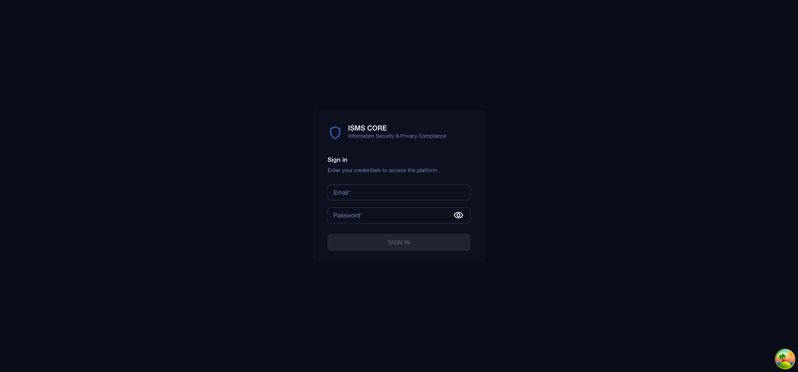</td>
<td align="center"><strong>Home — Product Dashboard</strong><br/>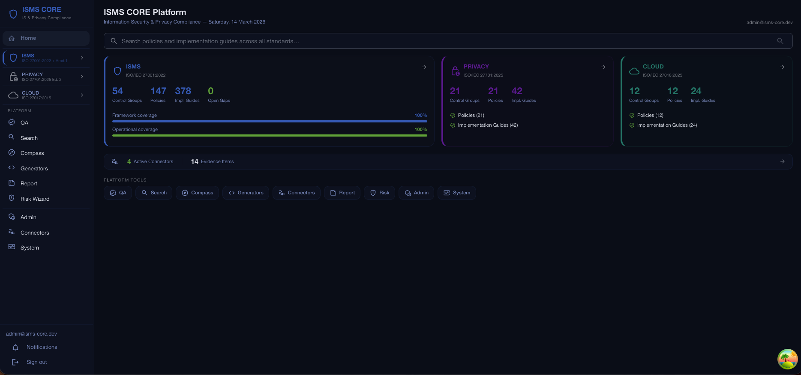</td>
</tr>
<tr>
<td align="center"><strong>Compliance Overview</strong><br/>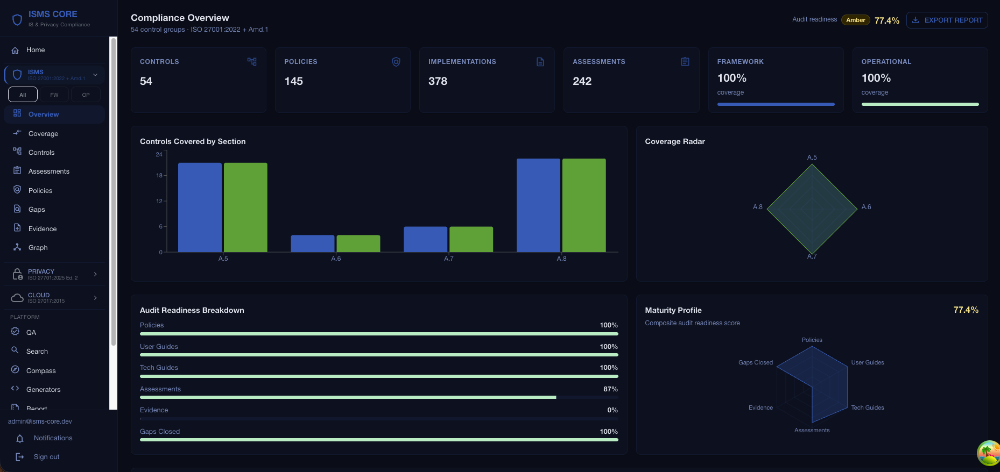</td>
<td align="center"><strong>Connectors — Automated Evidence</strong><br/>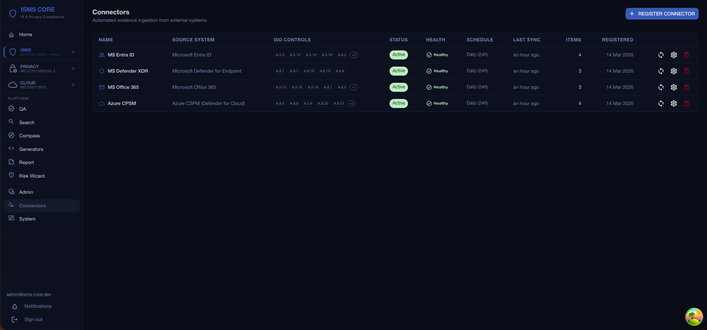</td>
</tr>
<tr>
<td align="center"><strong>ISMS Compass — AI Gap Analysis</strong><br/>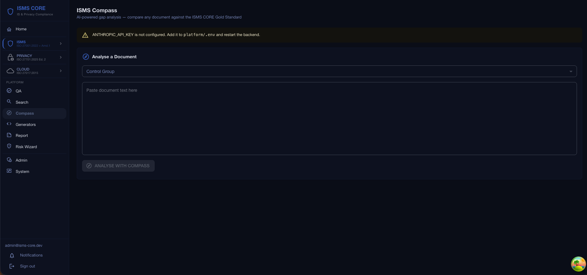</td>
<td align="center"><strong>System Status</strong><br/>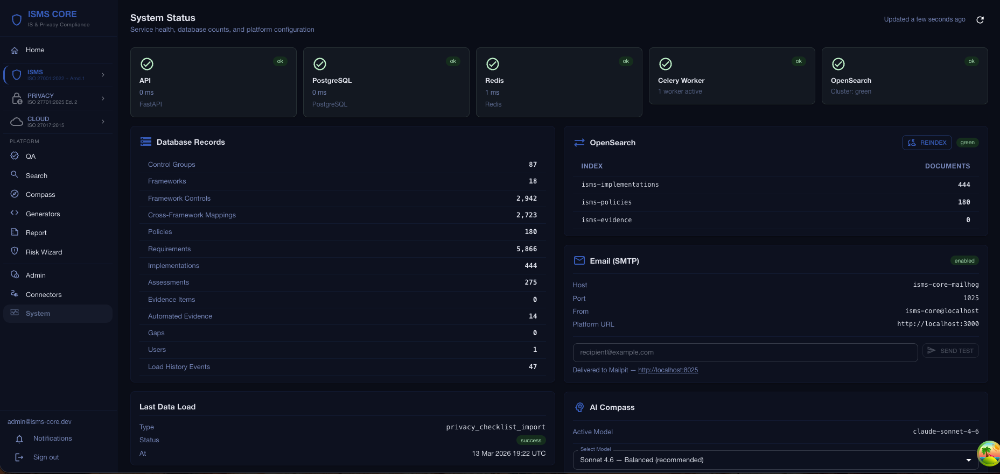</td>
</tr>
<tr>
<td align="center"><strong>NIST CSF 2.0 Assessment</strong><br/>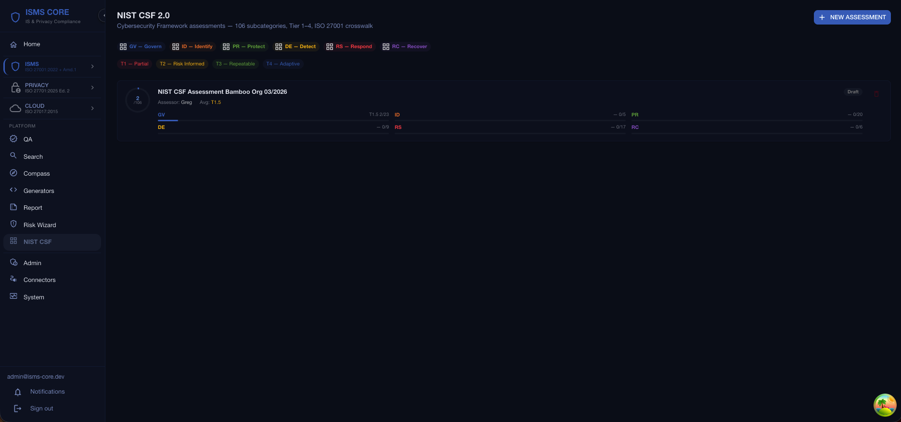</td>
<td align="center"><strong>NIS2 Directive Assessment</strong><br/>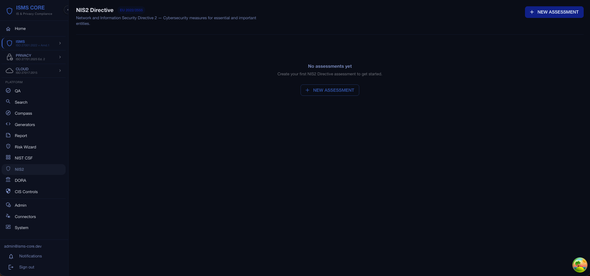</td>
</tr>
<tr>
<td align="center"><strong>DORA Assessment</strong><br/>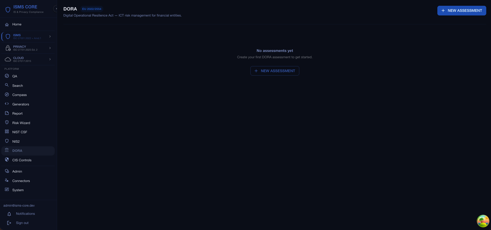</td>
<td align="center"><strong>CIS Controls v8 Assessment</strong><br/>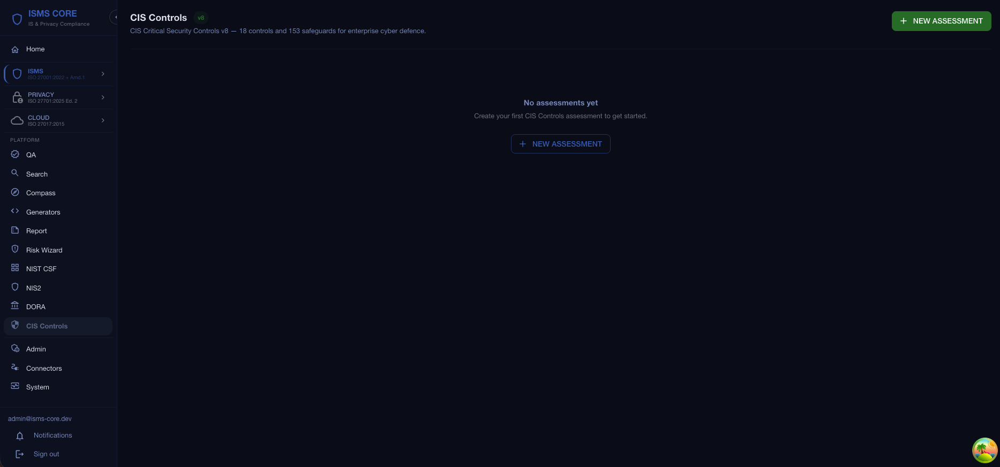</td>
</tr>
<tr>
<td align="center" colspan="2"><strong>Admin — Content Importer</strong><br/>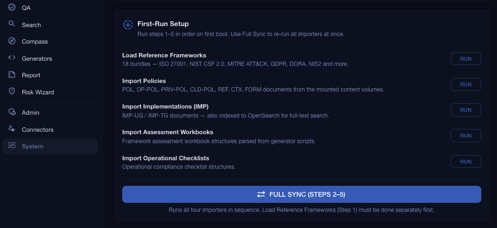</td>
</tr>
</table>

---

## Features

| Feature | Description |
|---------|-------------|
| **Control Explorer** | Browse all 87 control groups (ISMS + Privacy + Cloud) with compliance scores, policy status, assessment history |
| **Compliance Dashboard** | Aggregated scores across all four products with section breakdown; ISMS / Privacy / Cloud product switcher |
| **Coverage Heatmap** | Policy and assessment coverage by control group and section |
| **Policy Manager** | Browse, filter, preview, and manage all POL/OP-POL/PRIV-POL/CLD-POL/INS/REF/CTX documents |
| **Assessment Tracker** | Framework (188 workbooks), Operational (53 checklists), Privacy (21), Cloud (12) with per-item compliance status |
| **Gap Management** | Full gap lifecycle: create, assign, track, close — with severity and SLA monitoring |
| **Evidence Tracker** | Evidence items with expiry tracking, verification status, and freshness alerts |
| **Connectors** | Automated evidence ingestion from 44 systems — continuous compliance signals from real infrastructure |
| **Nightly Evidence Archive** | Celery Beat job archives stale connector evidence at 02:00 UTC daily |
| **Crosswalk Viewer** | Cross-framework mappings: ISO 27001 ↔ NIST CSF ↔ MITRE ATT&CK ↔ GDPR ↔ DORA and more |
| **QA / Existence Checker** | Validate that all expected artifacts are present (Framework, Operational, Privacy, Cloud) |
| **System Event Log** | Full audit log of all platform actions |
| **Admin Panel** | User management (CRUD), system info, service health, DB stats, import triggers |
| **Full-Text Search** | Search across all policy and IMP document content via OpenSearch (product-filtered) |
| **ISMS Compass** | AI gap analysis against ISMS CORE Gold Standard (requires `ANTHROPIC_API_KEY`) |
| **NIST CSF 2.0 Assessment** | Full assessment tool — 106 subcategories across 6 functions, tier 1–4 ratings, radar + bar chart report page, XLSX import from official NIST template, XLSX/CSV export |
| **NIS2 Assessment** | EU 2022/2555 compliance tool — 10 Article 21(2) security measures + 5 Article 23 reporting obligations, maturity score 0–4 (Non-compliant → Optimised) |
| **DORA Assessment** | EU 2022/2554 compliance tool — 25 articles across 4 chapters (ICT Risk Management, Incident Management, Resilience Testing, Third-Party Risk), maturity score 0–4 |
| **CIS Controls v8 Assessment** | CIS v8 compliance tool — 153 safeguards across 18 controls, maturity score 0–4 |
| **Collapsible Sidebar** | Azure Portal-style icon-only sidebar — collapses to 52 px strip, full tooltips, state persisted in localStorage |
| **RBAC** | Role-based access: Admin / ISMS Manager / Auditor / Control Owner / Viewer |
| **Approval Workflow** | Content state lifecycle: draft → review → approved → published |
| **Privacy Product** | 21 ISO 27701:2025 control groups — PRIV-POL imported; compliance checklists in Assessments |
| **Cloud Product** | 12 ISO 27018:2025 control groups — CLD-POL imported; compliance checklists in Assessments |

---

## Production Deployment — Step by Step

### Step 0 — Prerequisites

Before starting, confirm you have:

**Software:**
```bash
docker --version          # Must be 24.0 or higher
docker compose version    # Must be v2.x (not legacy docker-compose v1)
```

If either command fails or shows an old version, install Docker Desktop (macOS/Windows) or follow the Docker Engine install guide for Linux.

**Hardware (minimum for production):**
- RAM: 6 GB free (OpenSearch uses ~1.5 GB, backend ~512 MB, frontend ~256 MB, Postgres ~512 MB)
- Disk: 20 GB free (OS + images + DB + OpenSearch indices)
- CPU: 2 cores minimum, 4 recommended

**Linux only — OpenSearch kernel requirement:**

OpenSearch requires a higher virtual memory limit than the Linux default. Without this, the OpenSearch container will crash immediately.

Set it now (takes effect immediately, survives until next reboot):
```bash
sudo sysctl -w vm.max_map_count=262144
```

Make it permanent (survives reboots):
```bash
echo "vm.max_map_count=262144" | sudo tee -a /etc/sysctl.conf
```

macOS and Windows Docker Desktop handle this automatically inside their VM — no action needed.

---

### Step 1 — Copy Files to Server

If deploying to a remote server, rsync the platform directory across. Exclude secrets, caches, and build artifacts:

```bash
# Run this from your dev machine:
rsync -av \
  --exclude='.env' \
  --exclude='__pycache__' \
  --exclude='*.pyc' \
  --exclude='.git' \
  --exclude='node_modules' \
  --exclude='certs' \
  /path/to/factory_isms/platform/ \
  user@server:/home/user/isms-core/
```

Then SSH into the server and work from that directory for all remaining steps:
```bash
ssh user@server
cd /home/user/isms-core
```

If deploying locally, simply `cd` into the platform directory.

---

### Step 2 — Create .env

Copy the example file and fill in your values:
```bash
cp .env.example .env
```

Generate strong secrets (run this three times — once for each secret):
```bash
python3 -c "import secrets; print(secrets.token_hex(32))"
```

Edit `.env` with your values:

```env
# ─── Server ────────────────────────────────────────────────────────────────
HOST_IP=10.0.0.112            # Your server's IP address
FQDN=                         # Optional: domain name for Let's Encrypt TLS
PLATFORM_URL=https://10.0.0.112
CORS_ORIGINS=https://10.0.0.112

# ─── Required Secrets ──────────────────────────────────────────────────────
POSTGRES_PASSWORD=            # REQUIRED — strong password (use generator above)
REDIS_PASSWORD=               # REQUIRED — strong password (use generator above)
SECRET_KEY=                   # REQUIRED — min 32 chars random hex (use generator above)

# ─── Admin User ────────────────────────────────────────────────────────────
ADMIN_EMAIL=admin@isms-core.dev
ADMIN_PASSWORD=               # REQUIRED — no default in production, you must set this

# ─── Optional: AI Gap Analysis ─────────────────────────────────────────────
ANTHROPIC_API_KEY=            # Leave empty to disable ISMS Compass

# ─── Optional: Connector Runner ─────────────────────────────────────────────
CONNECTORS_WORKER_SECRET=     # Required only if starting the connector runner

# ─── Optional: Email ───────────────────────────────────────────────────────
MAIL_HOST=                    # Leave empty to disable email (safe default)
MAIL_PORT=1025

# ─── Optional: SMTP Bridge (M365 / OAuth) ─────────────────────────────────
# Only needed if using --profile smtp-bridge (see Email section below)
SMTP_BRIDGE_TENANT_ID=
SMTP_BRIDGE_CLIENT_ID=
SMTP_BRIDGE_CLIENT_SECRET=
SMTP_BRIDGE_FROM_ADDRESS=
SMTP_BRIDGE_FROM_NAME=ISMS CORE
```

> **Critical:** `ADMIN_PASSWORD` has no default in production. If you leave it empty, the admin account will not be created and you will not be able to log in.

---

### Step 3 — Start the Stack

```bash
docker compose up -d
```

The first run pulls all images and builds the backend and frontend containers. This takes **3–5 minutes** depending on your connection and hardware. Subsequent restarts take approximately 60 seconds.

Watch progress:
```bash
docker compose logs -f
```

Press `Ctrl+C` to stop watching logs. The containers continue running in the background.

Wait until all containers are up before proceeding to Step 4. You can check:
```bash
docker compose ps
```

Expected output — all 8 containers, 7 showing `healthy`, beat showing `Up` (no healthcheck — this is normal):

```
NAME                     STATUS
isms-core-nginx          Up (healthy)
isms-core-backend        Up (healthy)
isms-core-frontend       Up (healthy)
isms-core-postgres       Up (healthy)
isms-core-redis          Up (healthy)
isms-core-opensearch     Up (healthy)
isms-core-worker         Up (healthy)
isms-core-beat           Up
```

**Alembic migrations run automatically.** On a fresh database, the backend container stamps at migration 009 and applies 010 through head automatically via `entrypoint.sh`. You do not need to run `alembic upgrade head` manually.

---

### Step 4 — Load Content

You have two ways to load content into the platform: the command-line bootstrap script (recommended for first deploy) or the Admin WebUI (useful for selective loading or re-syncing).

#### Selective Loading — Mount Only What You Need

The platform only imports what is mounted. If you only want Framework and Operational, only mount those two folders in `docker-compose.yml` and leave the Privacy and Cloud mounts out. The importers will find nothing for the unmounted products and skip them cleanly.

```yaml
# docker-compose.yml — mount only the products you want
volumes:
  - ../isms-core-framework:/app/isms-framework:ro      # Framework — include
  - ../isms-core-operational:/app/isms-operational:ro  # Operational — include
  # - ../isms-core-privacy:/app/isms-privacy:ro        # Privacy — commented out = not imported
  # - ../isms-core-cloud:/app/isms-cloud:ro            # Cloud — commented out = not imported
  - ../isms-core-external:/app/isms-external:ro        # External — optional, see below
```

A fifth mount — `isms-core-external` — is included in the compose file for external policy documents. Create a sibling directory called `isms-core-external/` next to your other product folders and place any markdown policy documents there. They will be picked up by the importer, indexed into OpenSearch, and made available for full-text search and ISMS Compass gap analysis — useful for evaluating your existing policies against the ISMS CORE Gold Standard without mixing them into your core products.

#### Option A — bootstrap.sh (command line, recommended for first deploy)

`bootstrap.sh` is a one-shot script that:
1. Waits for the stack to be fully healthy
2. Authenticates as admin
3. Seeds the ISMS control groups (`/admin/load`)
4. Imports all policies, implementations, operational content, privacy content, and framework workbooks in the correct order
5. Triggers a full OpenSearch reindex
6. Prints import statistics on completion

**Why must it run at least once?** The importers are idempotent — re-running is safe. But control group seeding (`/admin/load`) must happen before any content import. If you skip it, the platform will appear to work but will have 0 policies and 0 assessments.

```bash
chmod +x bootstrap.sh
bash bootstrap.sh
```

This takes **3–5 minutes**. Do not interrupt it. At the end you will see import statistics confirming how many policies, implementations, and workbooks were imported.

> **bootstrap.sh is safe to re-run** at any time if you need to re-sync content. It will not duplicate data.

#### Option B — Admin WebUI (browser, selective step-by-step)

Log in as admin and go to **Admin → First-Run Setup**. Each importer is a separate button — run them in order, top to bottom.

<p align="center">
  
</p>

| Step | Button | What it does |
|------|--------|-------------|
| 1 | **Load Reference Frameworks** | Seeds control groups and loads the 18 reference datasets (ISO 27001, NIST CSF, MITRE ATT&CK, GDPR, DORA, NIS2 and more). **Always run this first.** |
| 2 | **Import Policies** | Imports POL, OP-POL, PRIV-POL, CLD-POL, REF, CTX, FORM documents from all mounted content volumes. Only imports what is mounted. |
| 3 | **Import Implementations (IMP)** | Imports IMP-UG and IMP-TG documents and indexes them into OpenSearch for full-text search. |
| 4 | **Import Assessment Workbooks** | Parses Framework assessment workbook structures from the generator scripts. |
| 5 | **Import Operational Checklists** | Parses Operational compliance checklist structures. |
| — | **Full Sync (Steps 2–5)** | Runs all four importers in sequence. Step 1 (Load Reference Frameworks) must be done separately first. |

> **External policies:** You can import your own existing policy documents by placing them in a mounted folder before running Import Policies. They will be indexed into OpenSearch and available for full-text search and ISMS Compass gap analysis — useful for evaluating your current documentation against the ISMS CORE Gold Standard.

---

### Step 5 — Verify

Check all containers:
```bash
docker compose ps
```

Check the health endpoint (the `-k` flag accepts the self-signed cert):
```bash
curl -k https://localhost/health
```

Expected response:
```json
{"status":"ok","database":"ok","opensearch":"ok"}
```

Open your browser and navigate to `https://{HOST_IP}`. Your browser will show a certificate warning — this is expected with a self-signed certificate. Accept it to proceed (see TLS section below for your options).

Log in with:
- Email: the value of `ADMIN_EMAIL` in your `.env`
- Password: the value of `ADMIN_PASSWORD` in your `.env`

You should see the ISMS CORE dashboard with compliance data populated.

---

### Step 6 — Change Admin Password

Go to **Admin → Users → Edit admin user** and change the password to something you will remember.

Do this before handing the system to anyone else.

---

## TLS Certificate Options

Three modes are supported. The system uses the first applicable mode automatically.

### Mode 1 — Let's Encrypt (recommended for public-facing deployments)

Requirements: a domain name that points to your server's public IP, port 80 open from the internet.

```bash
# Set FQDN in .env first:
FQDN=yourdomain.com

# Then run the setup script:
./nginx/scripts/setup-letsencrypt.sh yourdomain.com admin@yourdomain.com
```

The script obtains a certificate and configures nginx. Renewal is handled automatically.

### Mode 2 — Custom Certificate (recommended for enterprise/internal CA)

If your organisation has its own certificate authority or you have purchased a certificate:

1. Place your certificate file at `./certs/cert.pem`
2. Place your private key at `./certs/key.pem`
3. Restart nginx: `docker compose restart isms-core-nginx`

nginx detects the files automatically and uses them.

### Mode 3 — Self-Signed (default, requires no configuration)

If neither `FQDN` is set nor `./certs/` files exist, a self-signed certificate is generated automatically on first boot. No configuration required.

**Browser behaviour:** All browsers will show a security warning ("Your connection is not private" / "Potential Security Risk"). This is expected and harmless for internal use. To dismiss:
- Chrome/Edge: Click **Advanced** → **Proceed to {HOST_IP} (unsafe)**
- Firefox: Click **Advanced** → **Accept the Risk and Continue**
- Safari: Click **Show Details** → **visit this website**

Self-signed certificates are fully appropriate for internal-only deployments (e.g., on a LAN or VPN-only server).

---

## Email Configuration (Optional)

By default, no email is sent. The `MAIL_HOST=` variable is empty and the platform runs fine without it.

### Option A — Mailpit (local email catcher for testing)

Mailpit captures all outgoing email and shows it in a web UI. Useful for testing email workflows without a real mail server.

```bash
docker compose --profile mailpit up -d
```

- Outbound email is caught by Mailpit (nothing leaves the server)
- Web UI: `http://{HOST_IP}:8025`
- Set `MAIL_HOST=isms-core-mailhog` and `MAIL_PORT=1025` in `.env`

### Option B — SMTP Bridge (Microsoft 365 / OAuth)

For production email delivery via Microsoft 365 or another OAuth-capable SMTP provider:

1. Fill in the `SMTP_BRIDGE_*` variables in `.env`
2. Start the profile:

```bash
docker compose --profile smtp-bridge up -d
```

3. Set `MAIL_HOST=isms-core-smtp-bridge` and `MAIL_PORT=1025` in `.env`
4. Restart the backend: `docker compose restart isms-core-backend`

---

## Connectors — Automated Evidence

ISMS CORE includes an automated evidence ingestion layer. A single connector runner container loads all 44 connectors dynamically and pushes evidence directly into the `connector_evidence` table in PostgreSQL. Evidence appears in the **Automated Evidence** tab of each control group's detail view and refreshes every 60 seconds.

### Setup

1. Set `CONNECTORS_WORKER_SECRET` in your `.env` (same value must be in both backend and runner)
2. Start the connector runner (it uses its own `docker-compose.yml` in the `connectors/` directory):

```bash
cd connectors/
docker compose up -d
cd ..
```

The runner is independent from the main stack. You can start, stop, or update it without affecting the platform.

### Supported Connectors (44 systems)

| Category | Connectors |
|----------|-----------|
| **Microsoft** | Entra ID, Microsoft Defender, Microsoft Sentinel, Microsoft Intune, Microsoft 365, Microsoft Purview, Azure CSPM |
| **Network & Firewall** | FortiGate, FortiAnalyzer, FortiManager, Palo Alto PAN-OS, Cisco ASA, Cisco ISE, Zscaler |
| **ITSM** | ServiceNow, Jira / Jira Service Management, GLPI |
| **Vulnerability & EDR** | Qualys, Tenable.sc, Tenable.io, CrowdStrike Falcon, SentinelOne, Wazuh, OpenVAS |
| **Identity & PAM** | Windows Active Directory, LDAP, FreeIPA, Authentik, Keycloak, CyberArk, HashiCorp Vault, Devolutions Server |
| **Monitoring & SIEM** | PRTG Network Monitor, Graylog, Zabbix, Generic SIEM |
| **Cloud Security** | AWS Security Hub, Google Cloud SCC |
| **Threat Intelligence** | OpenCTI, OpenAEV, Threat Intel Feed |
| **DevOps** | GitHub, GitLab |

---

## Day 2 Operations

### Re-sync Content

If you update policy files or add new content, re-sync the platform:

```bash
# Option A: command line (safe to run any time)
bash bootstrap.sh

# Option B: WebUI
# Admin → System → Re-sync
```

Both options are idempotent — they will not create duplicate records.

### Update the Platform

```bash
docker compose pull
docker compose up -d --build
```

This pulls updated images and rebuilds containers in-place. Running containers are replaced one at a time. No data is lost — PostgreSQL and OpenSearch data live in named Docker volumes.

### View Logs

```bash
# All containers:
docker compose logs -f

# Specific container:
docker compose logs -f isms-core-backend
docker compose logs -f isms-core-worker
docker compose logs -f isms-core-nginx
```

### Backup the Database

```bash
docker exec isms-core-postgres \
  pg_dump -U isms_user isms_db > backup_$(date +%Y%m%d).sql
```

Restore from backup:
```bash
docker exec -i isms-core-postgres \
  psql -U isms_user isms_db < backup_20260314.sql
```

### Restart a Single Container

```bash
docker compose restart isms-core-backend
docker compose restart isms-core-nginx
```

### Stop the Stack

```bash
docker compose down          # Stops containers, preserves volumes (data intact)
docker compose down -v       # Stops containers AND deletes volumes (destroys all data)
```

> **Warning:** `docker compose down -v` permanently deletes your database and OpenSearch indices. Only use this if you intend a clean reinstall.

---

## RBAC — Roles

| Role | Capabilities |
|------|-------------|
| **Admin** | Full access — user management, system config, sync triggers, content approval, admin panel |
| **ISMS Manager** | All controls, assessments, gaps, evidence. Cannot manage users or system config. |
| **Auditor** | Read-only access to everything. Can export reports. |
| **Control Owner** | Read/write on assigned control groups only. |
| **Viewer** | Read-only on non-confidential items. |

Roles are assigned per-user in **Admin → Users**.

---

## API Documentation

The backend exposes interactive API documentation at:

- **Swagger UI:** `https://{HOST_IP}/api/docs`
- **ReDoc:** `https://{HOST_IP}/api/redoc`

Both are available without authentication for browsing. Authenticated endpoints require a Bearer token obtained from `POST /api/v1/auth/login`.

---

## Troubleshooting

### OpenSearch container exits immediately on Linux

**Symptom:** `isms-core-opensearch` exits within seconds of starting.

**Cause:** The Linux kernel's `vm.max_map_count` is too low (default is 65530; OpenSearch requires 262144).

**Fix:**
```bash
sudo sysctl -w vm.max_map_count=262144
docker compose restart isms-core-opensearch
```

To make it permanent across reboots:
```bash
echo "vm.max_map_count=262144" | sudo tee -a /etc/sysctl.conf
```

---

### Backend container keeps restarting

**Symptom:** `isms-core-backend` shows status `Restarting` in `docker compose ps`.

**Check the logs:**
```bash
docker compose logs isms-core-backend --tail=50
```

**Common causes:**
- `POSTGRES_PASSWORD` or `SECRET_KEY` not set in `.env`
- Database not yet ready when backend starts (usually resolves itself within 60 seconds — the entrypoint retries)
- Port conflict on the host

---

### "0 files imported" after running bootstrap.sh

**Symptom:** bootstrap.sh completes but shows 0 policies, 0 implementations imported.

**Cause:** Volume mounts are not configured correctly. The backend cannot see the content directories.

**Check:**
```bash
docker exec isms-core-backend ls /app/isms-framework
docker exec isms-core-backend ls /app/isms-operational
```

If these directories are empty or show "No such file or directory", the volume mounts in `docker-compose.yml` are pointing to paths that do not exist on the host. Update the volume paths to match your actual content directory locations.

---

### bootstrap.sh fails with authentication error

**Symptom:** `bootstrap.sh` prints an authentication failure or 401 error near the start.

**Cause:** The admin user was not created, usually because `ADMIN_EMAIL` or `ADMIN_PASSWORD` is empty in `.env`.

**Fix:**
1. Set `ADMIN_EMAIL` and `ADMIN_PASSWORD` in `.env`
2. Restart the backend: `docker compose restart isms-core-backend`
3. Re-run: `bash bootstrap.sh`

---

### Browser shows "Your connection is not private" / certificate warning

**This is expected** when using the default self-signed certificate. The platform is still working correctly — the warning is because the certificate is not signed by a trusted public certificate authority.

To dismiss (one-time, per browser):
- **Chrome / Edge:** Click **Advanced** → **Proceed to {HOST_IP} (unsafe)**
- **Firefox:** Click **Advanced…** → **Accept the Risk and Continue**
- **Safari:** Click **Show Details** → **visit this website**

For a production environment accessible to multiple users, consider using a custom certificate from your internal CA (Mode 2) or Let's Encrypt (Mode 1) — see the TLS section above.

---

### Celery Beat container shows no healthcheck status

**Symptom:** `isms-core-beat` shows `Up` in `docker compose ps` without a `(healthy)` label.

**This is normal.** The healthcheck for `isms-core-beat` is intentionally disabled. Celery Beat is a lightweight scheduler process that does not expose an HTTP endpoint, so a healthcheck is not meaningful. The container is working correctly if its status shows `Up` and it is not restarting.

To confirm it is running correctly:
```bash
docker compose logs isms-core-beat --tail=20
```

You should see log lines confirming the beat scheduler is running and next scheduled task times.

---

## Environment Variables Reference

| Variable | Required | Description |
|----------|----------|-------------|
| `HOST_IP` | Yes | Server IP address — used in `VITE_BACKEND_URL` and self-signed cert SAN |
| `FQDN` | No | Domain name — enables Let's Encrypt TLS when set |
| `PLATFORM_URL` | Yes | Full URL of the platform (e.g. `https://10.0.0.112`) |
| `CORS_ORIGINS` | Yes | CORS allowed origins — typically same as `PLATFORM_URL` |
| `POSTGRES_PASSWORD` | Yes | PostgreSQL password — must be strong |
| `REDIS_PASSWORD` | Yes | Redis password — must be strong |
| `SECRET_KEY` | Yes | JWT signing key — minimum 32 chars random hex |
| `ADMIN_EMAIL` | Yes | Admin account email — created automatically on startup |
| `ADMIN_PASSWORD` | Yes | Admin account password — **no default, must be set** |
| `EXTERNAL_PATH` | No | Path to external policy mount — set automatically from `isms-core-external` volume if present |
| `CONNECTORS_WORKER_SECRET` | No | Shared secret between backend and connector runner — required only if using connectors |
| `ANTHROPIC_API_KEY` | No | Enables ISMS Compass AI gap analysis — leave empty to disable |
| `MAIL_HOST` | No | SMTP host — leave empty to disable email |
| `MAIL_PORT` | No | SMTP port (default: 1025) |
| `SMTP_BRIDGE_TENANT_ID` | No | Azure AD tenant ID — only for `smtp-bridge` profile |
| `SMTP_BRIDGE_CLIENT_ID` | No | Azure AD app client ID — only for `smtp-bridge` profile |
| `SMTP_BRIDGE_CLIENT_SECRET` | No | Azure AD app client secret — only for `smtp-bridge` profile |
| `SMTP_BRIDGE_FROM_ADDRESS` | No | Sender address — only for `smtp-bridge` profile |
| `SMTP_BRIDGE_FROM_NAME` | No | Sender display name — only for `smtp-bridge` profile (default: `ISMS CORE`) |

---

## Go-Live Checklist

Use this checklist before declaring the deployment live.

- [ ] **Linux only:** `vm.max_map_count=262144` set — both immediately (`sysctl -w`) and permanently (`/etc/sysctl.conf`)
- [ ] `.env` created from `.env.example` with all required variables filled in
- [ ] `POSTGRES_PASSWORD` set to a strong password (not empty, not a default)
- [ ] `REDIS_PASSWORD` set to a strong password
- [ ] `SECRET_KEY` set to a random 32+ character hex string
- [ ] `ADMIN_PASSWORD` set — **there is no default; if empty, you cannot log in**
- [ ] `HOST_IP` set to your server's IP address
- [ ] `docker compose up -d` completed — all 8 containers up
- [ ] `docker compose ps` shows 7 containers `healthy` + `isms-core-beat` `Up`
- [ ] `bootstrap.sh` run once — import statistics show non-zero counts
- [ ] `curl -k https://localhost/health` returns `{"status":"ok","database":"ok","opensearch":"ok"}`
- [ ] `https://{HOST_IP}` accessible in browser — dashboard shows compliance data
- [ ] Admin password changed (Admin → Users → Edit admin user)
- [ ] TLS mode chosen and configured:
  - [ ] Self-signed (default — no action needed, browser warning expected and acceptable), or
  - [ ] Custom certificate (`./certs/cert.pem` + `./certs/key.pem`), or
  - [ ] Let's Encrypt (`setup-letsencrypt.sh` run with domain + email)
- [ ] Email profile started if needed (`--profile mailpit` or `--profile smtp-bridge`)
- [ ] Connector runner started if using automated evidence (`cd connectors/ && docker compose up -d`)
- [ ] `ANTHROPIC_API_KEY` set if using ISMS Compass AI gap analysis

---

<p align="center">
<strong>Copyright © 2025–2026 The ISMS Core Project. All rights reserved.</strong>
</p>

<p align="center">
<em>Where bamboo antennas actually work.</em> 🎋
</p>
