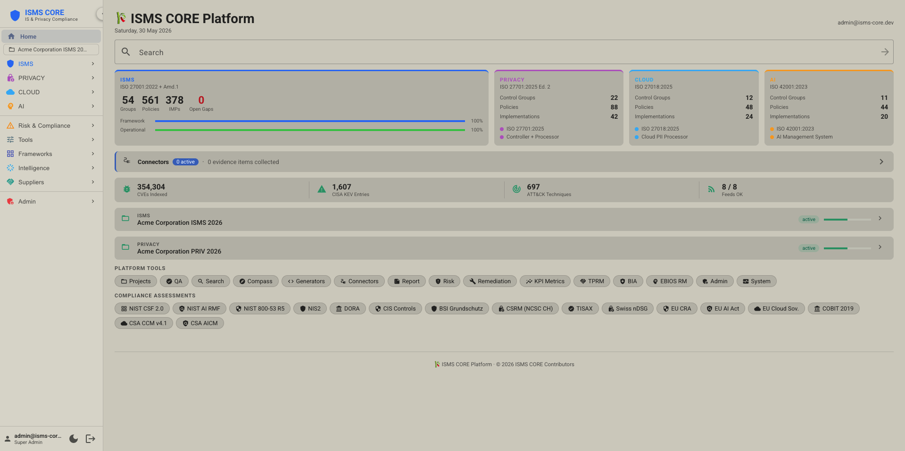
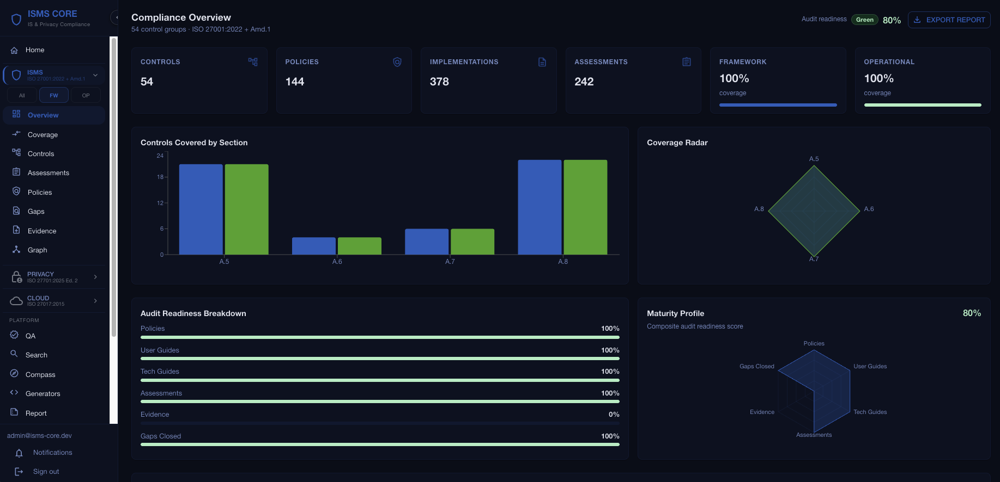
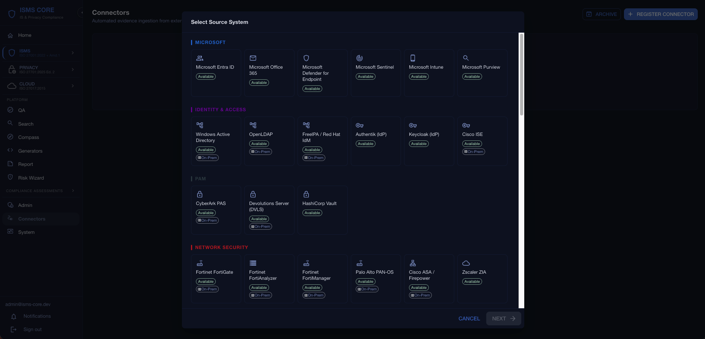
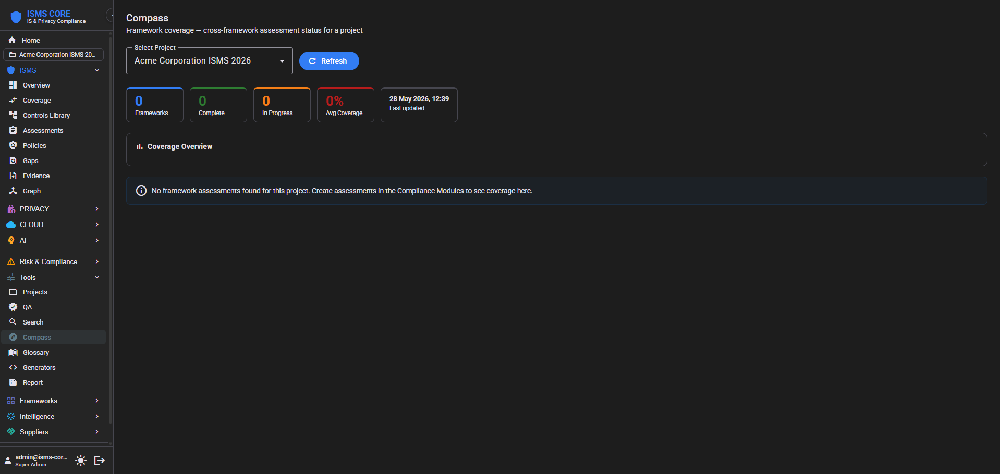
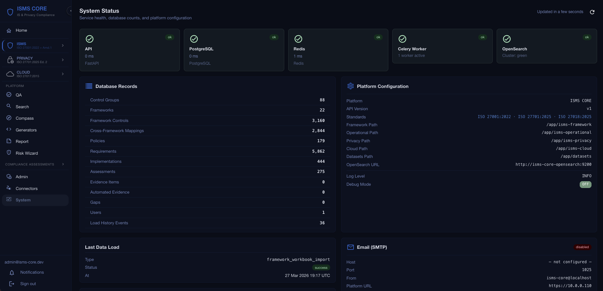
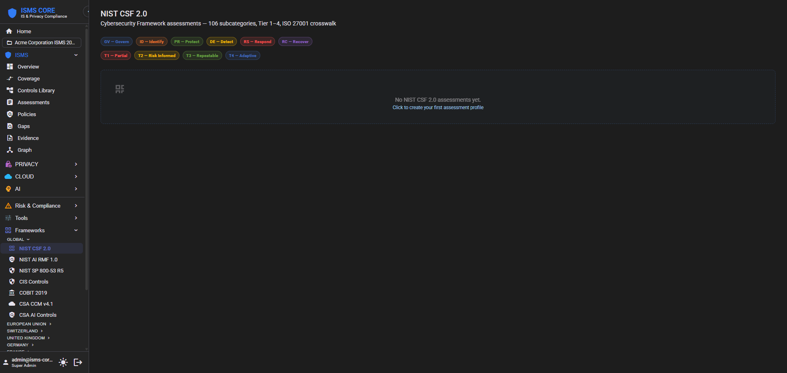
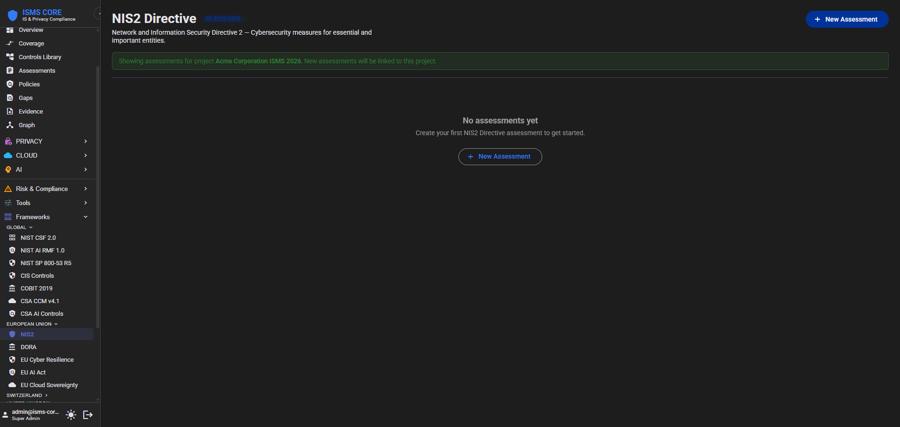
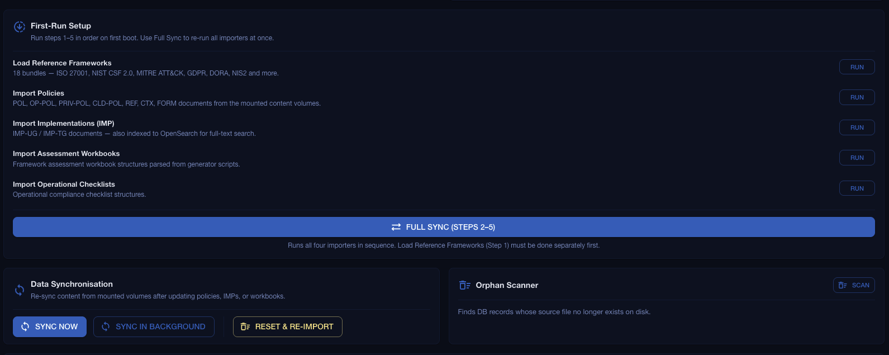

<p align="center">
  
</p>

<h1 align="center">🎋 ISMS CORE Platform</h1>

<p align="center">
  <strong>Production Deployment Guide — API, WebUI, and Connector Layer</strong>
</p>

<p align="center">
  
  
  
  
  
</p>

<p align="center">
  <em>Four products. One platform. All live.</em>
</p>

---

> **⚠️ READ THIS FIRST — IKEA MANUAL WARNING**
>
> This is the deployment manual. Read it top to bottom. Do not skip steps. Do not improvise.
>
> If you are deploying tonight, follow Steps 0 through 6 in order. The **Go-Live Checklist** is at the bottom of this document.
>
> The most common failure mode is running `bootstrap.sh` before the stack is fully up, or skipping it entirely. Both break things. Read Step 4.

---

## What Is ISMS CORE Platform?

ISMS CORE Platform is the **API and WebUI layer** that transforms all five ISMS CORE products (Framework, Operational, Privacy, Cloud, AI) into a live compliance management system. The policies, assessment workbooks, and implementation guides are the content — Platform is the engine that ingests, correlates, and presents them as a unified operational dashboard covering ISO 27001:2022, ISO 27701:2025, ISO 27018:2025, and ISO 42001:2023.

**Without Platform:** You have policy files and Excel workbooks on disk. Excellent paperwork.

**With Platform:** You have a live compliance system — searchable, scored, gap-tracked, evidence-linked, audit-ready, and (with connectors) continuously fed by automated evidence from your real infrastructure.

> Platform is additive. All five products work perfectly without it. Platform is the operational layer for teams who need continuous compliance management rather than periodic file reviews.

---

## Architecture

### Ten-Service Stack

```
                        ┌────────────────────────────────────────────────┐
  Clients               │            ISMS CORE Platform                   │
  (browser)             │                                                  │
      │                 │  ┌──────────────────────────────────────────┐   │
      ▼                 │  │  isms-core-nginx (ports 80 + 443)        │   │
  https://{HOST_IP} ────┼─►│  TLS termination + reverse proxy        │   │
                        │  │  / → frontend  /api/ → backend           │   │
                        │  └──────────┬───────────────┬───────────────┘   │
                        │             │               │                    │
                        │             ▼               ▼                    │
                        │  ┌──────────────┐  ┌──────────────────┐        │
                        │  │ isms-core-   │  │  isms-core-      │        │
                        │  │ frontend     │  │  backend         │        │
                        │  │ React 19     │  │  FastAPI         │        │
                        │  │ + MUI 6      │  │  + SQLAlchemy    │        │
                        │  └──────────────┘  └────┬──────┬──────┘        │
                        │                         │      │                 │
                        │             ┌───────────┘      │                 │
                        │             ▼                  ▼                 │
                        │  ┌──────────────┐  ┌──────────────────┐        │
                        │  │ isms-core-   │  │  isms-core-      │        │
                        │  │ postgres     │  │  redis           │        │
                        │  │ PostgreSQL18 │  │  Redis 8         │        │
                        │  └──────────────┘  └────┬─────────────┘        │
                        │                         │                        │
                        │             ┌───────────┘                        │
                        │             ▼                                     │
                        │  ┌──────────────┐  ┌──────────────────┐        │
                        │  │ isms-core-   │  │  isms-core-beat  │        │
                        │  │ worker       │  │  Celery Beat     │        │
                        │  │ Celery Worker│  │  (nightly jobs)  │        │
                        │  └──────────────┘  └──────────────────┘        │
                        │                                                  │
                        │  ┌──────────────────────────────────────────┐   │
                        │  │  isms-core-opensearch (internal)         │   │
                        │  │  Full-text search (policy/IMP)           │   │
                        │  │  + nvd-cve / nvd-cpe + evidence indices  │   │
                        │  └────────────────────┬─────────────────────┘   │
                        │                       │                          │
                        │             ┌─────────┴─────────┐               │
                        │             ▼                   ▼               │
                        │  ┌──────────────────┐  ┌──────────────────┐   │
                        │  │ isms-core-feeds  │  │ isms-core-       │   │
                        │  │ Threat intel     │  │ connectors       │   │
                        │  │ MITRE · KEV ·    │  │ 44 evidence      │   │
                        │  │ EPSS · NVD CVE   │  │ connectors       │   │
                        │  └──────────────────┘  └──────────────────┘   │
                        └────────────────────────────────────────────────┘
```

### Services

| Container | Technology | Role |
|-----------|-----------|------|
| `isms-core-nginx` | nginx (Alpine) | Reverse proxy — TLS termination, routes `/api/` to backend, `/` to frontend. Ports 80 + 443. |
| `isms-core-backend` | FastAPI 0.109+ | REST API, auth (JWT), business logic, import orchestration. Internal only — nginx proxies it. |
| `isms-core-frontend` | React 19 + Vite 8 | WebUI — dashboards, control explorer, evidence management. Internal only — nginx proxies it. |
| `isms-core-postgres` | PostgreSQL 18 Alpine | Primary data store — all compliance data. Internal only (no exposed port in prod). |
| `isms-core-redis` | Redis 8 Alpine | Session cache + Celery task broker. Internal only. |
| `isms-core-opensearch` | OpenSearch 3.x | Full-text search over policy and IMP content + NVD CVE/CPE indices. Internal only. |
| `isms-core-worker` | Celery 5.3 | Background tasks — import, sync, compliance recalculation. Queue: `isms`. |
| `isms-core-beat` | Celery Beat | Scheduled jobs — nightly evidence archive at 02:00 UTC; daily KPI snapshots at 06:00 UTC. No healthcheck (by design). |
| `isms-core-feeds` | Python 3.12 + schedule | Threat intelligence scheduler — MITRE ATT&CK, MITRE ATLAS, CISA KEV, FIRST EPSS, NVD CVE/CPE. Writes to Postgres and OpenSearch. Env: `FEEDS_CVE_ENABLED`, `FEEDS_CPE_FULL`, `NIST_API_KEY`. |
| `isms-core-connectors` | Python 3.12 | Automated evidence runner — loads all 44 connectors dynamically, pushes evidence to `connector_evidence` table. Env: `CONNECTORS_WORKER_SECRET`. |

> **Access in production:** `https://{HOST_IP}` via nginx. Do NOT access `:3000` or `:8000` directly — those ports are not exposed in production.

---

> **Enterprise v2 — In Development**
>
> An enterprise edition is currently in development that replaces PostgreSQL as the evidence store with a dedicated OpenSearch cluster (1-node default, optional 3-node profile) and adds Garage S3 object storage for evidence files and index snapshots. The v1.0 architecture documented here remains the production baseline. Enterprise v2 will be available as a separate deployment profile on the same codebase — no configuration changes for existing v1.0 deployments.

---

### Data Model

| Entity | Description |
|--------|-------------|
| **Control Groups** | 99 groups — 54 ISMS (ISO 27001), 21 Privacy (ISO 27701), 12 Cloud (ISO 27018), 12 AI (ISO 42001) |
| **Policies** | POL, OP-POL, PRIV-POL, CLD-POL, AI-POL, INS, REF, CTX, FORM — typed, product-tagged, state-tracked |
| **Implementations** | IMP-UG/TG documents, indexed into OpenSearch for full-text search |
| **Assessments** | Excel workbook contents: sheets, items, compliance status per item; Framework, Operational, Privacy, Cloud, and AI checklists |
| **Gaps** | Identified compliance gaps with severity, owner, SLA, and remediation tracking |
| **Evidence** | Evidence items linked to control groups and assessment items — manual upload + automated connector ingestion |
| **Connector Evidence** | Automated evidence from connectors — timestamped, classified, source-labelled |
| **Frameworks** | 37 reference datasets: ISO 27001, NIST CSF 2.0, NIST AI RMF 1.0, MITRE ATT&CK v18, GDPR, DORA, NIS2, CIS Controls v8, BSI IT-Grundschutz Kompendium, TISAX/VDA ISA 6.0, Swiss nDSG 2023, Swiss ISG (SR 128), EU CRA 2024, EU AI Act, CyberFundamentals BE, BaFin BAIT DE, CSSF 20-750 LU, ACN IT, UK NIS, UK Operational Resilience, FINMA, COBIT 2019, and more |
| **Crosswalk Mappings** | Cross-framework relationships: 3,915+ mappings — including NIST AI RMF 1.0 ↔ EU AI Act (72 mappings), BSI IT-Grundschutz (ISO 27001 ↔ BSI: 115, ISO 27701 ↔ BSI: 103, ISO 27018 ↔ BSI: 51), Swiss ISG (40), and EU country frameworks (CyberFundamentals BE: 107, BaFin BAIT: 69, CSSF LU: 47, ACN IT: 43, UK NIS: 51, UK Op. Resilience: 34) |
| **NIST CSF 2.0 Profiles** | Named assessment profiles — tier 1–4 ratings for all 106 subcategories, per-function scoring, gap analysis, XLSX import/export |
| **Compliance Assessments** | 23 frameworks — see [COMPLIANCE.md](COMPLIANCE.md) for full coverage |
| **Projects** | Workspace layer — named projects own a curated subset of policies, implementations, assessments, gaps, and evidence; doc-vars substitution (org name, CISO, effective date) applied on add; active/inactive/draft/archived lifecycle |
| **System Event Log** | Immutable trail of every platform action (who, what, when, resource) |
| **Threat Intelligence** | Feed run history, CISA KEV entries, EPSS scores, MITRE techniques. NVD CVE (~250K docs) and CPE (~50-100K docs) stored in OpenSearch indices `nvd-cve` / `nvd-cpe` with EPSS + KEV denormalised at index time. |

---

## Screenshots

<table>
<tr>
<td align="center"><strong>Login</strong><br/></td>
<td align="center"><strong>Home — Product Dashboard</strong><br/></td>
</tr>
<tr>
<td align="center"><strong>Compliance Overview</strong><br/></td>
<td align="center"><strong>Connectors — Automated Evidence</strong><br/></td>
</tr>
<tr>
<td align="center"><strong>ISMS Compass — AI Gap Analysis</strong><br/></td>
<td align="center"><strong>System Status</strong><br/></td>
</tr>
<tr>
<td align="center"><strong>NIST CSF 2.0 Assessment</strong><br/></td>
<td align="center"><strong>NIS2 Directive Assessment</strong><br/></td>
</tr>
<tr>
<td align="center" colspan="2"><strong>Admin — Content Importer</strong><br/></td>
</tr>
</table>

---

## Features

| Feature | Description |
|---------|-------------|
| **Control Explorer** | Browse all 99 control groups (ISMS + Privacy + Cloud + AI) with compliance scores, policy status, assessment history |
| **Compliance Dashboard** | Aggregated scores across all four products with section breakdown; ISMS / Privacy / Cloud / AI product switcher |
| **Coverage Heatmap** | Policy and assessment coverage by control group and section |
| **Policy Manager** | Browse, filter, preview, and manage all POL/OP-POL/PRIV-POL/CLD-POL/AI-POL/INS/REF/CTX documents |
| **Assessment Tracker** | Framework (188 workbooks), Operational (53 checklists), Privacy (21), Cloud (12), AI (10) with per-item compliance status |
| **Gap Management** | Full gap lifecycle: create, assign, track, close — severity, SLA monitoring, BSI 200-3 automatic risk calculator (likelihood × impact → risk level, pre-mapped threat codes per ISO section) |
| **Evidence Tracker** | Evidence items with expiry tracking, verification status, and freshness alerts |
| **Connectors** | Automated evidence ingestion from 44 systems — continuous compliance signals from real infrastructure |
| **Nightly Evidence Archive** | Celery Beat job archives stale connector evidence at 02:00 UTC daily |
| **Crosswalk Viewer** | Cross-framework mappings: 3,915+ relationships — ISO 27001 ↔ NIST CSF ↔ MITRE ATT&CK ↔ GDPR ↔ DORA ↔ BSI IT-Grundschutz and more |
| **QA / Existence Checker** | Validate that all expected artifacts are present (Framework, Operational, Privacy, Cloud, AI) |
| **System Event Log** | Full audit log of all platform actions |
| **Admin Panel** | User management (CRUD), system info, service health, DB stats, import triggers |
| **Full-Text Search** | Search across all policy and IMP document content via OpenSearch (product-filtered) |
| **ISMS Compass** | AI gap analysis against ISMS CORE Gold Standard (requires `ANTHROPIC_API_KEY`) |
| **Compliance Assessment Suite** | 23 compliance frameworks with assessment, scoring, gap tracking, and export. See [COMPLIANCE.md](COMPLIANCE.md). |
| **NIST CSF 2.0 Assessment** | 106 subcategories across 6 functions (incl. GV — Govern), tier 1–4 ratings, radar + bar chart, XLSX import from official NIST template, XLSX/CSV export |
| **NIS2 Assessment** | EU 2022/2555 — 10 Article 21(2) security measures + 5 Article 23 reporting obligations, maturity 0–4 |
| **DORA Assessment** | EU 2022/2554 — 25 articles across 4 chapters (ICT Risk, Incident Mgmt, Resilience Testing, Third-Party Risk), maturity 0–4 |
| **CIS Controls v8 Assessment** | 153 safeguards across 18 controls, maturity 0–4 |
| **BSI IT-Grundschutz Assessment** | 68 Bausteine across 10 layers, maturity 0–4. Paired with 269 crosswalk mappings across three ISO standards. |
| **CSRM Assessment (NCSC CH)** | Custom object-centric module — IT Protection Objects, 20 NIST CSF 2.0 baseline requirements, binary status, 6 Control Objectives |
| **TISAX Assessment** | VDA ISA 6.0 — 53 requirements across 12 domains, maturity 0–4 |
| **Swiss ISG Assessment (SR 128)** | Swiss Federal Act on Information Security 2024 — 27 requirements, 24h cyberattack reporting to BACS/OFCS (Art. 74e), maturity 0–4; ISO 27001 crosswalk: 40 mappings |
| **Swiss nDSG Assessment** | Swiss Federal Act on Data Protection 2023 — 25 provisions across 6 chapters, maturity 0–4 |
| **EU Cyber Resilience Act Assessment** | EU 2024/2847 — 26 essential requirements across 6 groups, maturity 0–4 |
| **EU AI Act Assessment** | EU 2024/1689 — 25 articles across 6 groups (Risk Management, Data Governance, Transparency, Human Oversight, Robustness, Accountability), maturity 0–4 |
| **NIST AI RMF 1.0 Assessment** | 72 subcategories across 4 functions (GOVERN, MAP, MEASURE, MANAGE), maturity 0–4; ISO 42001 crosswalk: 32 mappings, EU AI Act: 31 mappings |
| **EU Cloud Sovereignty Framework** | 8 Sovereignty Objectives (SOV-1 to SOV-8), SEAL-0 to SEAL-4 scoring, weighted Sovereignty Score |
| **COBIT 2019 Assessment** | 40 governance/management objectives, capability scoring 0–4 |
| **CyberFundamentals (BE)** | 41 NIST CSF 2.0 aligned practices, maturity 0–4; ISO 27001 crosswalk: 107 mappings |
| **BaFin BAIT (DE)** | Rundschreiben 10/2021 — 23 requirements across 12 modules, maturity 0–4; ISO 27001 crosswalk: 69 mappings |
| **CSSF 20-750 (LU)** | ICT Risk — 19 requirements across 7 domains, maturity 0–4; ISO 27001 crosswalk: 47 mappings |
| **ACN Guidelines (IT)** | 19 guidelines across 4 groups, maturity 0–4; ISO 27001 crosswalk: 43 mappings |
| **UK NIS Assessment** | UK NIS Regulations 2018 — 13 requirements across 3 objectives, maturity 0–4; ISO 27001 crosswalk: 51 mappings |
| **UK Operational Resilience** | FCA/PRA PS21/3 + PS26/2 — 12 requirements across 4 objectives, maturity 0–4; ISO 27001 crosswalk: 34 mappings |
| **Assessment Collections** | Group multiple assessments into named collections with derived stats (completion %, compliance %, status rollup). Export as CSV, colour-coded XLSX, or PDF (A4). |
| **Projects Workspace** | Create named projects — own, edit, and track a curated set of policies and implementations from the library. WYSIWYG editing, doc-vars substitution, bulk actions, SCR checklists, completeness scoring. |
| **Document Editor** | TipTap v3 WYSIWYG + raw source toggle; grid table auto-conversion (RST → GFM); metadata comment stripping |
| **Connector Evidence Promote** | Promote automated connector evidence into the Evidence Tracker scoped to the active project |
| **Collapsible Sidebar** | Azure Portal-style icon-only sidebar — collapses to 52 px strip, full tooltips, state persisted in localStorage |
| **RBAC** | Role-based access: Super Admin / Admin / ISMS Manager / Auditor / Control Owner / Viewer |
| **Approval Workflow** | Content state lifecycle: draft → review → approved → published |
| **Risk Register** | Project-scoped risk scenarios with 5×5 probability/impact matrix and visual risk heatmap |
| **Risk Heatmap** | Colour-coded 5×5 grid — view all risks at a glance, drill into any cell |
| **Remediation + ITSM Push** | Risk acceptance sign-off + action plans with ETA, cost, effort, progress; idempotent push to Jira / ServiceNow; ticket status sync |
| **KPI Dashboard** | 9 named metrics: `compliance_score`, `policy_coverage`, `risk_score_avg`, `risk_critical_count`, `evidence_freshness`, `gap_open_count`, `gap_closure_rate`, `remediation_overdue`, `audit_readiness`; sparkline trend charts |
| **Audit Readiness Score** | Composite hero score derived from all 9 KPI metrics |
| **Metrics Portfolio** | `super_admin` can view KPI metrics across all organisations from a single view |
| **TPRM** | Vendor/supplier register with criticality rating; DORA ICT service fields; vendor assessments; contract tracking with expiry alerts; dedicated DORA register view |
| **BIA** | Business Impact Analysis — asset records with RTO/RPO/MTPD hours; financial, operational, reputational, and regulatory impact scores; recovery testing tracking |
| **EBIOS RM** | Full 5-workshop ANSSI risk methodology — feared events, risk sources, strategic scenarios (likelihood × gravity matrix), attack paths with MITRE ATT&CK technique mapping |
| **Custom Framework Import** | YAML-based upload of custom or sector-specific frameworks; auto-mapped against ISO 27001 via `iso_mappings`; coverage % shown |
| **Country Localisation** | Policy rendering adapts regulatory references for 8 jurisdictions: CH (default), FR, BE, LU, DE, AT, IT, GB — applied at request time from `org.country` |
| **Cross-Framework Coverage** | BFS inference maps ISO 27001 assessment coverage to NIS2, DORA, and GDPR; Mapping Matrix and Inferred Coverage tabs |
| **MFA** | TOTP-based 2FA — Google Authenticator / Authy compatible; QR code setup; 8 single-use backup codes; auto-submits on 6-digit entry |
| **Threat Intelligence Feeds** | Dedicated `isms-core-feeds` container pulling 6 sources: MITRE ATT&CK v18 (weekly), MITRE ATLAS (weekly), CISA KEV (daily), FIRST EPSS (daily), NVD CVE full+delta (weekly/daily — ~250K CVEs into OpenSearch), NVD CPE Option B (weekly). EPSS and KEV denormalised into CVE docs at index time. |
| **CVE / CPE Explorer** | Search and filter ~250K NVD CVE entries by severity, EPSS score, year, KEV-only. Detail panel: CVSS scores, CPE applicability, CWEs, NVD references. Separate CPE tab. |
| **KEV Audit Report (A.8.8)** | Audit trail for ISO 27001:2022 A.8.8 using CISA KEV feed — remediation status by CVE, per-vendor summary, CSV export for auditor evidence. |
| **Health Alert Banner** | Dismissible warning banner when any feed run, connector sync, or OpenSearch check reports an error in the last 24 hours. Red-dot sidebar badges on Intelligence and Suppliers groups. |
| **CPE Option B Toggle** | Admin UI switch on Threat Feeds page to enable/disable NVD CPE Option B at runtime. Setting stored in `platform_settings` DB table, overrides env var. |
| **Dashboard Intelligence Cards** | Four clickable summary cards on Dashboard: CVE Index count, CISA KEV total, MITRE ATT&CK status, Feed Health. |
| **Project-Scoped Risk/Gaps/Evidence** | Risk scenarios, gaps, and evidence items are scoped to the active project — switching projects switches context |

---

## Production Deployment — Step by Step

### Step 0 — Prerequisites

**Software:**
```bash
docker --version          # Must be 24.0 or higher
docker compose version    # Must be v2.x (not legacy docker-compose v1)
```

If either command fails, install Docker Desktop (macOS/Windows) or Docker Engine for Linux.

**Hardware (minimum for production):**
- RAM: 6 GB free (OpenSearch ~1.5 GB, backend ~512 MB, frontend ~256 MB, Postgres ~512 MB)
- Disk: 20 GB free
- CPU: 2 cores minimum, 4 recommended

**Linux only — OpenSearch kernel requirement:**

```bash
# Takes effect immediately:
sudo sysctl -w vm.max_map_count=262144

# Survives reboots:
echo "vm.max_map_count=262144" | sudo tee -a /etc/sysctl.conf
```

macOS and Windows Docker Desktop handle this automatically — no action needed.

---

### Step 1 — Copy Files to Server

```bash
# Run this from your dev machine:
rsync -av \
  --exclude='.env' \
  --exclude='__pycache__' \
  --exclude='*.pyc' \
  --exclude='.git' \
  --exclude='node_modules' \
  --exclude='certs' \
  /path/to/factory_isms/isms-core-platform/ \
  user@server:/home/user/isms-core/

ssh user@server
cd /home/user/isms-core
```

---

### Step 2 — Create .env

```bash
cp .env.example .env
```

Generate strong secrets (run three times — once per secret):
```bash
python3 -c "import secrets; print(secrets.token_hex(32))"
```

Edit `.env`:

```env
# ─── Server ────────────────────────────────────────────────────────────────
HOST_IP=10.0.0.112
FQDN=                         # Optional: domain for Let's Encrypt TLS
PLATFORM_URL=https://10.0.0.112
CORS_ORIGINS=https://10.0.0.112

# ─── Required Secrets ──────────────────────────────────────────────────────
POSTGRES_PASSWORD=            # REQUIRED — strong password
REDIS_PASSWORD=               # REQUIRED — strong password
SECRET_KEY=                   # REQUIRED — min 32 chars random hex

# ─── Admin User ────────────────────────────────────────────────────────────
ADMIN_EMAIL=admin@isms-core.dev
ADMIN_PASSWORD=               # REQUIRED — no default in production

# ─── Optional: AI Gap Analysis ─────────────────────────────────────────────
ANTHROPIC_API_KEY=            # Leave empty to disable ISMS Compass

# ─── Optional: Connector Runner ────────────────────────────────────────────
CONNECTORS_WORKER_SECRET=     # Required if using automated evidence connectors

# ─── Optional: Email ───────────────────────────────────────────────────────
MAIL_HOST=                    # Leave empty to disable (safe default)
MAIL_PORT=1025

# ─── Optional: SMTP Bridge (M365 / OAuth) ──────────────────────────────────
SMTP_BRIDGE_TENANT_ID=
SMTP_BRIDGE_CLIENT_ID=
SMTP_BRIDGE_CLIENT_SECRET=
SMTP_BRIDGE_FROM_ADDRESS=
SMTP_BRIDGE_FROM_NAME=ISMS CORE
```

> **Critical:** `ADMIN_PASSWORD` has no default. If empty, the admin account will not be created and you will not be able to log in.

---

### Step 3 — Start the Stack

```bash
docker compose up -d
```

First run pulls all images and builds backend + frontend. This takes **3–5 minutes**. Subsequent restarts take ~60 seconds.

```bash
docker compose logs -f    # Watch progress (Ctrl+C stops watching)
docker compose ps         # Check all containers
```

Expected output — all 10 containers, 9 showing `healthy`, beat showing `Up` (no healthcheck — this is normal):

```
NAME                        STATUS
isms-core-nginx             Up (healthy)
isms-core-backend           Up (healthy)
isms-core-frontend          Up (healthy)
isms-core-postgres          Up (healthy)
isms-core-redis             Up (healthy)
isms-core-opensearch        Up (healthy)
isms-core-worker            Up (healthy)
isms-core-connectors        Up (healthy)
isms-core-feeds             Up (healthy)
isms-core-beat              Up
```

**Alembic migrations run automatically.** The backend stamps at the last applied migration and applies all remaining migrations via `entrypoint.sh`. No manual `alembic upgrade head` needed.

---

### Step 4 — Load Content

#### Selective Loading — Mount Only What You Need

```yaml
# docker-compose.yml — mount only the products you want
volumes:
  - ../isms-core-framework:/app/isms-framework:ro
  - ../isms-core-operational:/app/isms-operational:ro
  # - ../isms-core-privacy:/app/isms-privacy:ro       # comment out = not imported
  # - ../isms-core-cloud:/app/isms-cloud:ro
  - ../isms-core-external:/app/isms-external:ro       # optional — your own docs
```

A fifth mount — `isms-core-external` — accepts your own existing policy documents for ISMS Compass gap analysis against the ISMS CORE Gold Standard.

#### Option A — bootstrap.sh (recommended for first deploy)

`bootstrap.sh` is a one-shot script that:
1. Waits for the stack to be healthy
2. Authenticates as admin
3. Seeds all ISMS control groups
4. Imports all policies, implementations, content, and workbooks in order
5. Triggers a full OpenSearch reindex
6. Prints import statistics on completion

```bash
chmod +x bootstrap.sh
bash bootstrap.sh
```

This takes **3–5 minutes**. Do not interrupt it.

> **bootstrap.sh is safe to re-run** at any time. It will not duplicate data.

#### Option B — Admin WebUI (step-by-step)

Log in as admin → **Admin → First-Run Setup**. Run in order, top to bottom:

| Step | Button | What it does |
|------|--------|-------------|
| 1 | **Load Reference Frameworks** | Seeds control groups + loads all 37 reference datasets. **Always run first.** |
| 2 | **Import Policies** | Imports all POL, OP-POL, PRIV-POL, CLD-POL, REF, CTX, FORM documents from mounted volumes. |
| 3 | **Import Implementations (IMP)** | Imports IMP-UG and IMP-TG documents + indexes them into OpenSearch. |
| 4 | **Import Assessment Workbooks** | Parses Framework assessment workbook structures from generator scripts. |
| 5 | **Import Operational Checklists** | Parses Operational compliance checklist structures. |
| — | **Full Sync (Steps 2–5)** | Runs all four importers in sequence. Step 1 must be done separately first. |

---

### Step 5 — Verify

```bash
docker compose ps
curl -k https://localhost/health
```

Expected response:
```json
{"status":"ok","database":"ok","opensearch":"ok"}
```

Open `https://{HOST_IP}`, accept the self-signed cert warning, and log in.

---

### Step 6 — Change Admin Password

**Admin → Users → Edit admin user** — change the password before handing the system to anyone else.

---

## TLS Certificate Options

### Mode 1 — Let's Encrypt (recommended for public-facing)

```bash
FQDN=yourdomain.com   # set in .env first
./nginx/scripts/setup-letsencrypt.sh yourdomain.com admin@yourdomain.com
```

### Mode 2 — Custom Certificate (enterprise/internal CA)

1. Place cert at `./certs/cert.pem` and key at `./certs/key.pem`
2. `docker compose restart isms-core-nginx`

### Mode 3 — Self-Signed (default, no configuration needed)

Generated automatically on first boot. Browser shows a security warning — expected and harmless for internal deployments.

- **Chrome/Edge:** Advanced → Proceed to {HOST_IP}
- **Firefox:** Advanced… → Accept the Risk and Continue
- **Safari:** Show Details → visit this website

---

## Email Configuration (Optional)

### Option A — Mailpit (local testing)

```bash
docker compose --profile mailpit up -d
# Set MAIL_HOST=isms-core-mailpit, MAIL_PORT=1025
# Web UI: http://{HOST_IP}:8025
```

### Option B — SMTP Bridge (Microsoft 365 / OAuth)

1. Fill in `SMTP_BRIDGE_*` in `.env`
2. `docker compose --profile smtp-bridge up -d`
3. Set `MAIL_HOST=isms-core-smtp-bridge`, `MAIL_PORT=1025`
4. `docker compose restart isms-core-backend`

---

## Connectors — Automated Evidence

`isms-core-connectors` starts automatically with the main stack. Set `CONNECTORS_WORKER_SECRET` in `.env` (same value on backend and connector runner).

### Supported Connectors (44 systems)

| Category | Connectors |
|----------|-----------|
| **Microsoft** | Entra ID, Microsoft Defender, Microsoft Sentinel, Microsoft Intune, Microsoft 365, Microsoft Purview, Azure CSPM |
| **Network & Firewall** | FortiGate, FortiAnalyzer, FortiManager, Palo Alto PAN-OS, Cisco ASA, Cisco ISE, Zscaler |
| **ITSM** | ServiceNow (bidirectional), Jira / Jira Service Management (bidirectional), GLPI |
| **Vulnerability & EDR** | Qualys, Tenable.sc, Tenable.io, CrowdStrike Falcon, SentinelOne, Wazuh, OpenVAS |
| **Identity & PAM** | Windows Active Directory, LDAP, FreeIPA, Authentik, Keycloak, CyberArk, HashiCorp Vault, Devolutions Server |
| **Monitoring & SIEM** | PRTG Network Monitor, Graylog, Zabbix, Generic SIEM |
| **Cloud Security** | AWS Security Hub, Google Cloud SCC |
| **Threat Intelligence** | OpenCTI, OpenAEV, Threat Intel Feed |
| **DevOps** | GitHub, GitLab |

> **Jira and ServiceNow:** In addition to evidence collection, both support outbound ITSM push. Gap records and remediation actions can be pushed as tickets from the Gap Management and Remediation pages. Push is idempotent (no duplicates) and ticket status syncs back to the platform.

---

## Day 2 Operations

### Re-sync Content

```bash
bash bootstrap.sh         # CLI — safe to run any time, idempotent
# OR: Admin → System → Sync Now
```

### Update the Platform

```bash
git pull
docker compose up -d --build
```

No data loss — PostgreSQL and OpenSearch data live in named Docker volumes. Reference datasets are reloaded automatically on every container start.

### View Logs

```bash
docker compose logs -f                        # All containers
docker compose logs -f isms-core-backend      # Specific container
docker compose logs -f isms-core-worker
docker compose logs -f isms-core-feeds
```

### Backup the Database

```bash
docker exec isms-core-postgres \
  pg_dump -U isms_user isms_db > backup_$(date +%Y%m%d).sql

# Restore:
docker exec -i isms-core-postgres \
  psql -U isms_user isms_db < backup_20260314.sql
```

### Stop the Stack

```bash
docker compose down       # Stops containers, preserves volumes (data intact)
docker compose down -v    # DESTROYS all data — only for clean reinstall
```

---

## RBAC — Roles

| Role | Capabilities |
|------|-------------|
| **Super Admin** | Cross-organisation access — creates and manages organisations, views Metrics Portfolio across all orgs. |
| **Admin** | Full access within their organisation — user management, system config, sync triggers, content approval, admin panel. |
| **ISMS Manager** | All controls, assessments, gaps, evidence. Cannot manage users or system config. |
| **Auditor** | Read-only access to everything. Can export reports. |
| **Control Owner** | Read/write on assigned control groups only. |
| **Viewer** | Read-only on non-confidential items. |

---

## API Documentation

- **Swagger UI:** `https://{HOST_IP}/api/docs`
- **ReDoc:** `https://{HOST_IP}/api/redoc`

Authenticated endpoints require a Bearer token from `POST /api/v1/auth/login`.

---

## Troubleshooting

### OpenSearch container exits immediately on Linux

```bash
sudo sysctl -w vm.max_map_count=262144
docker compose restart isms-core-opensearch
# Permanent: echo "vm.max_map_count=262144" | sudo tee -a /etc/sysctl.conf
```

### Backend container keeps restarting

```bash
docker compose logs isms-core-backend --tail=50
```

Common causes: `POSTGRES_PASSWORD` or `SECRET_KEY` not set in `.env`; database not yet ready (resolves within 60 seconds — the entrypoint retries).

### "0 files imported" after bootstrap.sh

```bash
docker exec isms-core-backend ls /app/isms-framework
docker exec isms-core-backend ls /app/isms-operational
```

If empty or missing, the volume mounts in `docker-compose.yml` are pointing to non-existent paths. Update them.

### bootstrap.sh fails with authentication error

1. Set `ADMIN_EMAIL` and `ADMIN_PASSWORD` in `.env`
2. `docker compose restart isms-core-backend`
3. Re-run `bash bootstrap.sh`

### Browser shows certificate warning

Expected with the self-signed certificate. See TLS Options above.

### Celery Beat has no `(healthy)` label

Normal — Celery Beat has no HTTP endpoint. `Up` status confirms it is running correctly.

```bash
docker compose logs isms-core-beat --tail=20   # Confirm scheduler is running
```

---

## Environment Variables Reference

| Variable | Required | Description |
|----------|----------|-------------|
| `HOST_IP` | Yes | Server IP — used in `VITE_BACKEND_URL` and self-signed cert SAN |
| `FQDN` | No | Domain name — enables Let's Encrypt TLS when set |
| `PLATFORM_URL` | Yes | Full URL (e.g. `https://10.0.0.112`) |
| `CORS_ORIGINS` | Yes | CORS allowed origins — typically same as `PLATFORM_URL` |
| `POSTGRES_PASSWORD` | Yes | PostgreSQL password |
| `REDIS_PASSWORD` | Yes | Redis password |
| `SECRET_KEY` | Yes | JWT signing key — minimum 32 chars random hex |
| `ADMIN_EMAIL` | Yes | Admin account email |
| `ADMIN_PASSWORD` | Yes | Admin account password — **no default** |
| `CONNECTORS_WORKER_SECRET` | No | Shared secret for connector runner — required if using connectors |
| `ANTHROPIC_API_KEY` | No | Enables ISMS Compass AI gap analysis |
| `FEEDS_CVE_ENABLED` | No | Set to `true` to enable NVD CVE ingestion (default: false) |
| `FEEDS_CPE_FULL` | No | Set to `true` to enable NVD CPE Option B |
| `NIST_API_KEY` | No | NVD API key — removes rate-limiting on CVE/CPE downloads |
| `MAIL_HOST` | No | SMTP host — empty = no email |
| `MAIL_PORT` | No | SMTP port (default: 1025) |
| `SMTP_BRIDGE_TENANT_ID` | No | Azure AD tenant ID — only for `smtp-bridge` profile |
| `SMTP_BRIDGE_CLIENT_ID` | No | Azure AD app client ID — only for `smtp-bridge` profile |
| `SMTP_BRIDGE_CLIENT_SECRET` | No | Azure AD app secret — only for `smtp-bridge` profile |
| `SMTP_BRIDGE_FROM_ADDRESS` | No | Sender address — only for `smtp-bridge` profile |

---

## Go-Live Checklist

- [ ] **Linux only:** `vm.max_map_count=262144` set — both immediately (`sysctl -w`) and permanently (`/etc/sysctl.conf`)
- [ ] `.env` created from `.env.example` with all required variables filled in
- [ ] `POSTGRES_PASSWORD` set to a strong password
- [ ] `REDIS_PASSWORD` set to a strong password
- [ ] `SECRET_KEY` set to a random 32+ character hex string
- [ ] `ADMIN_PASSWORD` set — **there is no default; if empty, you cannot log in**
- [ ] `HOST_IP` set to your server's IP address
- [ ] `docker compose up -d` completed — all 10 containers up
- [ ] `docker compose ps` shows 9 containers `healthy` + `isms-core-beat` `Up`
- [ ] `bootstrap.sh` run once — import statistics show non-zero counts
- [ ] `curl -k https://localhost/health` returns `{"status":"ok","database":"ok","opensearch":"ok"}`
- [ ] `https://{HOST_IP}` accessible in browser — dashboard shows compliance data
- [ ] Admin password changed (**Admin → Users → Edit admin user**)
- [ ] TLS mode configured (self-signed / custom cert / Let's Encrypt)
- [ ] Email profile started if needed (`--profile mailpit` or `--profile smtp-bridge`)
- [ ] `CONNECTORS_WORKER_SECRET` set if using automated evidence
- [ ] `ANTHROPIC_API_KEY` set if using ISMS Compass
- [ ] MFA enabled on all admin accounts (**System → Two-factor authentication**)

---

<p align="center">
<strong>Copyright © 2025–2026 The ISMS Core Project. All rights reserved.</strong>
</p>

<p align="center">
<em>Where bamboo antennas actually work.</em> 🎋
</p>
