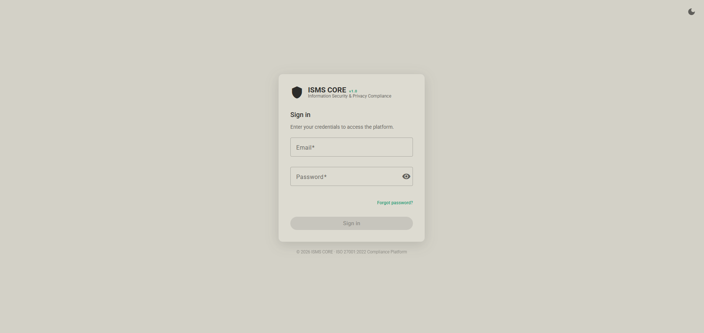
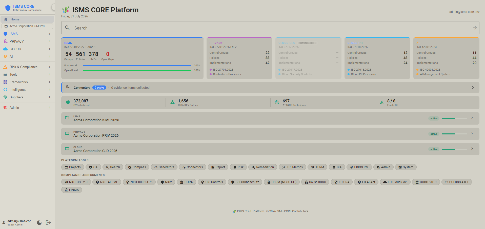
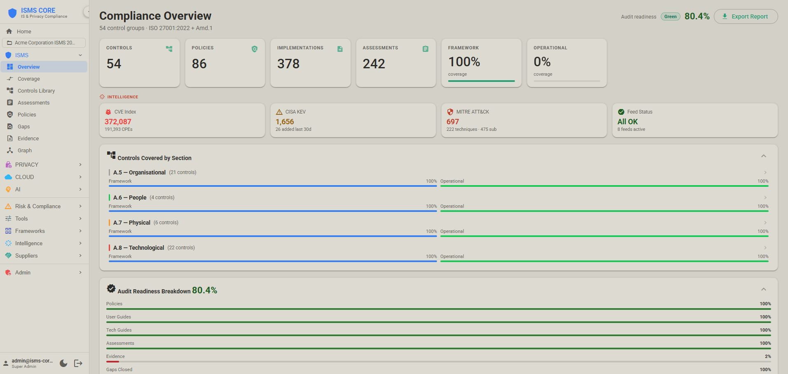
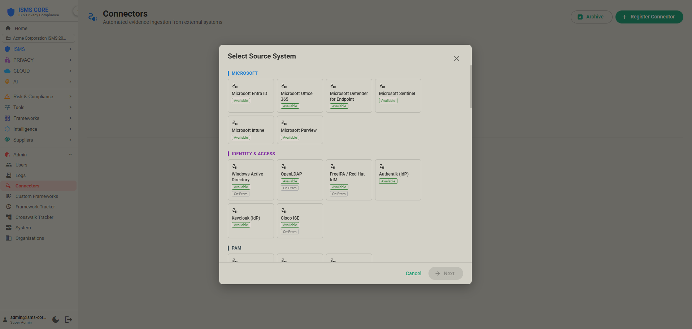
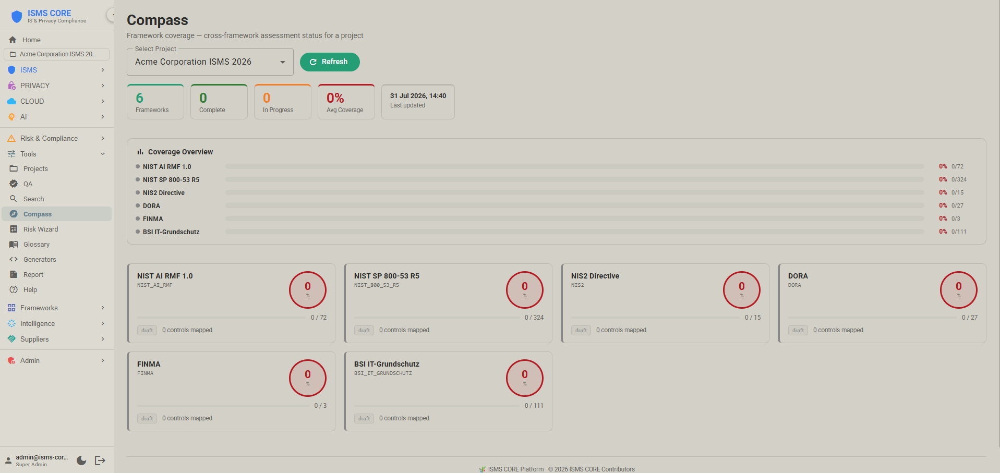
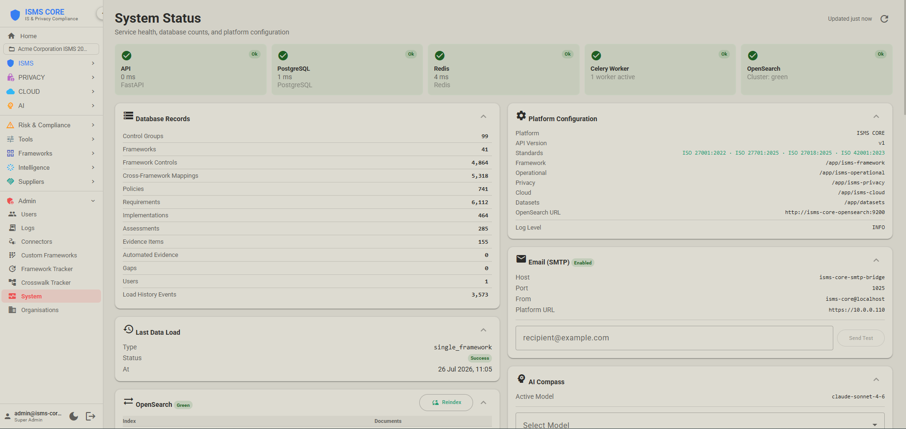
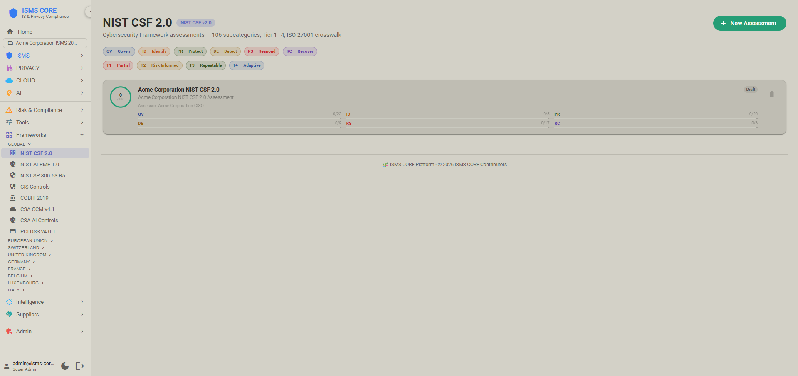
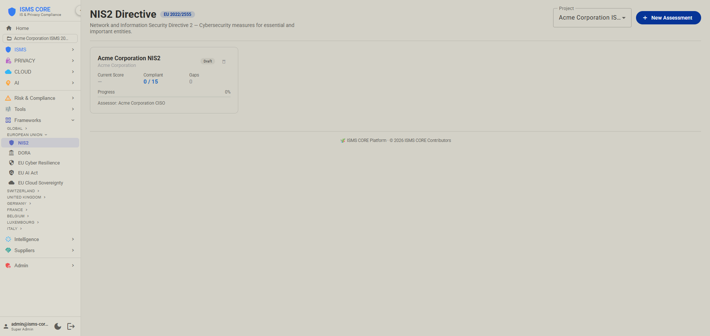

<p align="center">
  
</p>

<h1 align="center">🎋 ISMS CORE Platform</h1>

<p align="center"><a href="PLATFORM.md">English</a> · <a href="PLATFORM.zh-TW.md">繁體中文</a> · <strong>简体中文</strong></p>

<p align="center">
  <strong>生产部署指南 — API、WebUI 与连接器层</strong>
</p>

<p align="center">
  
  
  
  
  
  
</p>

<p align="center">
  <em>五项产品。一个平台。全数上线。</em>
</p>

---

> **⚠️ 请先读这段 —— IKEA 说明书警告 ⚠️**
>
> 这是部署说明书。请从头读到尾。不要跳过步骤。不要即兴发挥。
>
> 如果你今晚就要部署，请依序执行步骤 0 到 6。**上线检查表**在本文件最后。
>
> 最常见的失败模式，是在堆叠完全启动前就执行 `bootstrap.sh`，或是干脆整段跳过。两种都会把事情搞坏。请读步骤 4。

---

## 什么是 ISMS CORE Platform？

ISMS CORE Platform 是**API 与 WebUI 层**，把 ISMS CORE 各项产品（框架、运营、隐私、云端 PII、云端安全、AI）转化为一套即时运作的合规管理系统。政策、评估工作簿与实施指南是内容 —— Platform 则是引擎，负责导入、关联并呈现这些内容，形成涵盖 ISO 27001:2022、ISO 27701:2025、ISO 27018:2025、ISO 27017:2026 与 ISO 42001:2023 的统一运营仪表板。

**没有 Platform：** 你手上只有磁碟里的政策档案与 Excel 工作簿。漂亮的纸上作业。

**有了 Platform：** 你拥有的是一套即时运作的合规系统 —— 可搜寻、可评分、可追踪缺口、可连结证据、可供审计，而且（搭配连接器）由真实基础设施持续自动喂入证据。

> Platform 是加值项。本储存库出货的六项内容产品（框架、运营、隐私、云端 PII、云端安全、AI）没有它也能完美运作。Platform 是给需要持续合规管理、而非定期翻档案检视的团队所用的运营层。

---

## 架构

### 十项服务堆叠

```
                        ┌────────────────────────────────────────────────┐
  用户端                │            ISMS CORE Platform                   │
  (浏览器)              │                                                  │
      │                 │  ┌──────────────────────────────────────────┐   │
      ▼                 │  │  isms-core-nginx（连接埠 80 + 443）      │   │
  https://{HOST_IP} ────┼─►│  TLS 终止 + 反向代理                    │   │
                        │  │  / → 前端  /api/ → 后端                  │   │
                        │  └──────────┬───────────────┬───────────────┘   │
                        │             │               │                    │
                        │             ▼               ▼                    │
                        │  ┌──────────────┐  ┌──────────────────┐        │
                        │  │ isms-core-   │  │  isms-core-      │        │
                        │  │ frontend     │  │  backend         │        │
                        │  │ Angular 22   │  │  FastAPI         │        │
                        │  │ + Material 3 │  │  + SQLAlchemy    │        │
                        │  └──────────────┘  └────┬──────┬──────┘        │
                        │                         │      │                 │
                        │             ┌───────────┘      │                 │
                        │             ▼                  ▼                 │
                        │  ┌──────────────┐  ┌──────────────────┐        │
                        │  │ isms-core-   │  │  isms-core-      │        │
                        │  │ postgres     │  │  redis           │        │
                        │  │ PostgreSQL18 │  │  Redis 8         │        │
                        │  └──────────────┘  └────┬─────────────┘        │
                        │                         │                        │
                        │             ┌───────────┘                        │
                        │             ▼                                     │
                        │  ┌──────────────┐  ┌──────────────────┐        │
                        │  │ isms-core-   │  │  isms-core-beat  │        │
                        │  │ worker       │  │  Celery Beat     │        │
                        │  │ Celery Worker│  │  （夜间工作）    │        │
                        │  └──────────────┘  └──────────────────┘        │
                        │                                                  │
                        │  ┌──────────────────────────────────────────┐   │
                        │  │  isms-core-opensearch（内部）            │   │
                        │  │  全文搜寻（政策／IMP）                   │   │
                        │  │  + nvd-cve / nvd-cpe + 证据索引          │   │
                        │  └────────────────────┬─────────────────────┘   │
                        │                       │                          │
                        │             ┌─────────┴─────────┐               │
                        │             ▼                   ▼               │
                        │  ┌──────────────────┐  ┌──────────────────┐   │
                        │  │ isms-core-feeds  │  │ isms-core-       │   │
                        │  │ 威胁情报         │  │ 连接器           │   │
                        │  │ MITRE · KEV ·    │  │ 44 个证据        │   │
                        │  │ EPSS · NVD CVE · │  │ 连接器           │   │
                        │  │ ENISA EUVD · EDB │  │                  │   │
                        │  └──────────────────┘  └──────────────────┘   │
                        └────────────────────────────────────────────────┘
```

### 服务

| 容器 | 技术 | 角色 |
|-----------|-----------|------|
| `isms-core-nginx` | nginx (Alpine) | 反向代理 —— TLS 终止，将 `/api/` 导向后端、`/` 导向前端。连接埠 80 + 443。 |
| `isms-core-backend` | FastAPI 0.109+ | REST API、身份验证（JWT）、业务逻辑、导入协调。仅限内部 —— 由 nginx 代理。 |
| `isms-core-frontend` | Angular 22 + Material 3 | WebUI —— 仪表板、控制措施浏览器、证据管理。仅限内部 —— 由 nginx 代理。 |
| `isms-core-postgres` | PostgreSQL 18 Alpine | 主要数据存放区 —— 所有合规数据。仅限内部（生产环境不对外开放连接埠）。 |
| `isms-core-redis` | Redis 8 Alpine | 工作阶段缓存 + Celery 任务代理。仅限内部。 |
| `isms-core-opensearch` | OpenSearch 3.x | 对政策与 IMP 内容的全文搜寻 + NVD CVE/CPE 索引。仅限内部。 |
| `isms-core-worker` | Celery 5.3 | 背景任务 —— 导入、同步、合规重算。伫列：`isms`。 |
| `isms-core-beat` | Celery Beat | 计划工作 —— 每日 02:00 UTC 的夜间证据封存；每日 06:00 UTC 的 KPI 快照。无健康检查（设计如此）。 |
| `isms-core-feeds` | Python 3.12 + schedule | 威胁情报计划器 —— MITRE ATT&CK、MITRE ATLAS、CISA KEV、VulnCheck KEV、FIRST EPSS、NVD CVE/CPE、ENISA EUVD、Exploit-DB（每日约 52K 笔漏洞利用）。写入 Postgres 与 OpenSearch。环境变数：`FEEDS_CVE_ENABLED`、`FEEDS_CPE_FULL`、`FEEDS_EUVD_ENABLED`、`FEEDS_VULNCHECK_ENABLED`、`NIST_API_KEY`、`VULNCHECK_API_KEY`。 |
| `isms-core-threat-intel` | Python 3.12 + schedule | **选用**（透过 `COMPOSE_PROFILES=...,threat-intel` 启用）OSINT IOC 情报来源容器 —— 12 个来源：CIRCL MISP、Botvrij MISP、AbuseIPDB、URLhaus、ThreatFox、SSLBL、AlienVault OTX、Red Flag Domains、Stopforumspam、MalwareBazaar、Feodo Tracker、Malpedia。VirusTotal 增补（选用）。随选触发服务器位于连接埠 9002。环境变数：`THREAT_INTEL_ENABLED`、`ABUSEIPDB_API_KEY`、`OTX_API_KEY`、`MALWAREBAZAAR_API_KEY`、`VT_API_KEY`、`SHODAN_API_KEY`、`TI_MISP_IMPORT_FROM_DATE`。 |
| `isms-core-connectors` | Python 3.12 | 自动化证据执行器 —— 动态载入全部 44 个连接器，将证据推送至 `connector_evidence` 数据表。环境变数：`CONNECTORS_WORKER_SECRET`。 |
| `isms-core-backup` | offen/docker-volume-backup v2 | **选用**（透过 `COMPOSE_PROFILES=...,backup` 启用）每日磁碟区备份 —— 将 `postgres-data`、`garage-meta`、`garage-data` 封存到主机上的 `BACKUP_ARCHIVE_PATH`。以 cron 执行（预设 03:30 UTC），会短暂停止 postgres 以确保一致性。设置档：`backup.env`。无健康检查（设计如此）。 |

> **生产环境访问：** 透过 nginx 使用 `https://{HOST_IP}`。请勿直接访问 `:3000` 或 `:8000` —— 这些连接埠在生产环境并未开放。

---

> **部署设置档 — 设在 `.env`，不在命令列**
>
> `.env` 里的 `COMPOSE_PROFILES` 决定哪些服务群组会启用。Docker Compose 会自动读取 —— 命令列不需要任何 `--profile` 旗标。在 `.env.example` 中挑一行 `COMPOSE_PROFILES`，取消注解，`docker compose up -d` 就能直接运作。
>
> | `COMPOSE_PROFILES` 值 | 会启动什么 |
> |---|---|
> | `opensearch-single` | 标准堆叠（预设） |
> | `opensearch-single,threat-intel` | + OSINT IOC 情报来源 —— 另须设置 `THREAT_INTEL_ENABLED=true` |
> | `opensearch-single,dashboards` | + 连接埠 5601 上的 OpenSearch Dashboards |
> | `opensearch-single,garage` | + Garage S3 对象储存 |
> | `opensearch-single,mailpit` | + Mailpit 本机邮件拦截器（仅限开发） |
> | `opensearch-single,smtp-bridge` | + Microsoft 365 SMTP 中继 |
> | `opensearch-single,backup` | + 每日自动磁碟区备份（请先设置 `backup.env`） |
> | `opensearch-single,threat-intel,dashboards,smtp-bridge,backup` | 完整标准堆叠 + OSINT IOC 情报来源 —— 另须设置 `THREAT_INTEL_ENABLED=true` |
> | `opensearch-cluster,garage,dashboards,threat-intel,smtp-bridge,backup` | 完整企业堆叠 + OSINT IOC 情报来源 —— 另须设置 `THREAT_INTEL_ENABLED=true` |
>
> **`opensearch-single` 与 `opensearch-cluster` 互斥 —— 永远只能包含其中一个。**
>
> **证据储存后端（`EVIDENCE_STORE`）：** 预设为 `postgres`。设为 `opensearch` 时，证据会改经 OpenSearch 传送，档案存放于 Garage S3 —— 需要 `garage` + `opensearch-cluster` 设置档。

---

### 数据模型

| 实体 | 描述 |
|--------|-------------|
| **控制群组** | 100 个群组 —— 54 个 ISMS（ISO 27001）、21 个隐私（ISO 27701）、12 个云端 PII（ISO 27018）、1 个云端安全（ISO 27017）、12 个 AI（ISO 42001） |
| **政策** | POL、OP-POL、PRIV-POL、CLD-POL、CLD-SEC-POL、AI-POL、INS、REF、CTX、FORM —— 具型别、标记产品、追踪状态 |
| **实施** | IMP-UG/TG 文件，已索引至 OpenSearch 以供全文搜寻 |
| **评估** | Excel 工作簿内容：工作表、项目、逐项合规状态；框架、运营、隐私、云端 PII、云端安全与 AI 检查表 |
| **缺口** | 已识别的合规缺口，含严重性、拥有者、SLA 与矫正追踪 |
| **证据** | 连结至控制群组与评估项目的证据项目 —— 手动上传 + 连接器自动导入 |
| **连接器证据** | 来自连接器的自动化证据 —— 含时间戳、已分类、标记来源 |
| **框架** | 39 个参考数据集：ISO 27001、NIST CSF 2.0、NIST AI RMF 1.0、MITRE ATT&CK v19、GDPR、DORA、NIS2、CIS Controls v8、BSI IT-Grundschutz Kompendium、TISAX/VDA ISA 6.0、Swiss nDSG 2023、Swiss ISG (SR 128)、EU CRA 2024、EU AI Act、CyberFundamentals BE、BaFin BAIT DE、CSSF 20-750 LU、ACN IT、UK NIS、UK Operational Resilience、NCSC CAF v4.0、ReCyF v2.5（法国 NIS2）、FINMA、COBIT 2019，以及更多 |
| **对照映射** | 跨框架关联：4,671 个对象 / 59 条轴线 —— 包括 ISO 27001 ↔ MITRE ATT&CK v19（36）、ISO 27001 ↔ FINMA（73）、ISO 27001 ↔ OWASP ASVS 5.0（22）、NIST SP 800-53 R5 ↔ MITRE ATT&CK v19（590）、BSI IT-Grundschutz（ISO 27001 ↔ BSI：386，ISO 27701 ↔ BSI：101，ISO 27018 ↔ BSI：51）、NCSC CAF v4.0（41）、ReCyF v2.5 / FR NIS2（20）、Swiss ISG（27）、ISO 27017 ↔ CSA CCM v4.1/NIST CSF 2.0/FINMA/ISO 27001/DORA/NIS2（37），以及欧盟各国框架（CyberFundamentals BE：107，BaFin BAIT：69，CSSF LU：47，ACN IT：43，UK NIS：51，UK Op. Resilience：34） |
| **NIST CSF 2.0 设置档** | 具名评估设置档 —— 全部 106 项子类别的等级 1–4 评分、依功能计分、缺口分析、XLSX 导入／导出 |
| **合规评估** | 29 个框架 —— 完整涵盖范围请见 [COMPLIANCE.zh-CN.md](COMPLIANCE.zh-CN.md) |
| **项目** | 工作区层 —— 具名项目拥有精选的政策、实施、评估、缺口与证据子集；新增时套用文件变数替换（组织名称、CISO、生效日期）；具作用中／停用／草稿／已封存的生命周期 |
| **系统事件日志** | 平台每项动作的不可变轨迹（谁、做了什么、何时、资源） |
| **威胁情报** | 情报来源执行记录、CISA KEV 条目、VulnCheck KEV 条目（独立数据表 —— 涵盖范围比 CISA 更广，约 67% 的条目不在 CISA KEV 中）、EPSS 分数、MITRE 技术、ENISA EUVD 条目、Exploit-DB 交互参照。NVD CVE（约 250K 份文件）与 CPE（约 50-100K 份文件）储存于 OpenSearch 索引 `nvd-cve` / `nvd-cpe`，并在索引时以 EPSS + KEV + VulnCheck KEV + EUVD + Exploit-DB 交互增补（比对到的 CVE 会加上 `edb_id`、`edb_verified`、`edb_description`、`in_vulncheck_kev` 字段）。支持 CVSS 4.0。OSINT IOC 情报来源（12 个来源）：CIRCL MISP + Botvrij MISP（120K+ IOC）、AbuseIPDB 黑名单、URLhaus、ThreatFox、SSLBL、AlienVault OTX（带 TLP 标签与信心分数的 pulses）、Feodo Tracker、Red Flag Domains、Stopforumspam、MalwareBazaar、Malpedia（恶意程序家族 + 威胁行为者）—— 全部索引至各来源专属的 OpenSearch 索引，并在导入时以 ATT&CK TID、家族代号、行为者代号与 TLP 标签交互增补。VirusTotal 增补每日更新 IOC 信心分数；GreyNoise 在 IP 增补页面提供随选的 IP 杂讯分类（免费方案每周 50 次查询，仅限手动查询）。 |

---

## 平台画面

<table>
<tr>
<td align="center"><strong>登录</strong><br/></td>
<td align="center"><strong>首页 — 产品仪表板</strong><br/></td>
</tr>
<tr>
<td align="center"><strong>合规概览</strong><br/></td>
<td align="center"><strong>连接器 — 自动化证据</strong><br/></td>
</tr>
<tr>
<td align="center"><strong>ISMS Compass — AI 缺口分析</strong><br/></td>
<td align="center"><strong>系统状态</strong><br/></td>
</tr>
<tr>
<td align="center"><strong>NIST CSF 2.0 评估</strong><br/></td>
<td align="center"><strong>NIS2 指令评估</strong><br/></td>
</tr>
</table>

---

## 功能

| 功能 | 描述 |
|---------|-------------|
| **控制措施浏览器** | 浏览全部 99 个控制群组（ISMS + 隐私 + 云端 + AI），含合规分数、政策状态、评估历程 |
| **合规仪表板** | 四项产品的汇总分数与章节拆解；ISMS／隐私／云端／AI 产品切换器 |
| **涵盖热图** | 依控制群组与章节呈现的政策与评估涵盖范围 |
| **政策管理员** | 浏览、筛选、预览并管理所有 POL/OP-POL/PRIV-POL/CLD-POL/AI-POL/INS/REF/CTX 文件 |
| **评估追踪器** | 框架（188 个工作簿）、运营（53 份检查表）、隐私（21）、云端（12）、AI（10），含逐项合规状态 |
| **缺口管理** | 完整缺口生命周期：建立、指派、追踪、结案 —— 严重性、SLA 监控、BSI 200-3 自动风险计算器（可能性 × 影响 → 风险等级，依 ISO 章节预先映射的威胁代码） |
| **证据追踪器** | 具到期追踪、验证状态与新鲜度警示的证据项目 |
| **连接器** | 从 44 个系统自动导入证据 —— 来自真实基础设施的持续合规讯号 |
| **夜间证据封存** | Celery Beat 工作每日 02:00 UTC 封存过期的连接器证据 |
| **对照检视器** | 跨框架映射：4,671 个对象 / 59 条轴线 —— ISO 27001 ↔ NIST CSF ↔ MITRE ATT&CK v19 ↔ GDPR ↔ DORA ↔ BSI IT-Grundschutz ↔ FINMA ↔ OWASP ASVS 5.0 ↔ NCSC CAF ↔ ReCyF v2.5，以及更多 |
| **QA／存在性检查器** | 验证所有预期产出是否齐备（框架、运营、隐私、云端 PII、云端安全、AI） |
| **系统事件日志** | 平台所有动作的完整审计日志 |
| **管理面板** | 用户管理（CRUD）、系统信息、服务健康状态、数据库统计、导入触发 |
| **全文搜寻** | 透过 OpenSearch 搜寻所有政策与 IMP 文件内容（可依产品筛选） |
| **ISMS Compass** | 对照 ISMS CORE 黄金标准的 AI 缺口分析（需要 `ANTHROPIC_API_KEY`） |
| **合规评估套件** | 29 个合规框架，具评估、计分、缺口追踪与导出。请见 [COMPLIANCE.zh-CN.md](COMPLIANCE.zh-CN.md)。 |
| **NIST CSF 2.0 评估** | 6 项功能（含 GV — 治理）下的 106 项子类别、等级 1–4 评分、雷达图 + 长条图、可从官方 NIST 模板导入 XLSX、导出 XLSX/CSV |
| **NIS2 评估** | EU 2022/2555 —— 第 21(2) 条的 10 项安全措施 + 第 23 条的 5 项通报义务，成熟度 0–4 |
| **DORA 评估** | EU 2022/2554 —— 5 大支柱（ICT 风险、事件通报、韧性测试、第三方风险、信息分享）下的 27 条条文，成熟度 0–4 |
| **CIS Controls v8 评估** | 18 项控制措施下的 153 项防护措施，成熟度 0–4 |
| **BSI IT-Grundschutz 评估** | 10 个层级下的全部 111 个 Bausteine，成熟度 0–4。搭配横跨三项 ISO 标准的 538 笔对照映射。 |
| **CSRM 评估（NCSC CH）** | 自定义的对象导向模块 —— IT Protection Objects、20 项 NIST CSF 2.0 基准要求、二元状态、6 项控制目标 |
| **TISAX 评估** | VDA ISA 6.0 —— 9 个领域下的 79 项要求，成熟度 0–4 |
| **Swiss ISG 评估（SR 128）** | 瑞士联邦信息安全法 2024 —— 27 项要求、24 小时内向 BACS/OFCS 通报网络攻击（Art. 74e），成熟度 0–4；ISO 27001 对照：40 笔映射 |
| **Swiss nDSG 评估** | 瑞士联邦数据保护法 2023 —— 6 章下的 25 项条款，成熟度 0–4 |
| **EU 网络韧性法评估** | EU 2024/2847 —— 6 个群组下的 26 项基本要求，成熟度 0–4 |
| **EU AI Act 评估** | EU 2024/1689 —— 第三章高风险 AI 系统要求中的 9 条条文（Art. 8–15、Art. 27），成熟度 0–4 |
| **NIST AI RMF 1.0 评估** | 4 项功能（GOVERN、MAP、MEASURE、MANAGE）下的 72 项子类别，成熟度 0–4；ISO 42001 对照：32 笔映射，EU AI Act：31 笔映射 |
| **EU 云端主权框架** | 8 项主权目标（SOV-1 至 SOV-8）、SEAL-0 至 SEAL-4 评分、加权主权分数 |
| **COBIT 2019 评估** | 40 项治理／管理目标，能力评分 0–4 |
| **CyberFundamentals（BE）** | 41 项对齐 NIST CSF 2.0 的实务，成熟度 0–4；ISO 27001 对照：107 笔映射 |
| **BaFin BAIT（DE）** | Rundschreiben 10/2017（2021 修订）—— 12 个模块下的 23 项要求，成熟度 0–4；ISO 27001 对照：69 笔映射 |
| **CSSF 20-750（LU）** | ICT 风险 —— 7 个领域下的 19 项要求，成熟度 0–4；ISO 27001 对照：47 笔映射 |
| **ACN 指南（IT）** | Determinazione obblighi di base（2025 年 4 月）—— 37 项措施／87 项要求（Important）或 43 项措施／116 项要求（Essential），成熟度 0–4；ISO 27001 对照：43 笔映射 |
| **UK NIS 评估** | UK NIS Regulations 2018 —— 3 项目标下的 13 项要求，成熟度 0–4；ISO 27001 对照：51 笔映射 |
| **UK 运营韧性** | FCA/PRA PS21/3 + PS26/2 —— 4 项目标下的 12 项要求，成熟度 0–4；ISO 27001 对照：34 笔映射 |
| **NCSC CAF v4.0 评估** | 英国 NCSC 网络评估框架 v4.0 —— 14 项原则与 4 项目标下的 41 项贡献结果；未达成／部分达成／已达成；ISO 27001 对照：65 笔映射 |
| **ReCyF v2.5 评估（法国 NIS2）** | ANSSI ReCyF v2.5 —— 4 大支柱（Gouvernance / Protection / Défense / Résilience）下的 20 项安全目标、152 项要求；法国待通过的 NIS2 转换法；ISO 27001 对照：50 笔映射 |
| **评估集合** | 将多个评估组成具名集合，并附衍生统计（完成率 %、合规率 %、状态汇总）。可导出为 CSV、彩色标记的 XLSX 或 PDF（A4）。 |
| **项目工作区** | 建立具名项目 —— 拥有、编辑并追踪从文件库精选的政策与实施。所见即所得编辑、文件变数替换、批次操作、SCR 检查表、完整性计分。 |
| **文件编辑器** | TipTap v3 所见即所得 + 原始码切换；网格表格自动转换（RST → GFM）；中继数据注解剥除 |
| **连接器证据晋升** | 将自动化的连接器证据晋升至证据追踪器，范围限定于作用中的项目 |
| **可收合侧边栏** | Azure Portal 风格的纯图示侧边栏 —— 可收合为 52 px 的长条、完整工具提示、状态保存在 localStorage |
| **RBAC** | 角色型访问：超级管理员／管理员／ISMS 经理／审计员／控制措施拥有者／检视者 |
| **批准流程** | 内容状态生命周期：草稿 → 审查 → 已批准 → 已发布 |
| **风险登录表** | 项目范围的风险情境，含 5×5 可能性／影响矩阵与视觉化风险热图 |
| **风险热图** | 彩色标记的 5×5 网格 —— 一眼掌握所有风险，可深入任一格 |
| **矫正 + ITSM 推送** | 风险接受签核 + 含 ETA、成本、工作量、进度的行动计划；幂等地推送至 Jira／ServiceNow；工单状态同步 |
| **KPI 仪表板** | 9 项具名指标：`compliance_score`、`policy_coverage`、`risk_score_avg`、`risk_critical_count`、`evidence_freshness`、`gap_open_count`、`gap_closure_rate`、`remediation_overdue`、`audit_readiness`；走势图 |
| **审计准备度分数** | 由全部 9 项 KPI 指标衍生的复合主分数 |
| **指标组合** | `super_admin` 可在单一检视中查看所有组织的 KPI 指标 |
| **TPRM** | 供应商登记表，含关键性评级；DORA ICT 服务字段；供应商评估；含到期警示的合同追踪；专属的 DORA 登录表检视 |
| **BIA** | 运营影响分析 —— 具 RTO/RPO/MTPD 时数的资产记录；财务、运营、声誉与法规影响分数；恢复测试追踪 |
| **EBIOS RM** | 完整的 ANSSI 五场工作坊风险方法论 —— 重大事件、风险来源、策略情境（可能性 × 严重度矩阵）、对应 MITRE ATT&CK 技术的攻击路径 |
| **自定义框架导入** | 以 YAML 上传自定义或特定产业的框架；透过 `iso_mappings` 自动对应至 ISO 27001；显示涵盖率 % |
| **国家在地化** | 政策呈现会依 8 个司法管辖区调整法规引用：CH（预设）、FR、BE、LU、DE、AT、IT、GB —— 于请求时依 `org.country` 套用 |
| **跨框架涵盖** | 以 BFS 推论将 ISO 27001 评估涵盖范围映射至 NIS2、DORA 与 GDPR；提供映射矩阵与推论涵盖两个分页 |
| **MFA** | 以 TOTP 为基础的 2FA —— 相容于 Google Authenticator／Authy；QR 码设置；8 组单次备用码；输入 6 位数后自动送出 |
| **威胁情报情报来源** | 两个专责容器，拉取 21+ 个来源。`isms-core-feeds`（9 个）：MITRE ATT&CK v19（每周 —— 697 项技术、15 项战术）、MITRE ATLAS（每周）、CISA KEV（每日）、VulnCheck KEV（每日 —— VulnCheck 自有、涵盖更广的 KEV 目录；约 67% 的条目不在 CISA 的目录中）、FIRST EPSS（每日 —— 10K 上限，每日同步 OpenSearch）、NVD CVE 全量+增量（每周／每日 —— 约 250K 笔 CVE，支持 CVSS 4.0）、NVD CPE Option B（每周）、ENISA EUVD（每日 —— 已遭利用 + 重大 CVE）、Exploit-DB（每日 —— 约 52K 笔漏洞利用条目，以 CVE ID 交互参照至 NVD CVE；在 CVE 浏览器中加入 EDB 标签 + Metasploit 徽章）。`isms-core-threat-intel`（选用设置档，12 个来源）：CIRCL MISP + Botvrij MISP（每 6 小时增量，120K+ IOC）、AbuseIPDB（每日）、URLhaus（每日 —— 恶意程序 URL）、ThreatFox（每 6 小时 —— 恶意程序 IOC）、SSLBL（每日 —— 恶意 SSL 凭证指纹）、AlienVault OTX（每日 —— 带 TLP 标签与信心分数的 pulses）、Red Flag Domains（每日）、Stopforumspam（每日）、MalwareBazaar（每 6 小时 —— 恶意程序哈希）、Feodo Tracker（每 6 小时 —— C2 僵尸网络 IP）、Malpedia（每周 —— 恶意程序家族 + 行为者）。VirusTotal 增补（每日 —— 选用，更新 IOC 信心分数）。GreyNoise（仅随选 IP 查询，`isms-core-backend` —— 非计划情报来源，免费方案每周 50 次查询）。所有 OSINT IOC 在导入时以 ATT&CK TID、家族代号、行为者代号、TLP 标签交互增补。 |
| **CVE / CPE 浏览器** | 依严重性、EPSS 分数、CVSS 版本（v2/v3/v4）、年份、仅 KEV、仅 VulnCheck、EUVD 标记、仅 EDB（Exploit-DB 交互参照筛选）搜寻并筛选约 250K 笔 NVD CVE 条目。详细面板：CVSS 分数（v2/v3/v4）、CPE 适用性、CWE、NVD 参照、CISA KEV 徽章、VulnCheck KEV 徽章（独立于 CISA 的）、EUVD 徽章、EDB/EDB✓ 标签（当 `edb_verified` 时显示 Metasploit 徽章）。另有独立的 CPE 分页。 |
| **EUVD 浏览器** | ENISA 欧洲漏洞数据库 —— 浏览已遭利用与重大漏洞；可依分数筛选，并有仅已遭利用、仅重大、EU 指派（互斥）等切换；详细面板含厂商、产品、EPSS、别名。 |
| **KEV 审计报告（A.8.8）** | 使用 CISA KEV 情报来源的 ISO 27001:2022 A.8.8 审计跟踪 —— 依 CVE 的矫正状态、逐厂商汇总、供审计人员取证用的 CSV 导出。 |
| **威胁暴露** | 将即时 IOC 情报来源中的作用中 MITRE 技术映射至 ISO 27001 控制措施 —— 缺口会标记出来。摘要列：作用中技术 / 受影响控制措施 / 缺口数。逐技术表格含 IOC 数量、来源情报标签，以及彩色标记的控制措施标签（绿色 ≥ 70%、橙色 40–69%、红色 < 40%、灰色 = 未评估）。需在 `COMPOSE_PROFILES` 中包含 `threat-intel`。 |
| **IOC 浏览器** | 依类型（IP / 网域 / URL / 哈希）、来源与自由文本，搜寻并筛选全部 12 个来源（CIRCL MISP、Botvrij MISP、AbuseIPDB、URLhaus、ThreatFox、SSLBL、AlienVault OTX、Red Flag Domains、Stopforumspam、MalwareBazaar、Feodo Tracker、Malpedia）的 OSINT IOC。字段：类型、值、来源、信心、TLP 标签、最后出现时间、归因（家族 / 行为者 / ATT&CK TID 标签）。展开任一列可看含所有标记的完整细节。 |
| **IP 增补** | 针对单一 IP 的随选查询，涵盖五个来源：AbuseIPDB（滥用分数 + 检举次数 + 类别）、Shodan 付费 API（开放连接埠、横幅、CVE、主机名称）或 InternetDB 免费备援、MaxMind GeoLite2（地理位置／ASN）、IPInfo（隐私分类）、GreyNoise（杂讯／扫描器分类 + RIOT 状态）。AbuseIPDB／Shodan 缓存 24 小时；MaxMind／IPInfo／GreyNoise 缓存 30 天（用量较低或配额较严的来源）。 |
| **恶意程序图鉴** | 以 Malpedia 为来源的恶意程序家族浏览器（别名、描述、ATT&CK TID、关联行为者）与威胁行为者名录（国家归因、动机）。 |
| **健康警示横幅** | 当过去 24 小时内任一情报来源执行、连接器同步或 OpenSearch 检查回报错误时，显示可关闭的警示横幅。情报与供应商群组的侧边栏会有红点标记。 |
| **CPE Option B 切换** | 威胁情报来源页面上的管理介面开关，可在执行时启用／停用 NVD CPE Option B。设置储存于 `platform_settings` 数据表，会覆写环境变数。 |
| **仪表板情报卡片** | 仪表板上的四张可点击摘要卡：CVE 索引数量、CISA KEV 总数、MITRE ATT&CK 状态、情报来源健康状态。 |
| **项目范围的风险／缺口／证据** | 风险情境、缺口与证据项目都以作用中的项目为范围 —— 切换项目即切换脉络 |

---

## 生产部署 —— 逐步操作

### 步骤 0 — 前置条件

**软件：**
```bash
docker --version          # 必须为 24.0 或更高
docker compose version    # 必须为 v2.x（不是旧版 docker-compose v1）
```

若任一指令失败，请安装 Docker Desktop（macOS/Windows）或 Linux 版 Docker Engine。

**硬件（生产环境最低需求）：**
- 记忆体：6 GB 可用（OpenSearch 约 1.5 GB、后端约 512 MB、前端约 256 MB、Postgres 约 512 MB）
- 磁碟：20 GB 可用
- CPU：最少 2 核心，建议 4 核心

**仅限 Linux —— OpenSearch 核心参数需求：**

```bash
# 立即生效：
sudo sysctl -w vm.max_map_count=262144

# 重开机后仍保留：
echo "vm.max_map_count=262144" | sudo tee -a /etc/sysctl.conf
```

macOS 与 Windows 的 Docker Desktop 会自动处理 —— 无须任何操作。

---

### 目录结构

平台预期 ISMS CORE 内容储存库与平台目录**并排**放置：

```
/your/base/directory/
├── factory_isms/
│   ├── isms-core-platform/          ← docker-compose.yml 放在这里
│   ├── isms-core-framework/         ← FRAMEWORK 内容（以唯读方式挂载）
│   ├── isms-core-operational/       ← OPERATIONAL 内容（以唯读方式挂载）
│   ├── isms-core-privacy/           ← PRIVACY 内容 — ISO 27701:2025（以唯读方式挂载）
│   ├── isms-core-cloud/             ← CLOUD 内容 — ISO 27018:2025（以唯读方式挂载）
│   └── isms-core-ai/                ← AI 内容 — ISO 42001:2023（以唯读方式挂载）
```

`docker-compose.yml` 会将全部五个产品目录以唯读磁碟区挂载。平台永远不会修改这些档案。

---

### 步骤 1 — 将档案复制到服务器

```bash
# 请在你的开发机上执行：
rsync -av \
  --exclude='.env' \
  --exclude='__pycache__' \
  --exclude='*.pyc' \
  --exclude='.git' \
  --exclude='node_modules' \
  --exclude='certs' \
  /path/to/factory_isms/isms-core-platform/ \
  user@server:/home/user/isms-core/

ssh user@server
cd /home/user/isms-core
```

---

### 步骤 2 — 建立 .env

```bash
cp .env.example .env
```

编辑 `.env` —— 最低必要设置。请用下列指令产生每个密钥：
```bash
python3 -c "import secrets; print(secrets.token_hex(32))"
```

```env
# 部署模式 —— Docker Compose 会自动读取；不需要 --profile 旗标。
# 以下预设值适用于大多数部署。所有选项请见 .env.example。
COMPOSE_PROFILES=opensearch-single
# COMPOSE_PROFILES=opensearch-single,threat-intel      # ⚠ 另须设置 THREAT_INTEL_ENABLED=true
# COMPOSE_PROFILES=opensearch-cluster,garage,dashboards,threat-intel  # 企业版

# 主机
HOST_IP=10.0.0.112                    # 必填 —— 你的服务器 IP
FQDN=                                 # 选填 —— 使用 Let's Encrypt TLS 时设置
PLATFORM_URL=https://10.0.0.112       # 必填 —— 须与上方 HOST_IP 一致
CORS_ORIGINS=https://10.0.0.112       # 必填 —— 须与上方 HOST_IP 一致

# 密钥 —— 用上方指令逐一产生
POSTGRES_PASSWORD=                    # 必填
REDIS_PASSWORD=                       # 必填
SECRET_KEY=                           # 必填 —— 至少 32 个字符的随机十六进位
CONNECTORS_WORKER_SECRET=             # 必填 —— 与 SECRET_KEY 相同方式产生

# 管理员账户
ADMIN_EMAIL=admin@isms-core.dev
ADMIN_PASSWORD=                       # 必填 —— 无预设值；留空则平台拒绝启动
```

> **`ADMIN_PASSWORD` 没有预设值。** 若留空，管理员账户不会被建立，你也无法登录。
>
> 所有选填设置请见 `.env.example`：AI／Compass 密钥、电子邮件、TI API 密钥、NVD 情报来源、OpenSearch 调校与 Garage S3。

---

### 步骤 3 — 启动堆叠

```bash
docker compose up -d
```

> `.env` 里的 `COMPOSE_PROFILES` 会告诉 Docker Compose 要启动哪些服务。预设值（`opensearch-single`）已在 `.env.example` 中启用。命令列不需要任何 `--profile` 旗标。

首次执行会拉取所有映像档（没有本机建置步骤 —— 后端／前端等都以预先建置好的映像档从 GHCR/Docker Hub 出货）。视连线速度而定，这需要 **3–5 分钟**。之后重启约需 60 秒。

```bash
docker compose logs -f    # 观看进度（按 Ctrl+C 停止观看）
docker compose ps         # 检查所有容器
```

预期输出 —— 所有容器都显示 `healthy` 或 `Up`：

```
NAME                        STATUS
isms-core-nginx             Up (healthy)
isms-core-backend           Up (healthy)
isms-core-frontend          Up (healthy)
isms-core-postgres          Up (healthy)
isms-core-redis             Up (healthy)
isms-core-opensearch        Up (healthy)
isms-core-worker            Up (healthy)
isms-core-connectors        Up (healthy)
isms-core-feeds             Up (healthy)
isms-core-beat              Up
```

> `isms-core-beat` 显示 `Up` 而没有 `(healthy)` —— 这是正常的。Celery Beat 没有 HTTP 端点。
> 若 `backup` 设置档已启用，`isms-core-backup` 也会显示为 `Up`（无健康检查 —— 它依 cron 计划执行）。

**Alembic 迁移会自动执行。** 后端在启动时透过 `entrypoint.sh` 套用所有待处理的迁移。不需要手动执行 `alembic upgrade head`。

---

### 步骤 4 — 载入内容

#### 选择性载入 —— 只挂载你需要的部分

```yaml
# docker-compose.yml —— 只挂载你想要的产品
volumes:
  - ../isms-core-framework:/app/isms-framework:ro
  - ../isms-core-operational:/app/isms-operational:ro
  # - ../isms-core-privacy:/app/isms-privacy:ro       # 注解掉 = 不导入
  # - ../isms-core-cloud:/app/isms-cloud:ro
  # - ../isms-core-ai:/app/isms-ai:ro
  - ../isms-core-external:/app/isms-external:ro       # 选填 —— 你自己的文件
```

第五个挂载点 —— `isms-core-external` —— 可放入你既有的政策文件，供 ISMS Compass 对照 ISMS CORE 黄金标准做缺口分析。

#### 选项 A —— bootstrap.sh（首次部署建议使用）

`bootstrap.sh` 是一次性脚本，会：
1. 等待堆叠进入健康状态
2. 以管理员身份验证
3. 植入所有 ISMS 控制群组
4. 依序导入所有政策、实施、内容与工作簿
5. 触发 OpenSearch 完整重建索引
6. 完成后印出导入统计

```bash
chmod +x bootstrap.sh
bash bootstrap.sh
```

这需要 **3–5 分钟**。请勿中断。

> **bootstrap.sh 可安全重复执行**，任何时候都行。它不会产生重复数据。

#### 选项 B —— 管理 WebUI（逐步操作）

以管理员身分登录 → **管理 → 首次执行设置**。由上而下依序执行：

| 步骤 | 按钮 | 作用 |
|------|--------|-------------|
| 1 | **载入参考框架** | 植入控制群组 + 载入全部 37 个参考数据集。**务必先执行。** |
| 2 | **导入政策** | 从已挂载的磁碟区导入所有 POL、OP-POL、PRIV-POL、CLD-POL、REF、CTX、FORM 文件。 |
| 3 | **导入实施（IMP）** | 导入 IMP-UG 与 IMP-TG 文件，并将它们索引至 OpenSearch。 |
| 4 | **导入评估工作簿** | 从生成器脚本解析框架评估工作簿的结构。 |
| 5 | **导入运营检查表** | 解析运营合规检查表的结构。 |
| — | **完整同步（步骤 2–5）** | 依序执行全部四个导入器。步骤 1 必须先单独完成。 |

#### 导入之后 —— 你会看到什么

| 区段 | 内容 |
|---------|-------------|
| **仪表板** | 合规概览、审计准备度分数、主要缺口；ISMS／隐私／云端／AI 产品切换器 |
| **控制措施** | 99 个控制群组（54 ISMS + 21 隐私 + 12 云端 + 12 AI），含政策／评估／缺口状态 |
| **政策** | 已导入的文件（POL + OP-POL + PRIV-POL + CLD-POL + AI-POL + 基础 + REF/CTX/INS） |
| **评估** | 188 个框架 + 53 个运营 + 21 个隐私 + 12 个云端 + 10 个 AI 工作簿结构，含逐项合规状态 |
| **缺口** | 已识别的合规缺口 —— 建立、指派、追踪 |
| **证据** | 上传证据并连结至控制群组与要求 |
| **涵盖** | 框架与运营涵盖范围的热图 |
| **QA** | 存在性检查器 —— 验证全部五项产品的产出完整性 |
| **合规评估** | 29 个框架 —— NIST CSF 2.0、NIS2、DORA、CIS v8、BSI IT-Grundschutz、BSI C5:2026、BSI C3A、TISAX、Swiss nDSG/ISG、EU AI Act、NIST AI RMF、NCSC CAF v4.0、ReCyF v2.5（FR NIS2）、PCI DSS v4.0.1，以及更多 |
| **风险登录表** | 风险登录表 —— 空白，可供输入数据 |
| **KPI 指标** | KPI 仪表板 —— 空白，可供输入数据 |
| **TPRM** | 第三方风险管理 —— 空白，可供输入数据 |
| **BIA** | 运营影响分析 —— 空白，可供输入数据 |
| **EBIOS RM** | EBIOS 风险管理器 —— 空白，可供输入数据 |
| **矫正** | 矫正追踪 —— 已连结至缺口，可供指派 |
| **管理** | 用户管理、系统健康状态、导入控制 |

---

### 步骤 5 — 验证

```bash
docker compose ps
curl -k https://localhost/health
```

预期回应：
```json
{"status":"ok","database":"ok","opensearch":"ok"}
```

开启 `https://{HOST_IP}`，接受自签凭证警告，然后登录。

---

### 步骤 6 — 变更管理员密码

**管理 → 用户 → 编辑管理员用户** —— 把系统交给任何人之前，请先变更密码。

---

### 步骤 7 — 启用 MFA

我们强烈建议在正式上线前，为所有管理员账户启用 MFA。

1. 登录 → 前往 **系统**（管理侧边栏）
2. 在 **安全性** 区段中，点选 **启用 MFA**
3. 用 Google Authenticator、Authy 或任何 TOTP 应用程序扫描 QR 码
4. 输入 6 位数验证码以确认
5. **复制你的 8 组备用码**并妥善保存 —— 它们只会显示一次

之后登录时，输入密码后会要求你提供 6 位数 TOTP 验证码。若你的验证器应用程序遗失，请在登录画面使用备用码。

---

## TLS 凭证选项

### 模式 1 — Let's Encrypt（对外公开时建议使用）

```bash
FQDN=yourdomain.com   # 先在 .env 设置
./nginx/scripts/setup-letsencrypt.sh yourdomain.com admin@yourdomain.com
```

### 模式 2 — 自定义凭证（企业／内部 CA）

1. 将凭证放在 `./certs/cert.pem`，密钥放在 `./certs/key.pem`
2. `docker compose restart isms-core-nginx`

### 模式 3 — 自签（预设，无须设置）

首次开机时自动产生。浏览器会显示安全性警告 —— 对内部部署而言这是预期且无害的。

- **Chrome/Edge：** 进阶 → 继续前往 {HOST_IP}
- **Firefox：** 进阶… → 接受风险并继续
- **Safari：** 显示详细数据 → 前往此网站

---

## 电子邮件设置（选填）

电子邮件预设为停用（`MAIL_HOST` 留空）。若要启用，请在 `.env` 设置 `COMPOSE_PROFILES` 与 `MAIL_HOST`，然后执行 `docker compose up -d`。

### 选项 A — Mailpit（仅限本机测试 —— 切勿用于生产环境）

在 `.env` 中：
```env
COMPOSE_PROFILES=opensearch-single,mailpit
MAIL_HOST=isms-core-mailpit
MAIL_PORT=1025
```

然后执行 `docker compose up -d`。Mailpit 网页介面：`http://{HOST_IP}:8025`

### 选项 B — SMTP 桥接（Microsoft 365 / Exchange Online）

在 `.env` 中：
```env
COMPOSE_PROFILES=opensearch-single,smtp-bridge
MAIL_HOST=isms-core-smtp-bridge
MAIL_PORT=1025
SMTP_BRIDGE_TENANT_ID=<your-tenant-id>
SMTP_BRIDGE_CLIENT_ID=<your-app-client-id>
SMTP_BRIDGE_CLIENT_SECRET=<your-app-secret>
SMTP_BRIDGE_FROM_ADDRESS=<sender@yourdomain.com>
SMTP_BRIDGE_FROM_NAME=ISMS CORE
```

然后执行 `docker compose up -d`。

---

## 连接器 —— 自动化证据

`isms-core-connectors` 会随主堆叠自动启动。请在 `.env` 设置 `CONNECTORS_WORKER_SECRET`（后端与连接器执行器使用相同值）。

### 支持的连接器（44 个系统）

| 类别 | 连接器 |
|----------|-----------|
| **Microsoft** | Entra ID、Microsoft Defender、Microsoft Sentinel、Microsoft Intune、Microsoft 365、Microsoft Purview、Azure CSPM |
| **网络与防火墙** | FortiGate、FortiAnalyzer、FortiManager、Palo Alto PAN-OS、Cisco ASA、Cisco ISE、Zscaler |
| **ITSM** | ServiceNow（双向）、Jira / Jira Service Management（双向）、GLPI |
| **漏洞与 EDR** | Qualys、Tenable.sc、Tenable.io、CrowdStrike Falcon、SentinelOne、Wazuh、OpenVAS |
| **身分与 PAM** | Windows Active Directory、LDAP、FreeIPA、Authentik、Keycloak、CyberArk、HashiCorp Vault、Devolutions Server |
| **监控与 SIEM** | PRTG Network Monitor、Graylog、Zabbix、Generic SIEM |
| **云端安全** | AWS Security Hub、Google Cloud SCC |
| **威胁情报** | OpenCTI、OpenAEV、Threat Intel Feed |
| **DevOps** | GitHub、GitLab |

> **Jira 与 ServiceNow：** 除了证据收集之外，两者都支持对外推送至 ITSM。缺口记录与矫正行动可从缺口管理与矫正页面推送成工单。推送具幂等性（不会重复），工单状态也会同步回平台。

---

## 威胁情报 —— OSINT IOC 情报来源

`isms-core-threat-intel` 容器是选用设置档，可在标准漏洞情报来源之上加入 OSINT IOC 情报。若要启用，请在 `.env` 中设置：

```env
COMPOSE_PROFILES=opensearch-single,threat-intel
THREAT_INTEL_ENABLED=true
```

然后执行 `docker compose up -d`。`THREAT_INTEL_ENABLED=true` 旗标会启用 **IOC 浏览器**、**IP 增补**、**恶意程序图鉴** 与 **威胁暴露** 的侧边栏项目。

### 情报来源

| 情报来源 | 计划 | API 密钥 | 导入内容 |
|------|----------|---------|-----------------|
| **CIRCL MISP** | 每 6 小时：00:00、06:00、12:00、18:00 UTC（增量） | 无（公开） | IOC（IP、网域、URL、哈希），含 ATT&CK TID + Malpedia galaxy 标签 + TLP |
| **Botvrij MISP** | 每 6 小时：01:00、07:00、13:00、19:00 UTC（错开的增量） | 无（公开） | 相同结构 —— 以 `(ioc_type, value, source)` 对 CIRCL 去重 |
| **AbuseIPDB 黑名单** | 每日 02:00 UTC | `ABUSEIPDB_API_KEY` | 前 10,000 个信心值=100 的滥用 IP → `ti_iocs` + `ti-abuseipdb-blacklist` OpenSearch 索引 |
| **URLhaus** | 每日 03:00 UTC | 无 | 恶意程序下载 URL + 载荷哈希（abuse.ch） |
| **ThreatFox** | 每 6 小时：03:00、09:00、15:00、21:00 UTC | `THREATFOX_API_KEY`（选填） | 恶意程序 IOC（IP、网域、URL、哈希），含信心分数与恶意程序家族标签 |
| **SSL 黑名单（SSLBL）** | 每日 04:00 UTC | 无 | 恶意程序 C2 基础设施所用 SSL 凭证的 SHA1 指纹 |
| **AlienVault OTX** | 每日 04:30 UTC | `OTX_API_KEY` | Open Threat Exchange pulses —— 含 TLP 标签、ATT&CK TID、由 pulse 订阅者数量衍生的信心分数的 IOC |
| **Feodo Tracker** | 每 6 小时：04:30、10:30、16:30、22:30 UTC | 无 | Emotet、QakBot、TrickBot、Dridex 僵尸网络的 C2 IP（信心 85）；`ti-feodotracker` |
| **Red Flag Domains** | 每日 05:00 UTC | 无 | 新注册的可疑网域 |
| **Stopforumspam** | 每日 05:30 UTC | 无 | 垃圾消息发送者的 IP、电子邮件与用户名称数据库（约 140K 个 IP） |
| **VirusTotal 增补** | 每日 07:00 UTC | `VT_API_KEY`（选填） | 以 VT 检测比率增补既有 IOC —— 仅更新 `confidence`；不会新增 IOC。上限 450 次请求／日（免费方案安全值）。 |
| **MalwareBazaar** | 每 6 小时：02:00、08:00、14:00、20:00 UTC | `MALWAREBAZAAR_API_KEY` | 恶意程序样本档案哈希（MD5/SHA1/SHA256），含恶意程序家族分类 |
| **Malpedia** | 每周，周日 03:00 UTC | 无 | 来自 MISP galaxy 的恶意程序家族（3,600+）与威胁行为者（900+）—— 无须 API 密钥 |

**随选增补**（无计划 —— 从 IP 增补页面触发，全部缓存于 `ti_enrichment_cache`）：
- **AbuseIPDB 查询** —— 单一 IP 的滥用分数、检举次数、类别；缓存 24 小时
- **Shodan** —— 开放连接埠、横幅、CVE、主机名称；付费 API（`SHODAN_API_KEY`）或免费 InternetDB 备援；缓存 24 小时
- **MaxMind GeoLite2** —— 国家／城市／ASN 地理位置；`MAXMIND_ACCOUNT_ID` + `MAXMIND_LICENSE_KEY`；缓存 30 天
- **IPInfo** —— 隐私分类（VPN/Proxy/Tor/Relay/Hosting/Clean）；`IPINFO_API_KEY`；缓存 30 天
- **GreyNoise** —— 互联网杂讯／扫描器分类 + RIOT（已知合法服务）状态；`GREYNOISE_API_KEY`；缓存 30 天（免费方案每周 50 次查询，因此缓存较积极）

### 首次执行行为

首次启动时（或 `TI_RUN_ON_START=true` 时），每个情报来源会立即执行，而非等待其计划时段。之后的执行对 MISP 仅取增量（只抓取新的 manifest UUID）。

控制首次执行的 MISP 历史深度：
```env
TI_MISP_IMPORT_FROM_DATE=2024-01-01   # 预设 —— 两年区间
# TI_MISP_IMPORT_FROM_DATE=2000-01-01  # 完整历史（首次执行较慢）
```

### OpenSearch 索引

| 索引 | 情报来源 |
|-------|------|
| `ti-misp-circl` | CIRCL MISP |
| `ti-misp-botvrij` | Botvrij MISP |
| `ti-abuseipdb-blacklist` | AbuseIPDB 黑名单 |
| `ti-urlhaus` | URLhaus |
| `ti-threatfox` | ThreatFox |
| `ti-sslbl` | SSL 黑名单（SSLBL） |
| `ti-red-flag-domains` | Red Flag Domains |
| `ti-stopforumspam` | Stopforumspam |
| `ti-malwarebazaar` | MalwareBazaar |
| `ti-feodotracker` | Feodo Tracker |
| `ti-malpedia-families` | Malpedia 恶意程序家族 |
| `ti-malpedia-actors` | Malpedia 威胁行为者 |

### 停用个别情报来源

```env
TI_MISP_CIRCL_ENABLED=false           # 停用 CIRCL MISP
TI_MISP_BOTVRIJ_ENABLED=false         # 停用 Botvrij MISP
TI_ABUSEIPDB_ENABLED=false            # 停用 AbuseIPDB 黑名单
TI_URLHAUS_ENABLED=false              # 停用 URLhaus
TI_THREATFOX_ENABLED=false            # 停用 ThreatFox
TI_SSLBL_ENABLED=false                # 停用 SSL 黑名单
TI_ALIENVAULT_ENABLED=false           # 停用 AlienVault OTX
TI_FEODOTRACKER_ENABLED=false         # 停用 Feodo Tracker
TI_RED_FLAG_DOMAINS_ENABLED=false     # 停用 Red Flag Domains
TI_STOPFORUMSPAM_ENABLED=false        # 停用 Stopforumspam
TI_VIRUSTOTAL_ENABLED=false           # 停用 VirusTotal 增补
TI_MALWAREBAZAAR_ENABLED=false        # 停用 MalwareBazaar
TI_MALPEDIA_ENABLED=false             # 停用 Malpedia
```

---

## 企业部署 —— OpenSearch 丛集 + Dashboards

标准堆叠执行单一 OpenSearch 节点（`isms-core-opensearch`）。若生产部署需要更高的搜寻容量或 HA 需求，请启用 3 节点丛集设置档。OpenSearch Dashboards 可独立于丛集设置档之外另行加入。

> **⚠️ 启动堆叠前先设置 `.env` 里的 `COMPOSE_PROFILES`。** Docker Compose 在启动时读取 `.env` —— 变更只有在完整重启后才会生效（`docker compose down && docker compose up -d`）。

### 硬件规模

| 配置 | 最低记忆体 | 建议 |
|---------------|---------|-------------|
| 单节点（预设） | 总计 6 GB | 8 GB |
| 3 节点丛集 | 总计 16 GB | 32 GB（4 GB 堆积 × 3 个节点） |

OpenSearch 堆积的经验法则：分配给 OpenSearch 的记忆体 ≤ RAM 的 50%，每个节点绝不超过 31 GB。

### 选项 A — 标准（单一 OpenSearch 节点，无 Dashboards）

除了基本设置外，不需要变更 `.env`。预设的 `COMPOSE_PROFILES=opensearch-single` 已设置好。执行：

```bash
docker compose up -d
```

预期的 `docker compose ps` 输出：10 个容器 —— `isms-core-opensearch` 是唯一的搜寻节点。

### 选项 B — 3 节点丛集，无 Dashboards

**在 `.env` 中：**
```env
COMPOSE_PROFILES=opensearch-cluster
OPENSEARCH_HEAP=4g   # 每节点堆积 —— 例如 16 GB 主机用 2g，32 GB 用 4g
```

然后执行 `docker compose up -d`。预期：12 个容器 —— 由 `isms-core-os01/02/03` 取代单一节点。

```
NAME                        STATUS
isms-core-nginx             Up (healthy)
isms-core-backend           Up (healthy)
isms-core-frontend          Up (healthy)
isms-core-postgres          Up (healthy)
isms-core-redis             Up (healthy)
isms-core-os01              Up (healthy)
isms-core-os02              Up (healthy)
isms-core-os03              Up (healthy)
isms-core-worker            Up (healthy)
isms-core-connectors        Up (healthy)
isms-core-feeds             Up (healthy)
isms-core-beat              Up
```

> `isms-core-os01` 是获选的丛集管理器。三个节点构成名为 `isms-core-cluster` 的单一丛集。后端连线至 `isms-core-os01:9200` —— 后端设置无须变更。

### 选项 C — 3 节点丛集 + OpenSearch Dashboards

**在 `.env` 中：**
```env
COMPOSE_PROFILES=opensearch-cluster,dashboards
OPENSEARCH_HEAP=4g
DASHBOARDS_BIND=0.0.0.0   # 0.0.0.0 = 可从区域网络连线；127.0.0.1 = 仅限本机
```

然后执行 `docker compose up -d`。Dashboards 介面：`http://{HOST_IP}:5601` —— 当 `OPENSEARCH_DISABLE_SECURITY=true`（预设）时无须登录。

> Dashboards 用于基础设施监控与索引检视。`https://{HOST_IP}` 的平台 WebUI 不依赖它。

### 选项 D — 单节点 + OpenSearch Dashboards

**在 `.env` 中：**
```env
COMPOSE_PROFILES=opensearch-single,dashboards
DASHBOARDS_BIND=0.0.0.0   # 0.0.0.0 = 可从区域网络连线；127.0.0.1 = 仅限本机
```

然后执行 `docker compose up -d`。Dashboards 介面：`http://{HOST_IP}:5601`

当你想要索引能见度、又不想承担 3 节点丛集的资源开销时很有用。

### 加入 Garage S3 对象储存

Garage 是选用的 S3 相容储存，用于证据档案与索引快照。它的运作与 OpenSearch 设置档的选择无关。

**步骤 1 —— 产生密钥：**
```bash
openssl rand -hex 32
# → 将结果贴为 GARAGE_RPC_SECRET

python3 -c "import secrets; print('GK'+secrets.token_hex(12))"
# → 将结果贴为 GARAGE_ACCESS_KEY（必须是 GK + 24 个十六进位字符）

python3 -c "import secrets; print(secrets.token_hex(32))"
# → 将结果贴为 GARAGE_SECRET_KEY（必须是 64 个十六进位字符）
```

**步骤 2 —— 在 `.env` 中，将 `garage` 加入 `COMPOSE_PROFILES` 并设置密钥：**
```env
# 标准 + Garage：
COMPOSE_PROFILES=opensearch-single,garage
# 企业版（完整堆叠）：
# COMPOSE_PROFILES=opensearch-cluster,garage,dashboards,threat-intel

GARAGE_RPC_SECRET=<generated above>
GARAGE_ACCESS_KEY=<generated above>
GARAGE_SECRET_KEY=<generated above>
GARAGE_BIND=127.0.0.1   # 仅在需要外部 S3 访问时才设为 0.0.0.0
```

然后执行 `docker compose up -d`。Garage 会在首次开机时透过 `isms-core-garage-setup` 容器自动初始化其桶（`isms-evidence`、`isms-snapshots`、`isms-exports`）。S3 API 在连接埠 3900 上监听。

---

## 运营参考

### 重新同步内容

```bash
bash bootstrap.sh         # CLI —— 任何时候都能安全执行，具幂等性
# 或：管理 → 系统 → 立即同步
```

### 更新平台

```bash
git pull
docker compose pull
docker compose up -d
```

不会遗失数据 —— PostgreSQL 与 OpenSearch 的数据存放在具名的 Docker 磁碟区中。参考数据集会在每次容器启动时自动重新载入。

### 检视日志

```bash
docker compose logs -f                        # 所有容器
docker compose logs -f isms-core-backend      # 特定容器
docker compose logs -f isms-core-worker
docker compose logs -f isms-core-feeds
```

### 自动化磁碟区备份

**`isms-core-backup`** 是选用的设置档服务（[offen/docker-volume-backup](https://github.com/offen/docker-volume-backup)），依每日 cron 计划执行。

**启用：** 在 `.env` 中将 `backup` 加入 `COMPOSE_PROFILES`：
```bash
COMPOSE_PROFILES=opensearch-single,backup
```

**备份内容：** `postgres-data`、`garage-meta` 与 `garage-data` 磁碟区（不含 OpenSearch 数据 —— 由 ISM 快照至 Garage S3 涵盖）。

**设置：** 启动前先复制 `backup.env.example` → `backup.env` 并编辑：

```bash
cp backup.env.example backup.env
# 编辑 BACKUP_CRON_EXPRESSION、BACKUP_RETENTION_DAYS，并视需要
# 取消注解 SSH 或 S3 远端目的地区块。
```

`backup.env` 中的重要设置：

| 变数 | 预设值 | 描述 |
|----------|---------|-------------|
| `BACKUP_CRON_EXPRESSION` | `30 3 * * *` | 每日 03:30 UTC |
| `BACKUP_FILENAME` | `isms-backup-%Y-%m-%dT%H-%M-%S.tar.gz` | 封存档名样式 |
| `BACKUP_COMPRESSION` | `gz` | 压缩演算法 |
| `BACKUP_RETENTION_DAYS` | `7` | 早于此天数的封存档会被清除 |
| `BACKUP_PRUNING_PREFIX` | `isms-backup-` | 仅清除符合此前置字符的档案 |

主机上的封存目的地是在 `.env` 中设置：

```bash
BACKUP_ARCHIVE_PATH=/var/backups/isms-core    # 必须在启动堆叠前存在
```

建立该目录一次：
```bash
sudo mkdir -p /var/backups/isms-core
```

**仅 PostgreSQL 的手动备份（一次性或 CI）：**

```bash
docker exec isms-core-postgres \
  pg_dump -U isms_user isms_db > backup_$(date +%Y%m%d).sql

# 还原：
docker exec -i isms-core-postgres \
  psql -U isms_user isms_db < backup_YYYYMMDD.sql
```

### 停止堆叠

```bash
docker compose down       # 停止容器，保留磁碟区（数据完好）
docker compose down -v    # 销毁所有数据 —— 仅用于干净重新安装
```

---

## RBAC —— 角色

| 角色 | 能力 |
|------|-------------|
| **超级管理员** | 跨组织访问 —— 建立并管理组织，检视所有组织的指标组合。 |
| **管理员** | 在其组织内的完整访问 —— 用户管理、系统设置、同步触发、内容批准、管理面板。 |
| **ISMS 经理** | 所有控制措施、评估、缺口、证据。无法管理用户或系统设置。 |
| **审计员** | 对所有内容的唯读访问。可导出报告。 |
| **控制措施拥有者** | 仅对被指派控制群组的读写权。 |
| **检视者** | 对非机密项目的唯读权。 |

---

## API 说明文件

- **Swagger UI：** `https://{HOST_IP}/api/docs`
- **ReDoc：** `https://{HOST_IP}/api/redoc`

需要身份验证的端点必须带有来自 `POST /api/v1/auth/login` 的 Bearer 令牌。

---

## 疑难排解

### OpenSearch 容器在 Linux 上立即结束

```bash
sudo sysctl -w vm.max_map_count=262144
docker compose restart isms-core-opensearch
# 永久生效：echo "vm.max_map_count=262144" | sudo tee -a /etc/sysctl.conf
```

### 后端容器不断重启

```bash
docker compose logs isms-core-backend --tail=50
```

常见原因：`.env` 中未设置 `POSTGRES_PASSWORD` 或 `SECRET_KEY`；数据库尚未就绪（60 秒内会解决 —— entrypoint 会重试）。

### bootstrap.sh 之后显示「0 files imported」

```bash
docker exec isms-core-backend ls /app/isms-framework
docker exec isms-core-backend ls /app/isms-operational
```

若为空或不存在，表示 `docker-compose.yml` 中的磁碟区挂载指向不存在的路径。请更新它们以符合你实际的目录结构。

### bootstrap.sh 因验证错误而失败

1. 在 `.env` 设置 `ADMIN_EMAIL` 与 `ADMIN_PASSWORD`
2. `docker compose restart isms-core-backend`
3. 重新执行 `bash bootstrap.sh`

### 浏览器显示凭证警告

使用自签凭证时属预期情况。请见上方的 [TLS 凭证选项](#tls-凭证选项)。

### Celery Beat 没有 `(healthy)` 标签

正常 —— Celery Beat 没有 HTTP 端点。`Up` 状态即确认它正常运作。

```bash
docker compose logs isms-core-beat --tail=20   # 确认计划器正在运作
```

---

## 环境变数参考

| 变数 | 必要 | 描述 |
|----------|----------|-------------|
| `COMPOSE_PROFILES` | 是 | 启用服务群组 —— 请见上方的[部署设置档](#服务)表格 |
| `HOST_IP` | 是 | 服务器 IP —— 用于 nginx 自签凭证的 SAN 与前端 API URL |
| `FQDN` | 否 | 网域名称 —— 设置后即启用 Let's Encrypt TLS |
| `PLATFORM_URL` | 是 | 完整 URL（例如 `https://10.0.0.112`） |
| `CORS_ORIGINS` | 是 | CORS 允许的来源 —— 通常与 `PLATFORM_URL` 相同 |
| `POSTGRES_PASSWORD` | 是 | PostgreSQL 密码 |
| `REDIS_PASSWORD` | 是 | Redis 密码 |
| `SECRET_KEY` | 是 | JWT 签署密钥 —— 至少 32 个字符的随机十六进位 |
| `ADMIN_EMAIL` | 是 | 管理员账户电子邮件 |
| `ADMIN_PASSWORD` | 是 | 管理员账户密码 —— **无预设值；留空则平台拒绝启动** |
| `CONNECTORS_WORKER_SECRET` | 是 | 连接器执行器与后端 API 身份验证共用的密钥 |
| `ANTHROPIC_API_KEY` | 否 | 启用 ISMS Compass AI 缺口分析 |
| `FEEDS_RUN_ON_START` | 否 | 设为 `true` 可让所有情报来源在容器启动时立即执行（预设：true） |
| `FEEDS_CVE_ENABLED` | 否 | 设为 `true` 可启用 NVD CVE 导入（预设：false —— 首次下载量很大） |
| `FEEDS_CPE_FULL` | 否 | 设为 `true` 可启用 NVD CPE Option B |
| `FEEDS_EUVD_ENABLED` | 否 | 设为 `false` 可停用 ENISA EUVD 情报来源（预设：true） |
| `FEEDS_EXPLOITDB_ENABLED` | 否 | 设为 `false` 可停用 Exploit-DB 情报来源（预设：true） |
| `FEEDS_VULNCHECK_ENABLED` | 否 | 设为 `false` 可停用 VulnCheck KEV 情报来源（预设：true —— 未设 `VULNCHECK_API_KEY` 时会干净地不做事） |
| `VULNCHECK_API_KEY` | 否 | VulnCheck KEV 情报来源 —— 免费 Community 方案（1,000 次请求／分钟）；请至 console.vulncheck.com 注册 |
| `NIST_API_KEY` | 否 | NVD API 密钥 —— 将速率上限从 5 次提升至 50 次／30 秒；请至 nvd.nist.gov 免费注册 |
| `THREAT_INTEL_ENABLED` | 否 | 设为 `true` 可在前端启用 IOC 浏览器／IP 增补／恶意程序图鉴／威胁暴露 —— 需在 `COMPOSE_PROFILES` 中包含 `threat-intel` |
| `ABUSEIPDB_API_KEY` | 否 | 拉取 AbuseIPDB 黑名单与随选 IP 增补所需 |
| `SHODAN_API_KEY` | 否 | 用于 IP 增补的 Shodan 付费 API —— 未设置时使用免费 InternetDB 备援 |
| `OTX_API_KEY` | 否 | AlienVault OTX 情报来源 —— 导入 OTX IOC 所需 |
| `OTX_IMPORT_DAYS` | 否 | 首次执行的 OTX 历史深度（预设：`90` 天） |
| `THREATFOX_API_KEY` | 否 | ThreatFox API 密钥 —— 选填，可提高速率上限 |
| `MALWAREBAZAAR_API_KEY` | 否 | MalwareBazaar API 密钥 —— 该情报来源所需 |
| `VT_API_KEY` | 否 | VirusTotal API 密钥 —— 启用每日 IOC 信心增补（免费方案：约 500 次请求／日） |
| `VT_DAILY_LIMIT` | 否 | 每次 VirusTotal 执行增补的 IOC 上限（预设：`450`） |
| `MAXMIND_ACCOUNT_ID` / `MAXMIND_LICENSE_KEY` | 否 | GeoLite2 —— IP 地理位置增补（国家、城市、ASN） |
| `IPINFO_API_KEY` | 否 | IPInfo —— IP 隐私检测（VPN/proxy/Tor/hosting） |
| `GREYNOISE_API_KEY` | 否 | GreyNoise —— 随选的互联网杂讯／扫描器 IP 分类（免费方案：每周 50 次查询，需商务电子邮件；仅限手动查询，非计划情报来源） |
| `TI_MISP_IMPORT_FROM_DATE` | 否 | MISP 首次执行的日期下限（预设：`2024-01-01`；设为 `2000-01-01` 可取得完整历史） |
| `TI_RUN_ON_START` | 否 | 设为 `true` 可强制所有 OSINT 情报来源在容器启动时立即执行 |
| `TI_MISP_CIRCL_ENABLED` | 否 | 设为 `false` 可停用 CIRCL MISP 情报来源（预设：true） |
| `TI_MISP_BOTVRIJ_ENABLED` | 否 | 设为 `false` 可停用 Botvrij MISP 情报来源（预设：true） |
| `TI_ABUSEIPDB_ENABLED` | 否 | 设为 `false` 可停用 AbuseIPDB 黑名单拉取（预设：true） |
| `TI_ALIENVAULT_ENABLED` | 否 | 设为 `false` 可停用 AlienVault OTX 情报来源（预设：true） |
| `TI_VIRUSTOTAL_ENABLED` | 否 | 设为 `false` 可停用 VirusTotal 增补（预设：设置 `VT_API_KEY` 时为 true） |
| `TI_MALPEDIA_ENABLED` | 否 | 设为 `false` 可停用 Malpedia 情报来源（预设：true）—— 无须 API 密钥 |
| `MAIL_HOST` | 否 | SMTP 主机 —— 留空即停用电子邮件（预设） |
| `MAIL_PORT` | 否 | SMTP 连接埠（预设：1025） |
| `NOTIFICATION_EMAIL` | 否 | 通知收件者 —— 预设为管理员账户电子邮件 |
| `SMTP_BRIDGE_TENANT_ID` | 否 | Azure AD 租用户 ID —— 当 `COMPOSE_PROFILES` 含 `smtp-bridge` 时必要 |
| `SMTP_BRIDGE_CLIENT_ID` | 否 | Azure AD 应用程序用户端 ID —— 当 `COMPOSE_PROFILES` 含 `smtp-bridge` 时必要 |
| `SMTP_BRIDGE_CLIENT_SECRET` | 否 | Azure AD 应用程序密钥 —— 当 `COMPOSE_PROFILES` 含 `smtp-bridge` 时必要 |
| `SMTP_BRIDGE_FROM_ADDRESS` | 否 | 寄件者位址 —— 当 `COMPOSE_PROFILES` 含 `smtp-bridge` 时必要 |
| `OPENSEARCH_HEAP` | 否 | 每个 OpenSearch 节点的堆积 —— 例如 `1g`（预设）或 3 节点丛集的 `4g` |
| `OPENSEARCH_DISABLE_SECURITY` | 否 | 设为 `false` 可启用 OpenSearch Security 外挂（需要 `OPENSEARCH_ADMIN_PASSWORD`） |
| `OPENSEARCH_ADMIN_PASSWORD` | 否 | 当 `OPENSEARCH_DISABLE_SECURITY=false` 时必要（OpenSearch 2.12+） |
| `EVIDENCE_STORE` | 否 | `postgres`（预设）或 `opensearch` —— opensearch 需要在 `COMPOSE_PROFILES` 中包含 `garage` + `opensearch-cluster` |
| `GARAGE_RPC_SECRET` | 否 | Garage 丛集密钥 —— 当 `COMPOSE_PROFILES` 含 `garage` 时必要 |
| `GARAGE_ACCESS_KEY` | 否 | Garage S3 访问密钥 —— 当 `COMPOSE_PROFILES` 含 `garage` 时必要 |
| `GARAGE_SECRET_KEY` | 否 | Garage S3 私钥 —— 当 `COMPOSE_PROFILES` 含 `garage` 时必要 |
| `GARAGE_BUCKET_EVIDENCE` | 否 | 存放证据档案的 Garage 桶（预设：`isms-evidence`） |
| `GARAGE_BIND` | 否 | Garage S3 API 绑定位址 —— `0.0.0.0` 对外暴露（预设：`127.0.0.1`） |
| `DASHBOARDS_BIND` | 否 | OpenSearch Dashboards 绑定位址 —— `0.0.0.0` 在区域网络上暴露（预设：`127.0.0.1`） |

---

## 上线检查表

- [ ] **仅限 Linux：** 已设置 `vm.max_map_count=262144` —— 立即（`sysctl -w`）与永久（`/etc/sysctl.conf`）两种皆完成
- [ ] 已从 `.env.example` 建立 `.env`，并填妥所有必要变数
- [ ] 已设置 `COMPOSE_PROFILES` —— 标准用 `opensearch-single`，企业用 `opensearch-cluster,...`
- [ ] `POSTGRES_PASSWORD` 已设为强随机值
- [ ] `REDIS_PASSWORD` 已设为强随机值
- [ ] `SECRET_KEY` 已设置 —— 至少 32 个字符的随机十六进位
- [ ] `CONNECTORS_WORKER_SECRET` 已设置 —— 至少 32 个字符的随机十六进位
- [ ] `ADMIN_PASSWORD` 已设置 —— **无预设值；留空则平台拒绝启动**
- [ ] `HOST_IP` 已设为你服务器的 IP 位址
- [ ] `docker compose up -d` 已完成 —— 所有容器已启动
- [ ] `docker compose ps` 显示所有服务容器为 `healthy`，且 `isms-core-beat` 为 `Up`
- [ ] `bootstrap.sh` 已执行一次 —— 导入统计显示非零数量
- [ ] `curl -k https://localhost/health` 回传 `{"status":"ok","database":"ok","opensearch":"ok"}`
- [ ] 可在浏览器访问 `https://{HOST_IP}` —— 仪表板显示合规数据
- [ ] 已变更管理员密码（**管理 → 用户 → 编辑管理员用户**）
- [ ] 已设置 TLS 模式（自签／自定义凭证／Let's Encrypt）
- [ ] 视需要已设置电子邮件 —— 在 `.env` 中设置 `COMPOSE_PROFILES=opensearch-single,mailpit`（开发）或 `opensearch-single,smtp-bridge`（生产）
- [ ] 若使用 ISMS Compass，已设置 `ANTHROPIC_API_KEY`
- [ ] 已为所有管理员账户启用 MFA（**系统 → 两步骤验证**）

---

<p align="center">
  <a href="https://isms-core.com/platform">isms-core.com/platform</a> · <a href="https://isms-core.com">isms-core.com</a>
</p>

<p align="center">
<strong>Copyright © 2025–2026 The ISMS Core Project. All rights reserved.</strong>
</p>

<p align="center">
<em>竹子天线真正管用的地方。</em> 🎋
</p>
