<p align="center">
  
</p>

<h1 align="center">🎋 ISMS CORE Project</h1>

<p align="center">
  <strong>Compliance Operations, Risk & Evidence — ISO 27001 · ISO 27701 · ISO 27017 · ISO 27018 · ISO 42001</strong>
</p>

<p align="center">
  <a href="https://www.iso.org/standard/27001"></a>
  <a href="https://www.iso.org/standard/71670.html"></a>
  <a href="https://www.iso.org/standard/76559.html"></a>
  <a href="https://www.iso.org/standard/82878.html"></a>
  <a href="https://www.iso.org/standard/81230.html"></a>
  <a href="isms-core-framework/STATUS.md"></a>
  <a href="LICENSE"></a>
  <a href="isms-core-platform/LICENSE"></a>
</p>

<details>
<summary><strong>29 compliance assessment modules — click to expand</strong></summary>
<br/>
<p align="center">
  <a href="COMPLIANCE.md"></a>
  <a href="COMPLIANCE.md"></a>
  <a href="COMPLIANCE.md"></a>
  <a href="COMPLIANCE.md"></a>
  <a href="COMPLIANCE.md"></a>
  <a href="COMPLIANCE.md"></a>
  <a href="COMPLIANCE.md"></a>
  <a href="COMPLIANCE.md"></a>
  <a href="COMPLIANCE.md"></a>
  <a href="COMPLIANCE.md"></a>
  <a href="COMPLIANCE.md"></a>
  <a href="COMPLIANCE.md"></a>
  <a href="COMPLIANCE.md"></a>
  <a href="COMPLIANCE.md"></a>
  <a href="COMPLIANCE.md"></a>
  <a href="COMPLIANCE.md"></a>
  <a href="COMPLIANCE.md"></a>
  <a href="COMPLIANCE.md"></a>
  <a href="COMPLIANCE.md"></a>
  <a href="COMPLIANCE.md"></a>
  <a href="COMPLIANCE.md"></a>
  <a href="COMPLIANCE.md"></a>
  <a href="COMPLIANCE.md"></a>
  <a href="COMPLIANCE.md"></a>
  <a href="COMPLIANCE.md"></a>
  <a href="COMPLIANCE.md"></a>
  <a href="COMPLIANCE.md"></a>
  <a href="COMPLIANCE.md"></a>
  <a href="COMPLIANCE.md"></a>
  <a href="#-framework-integration"></a>
  <a href="COMPLIANCE.md"></a>
</p>
</details>

<p align="center">
  <em>Grows fast. Bends, doesn't break. Built to last.</em> 🎋
</p>

---

## 🎯 What is ISMS CORE?

ISMS CORE is a production-grade **control engineering** platform for building and operating an information security management system. It treats compliance implementation as an **engineering problem** — not a consulting exercise.

> **New here?** Read [PARADIGM.md](PARADIGM.md) first — it explains how ISMS CORE differs from traditional ISMS approaches, how to choose between products, and what to expect.

---

## Five Products. Four Standards. One Platform.

<table>
<tr>
<td align="center" valign="top" width="33%">

### 🏗️ [Framework](isms-core-framework/)


**Full SSE engineering product** for mature security teams and consultants. Governance policies, implementation guides, assessment scripts, generated workbooks — one complete pack per control.

**53** control packs · **93** Annex A controls<br/>
**376** IMP docs · **188** generators<br/>
EN · FR · DE · IT


</td>
<td align="center" valign="top" width="33%">

### ⚡ [Operational](isms-core-operational/)


**Foundation ISMS for SMEs** (10–500 people). Operational policies with single-sheet compliance checklists. No engineering overhead — read the policy, run the checklist, done.

**53** control groups · **53** OP-POL docs<br/>
**53** checklist generators<br/>
EN · FR · DE · IT


</td>
<td align="center" valign="top" width="34%">

### 🔒 [Privacy](isms-core-privacy/)


**Privacy information management** — controller, processor, and shared control groups for ISO 27701:2025. Pairs with Framework or Operational.

**21** control groups · **23** PRIV-POL docs<br/>
**42** IMP docs · **21** generators<br/>
EN · FR · DE · IT


</td>
</tr>
<tr>
<td align="center" valign="top" width="33%">

### ☁️ [Cloud](isms-core-cloud/)


**PII protection + cloud security controls** — checklists for cloud service providers processing PII (ISO 27018:2025 Annex A) plus 4 standalone cloud security extension controls (ISO 27017:2026), each a standalone standard alongside ISO 27001.

**16** control groups · **16** POL docs<br/>
**32** IMP docs · **16** generators<br/>
EN · FR · DE · IT


</td>
<td align="center" valign="top" width="33%">

### 🤖 [AI](isms-core-ai/)


**AI management system** — governance policies covering AI development, deployment, impact assessment, responsible use, and third-party AI relationships.

**12** AI control groups · **12** AI-POL policies<br/>
**20** IMP docs · **10** checklist generators<br/>
EN · FR · DE · IT


</td>
<td align="center" valign="top" width="34%">

### 🖥️ [Platform](PLATFORM.md)


**Live compliance management system** — turns all content products into dashboards, gap tracking, evidence ingestion, risk registers, and audit reports. Docker Compose, 10 services, self-hosted.

**44** connectors · **29** assessment modules · **4,671** crosswalk objects / 59 axes<br/>
8 country jurisdictions · **21+** threat intelligence sources


</td>
</tr>
</table>

---

## 📦 What You Get — Ready to Use

This is not a framework reference or a checklist template library. **Every control pack ships production-ready artifacts you open, adapt, and issue.**

<table>
<tr>
<th width="10%">Artifact</th>
<th width="7%">Format</th>
<th width="43%">What it is</th>
<th width="20%">Who uses it</th>
<th width="20%">Products</th>
</tr>
<tr>
<td><strong>POL</strong></td>
<td>Markdown</td>
<td>Governance policy document — what the control requires, who owns it, which standards apply. Set your org name, CISO, and effective date. Issue it.</td>
<td>ISMS Manager → Board / Staff</td>
<td>All five products</td>
</tr>
<tr>
<td><strong>IMP-UG</strong></td>
<td>Markdown</td>
<td>Implementation User Guide — how the ISMS Manager implements and operates the control. Roles, process steps, KPIs, review cycles.</td>
<td>ISMS Manager</td>
<td>Framework · Privacy · Cloud · AI</td>
</tr>
<tr>
<td><strong>IMP-TG</strong></td>
<td>Markdown</td>
<td>Implementation Technical Guide — step-by-step for the engineer. Commands, config snippets, vendor-specific notes, hardening checklists.</td>
<td>Security Engineer</td>
<td>Framework · Privacy · Cloud · AI</td>
</tr>
<tr>
<td><strong>SCR</strong></td>
<td>Python 3.11+</td>
<td>Assessment generator — run <code>python3 generate_*.py</code> to produce a structured, formatted compliance evidence workbook. Single dependency: <code>openpyxl</code>.</td>
<td>ISMS Manager → Auditor</td>
<td>All five products</td>
</tr>
<tr>
<td><strong>WKBK</strong></td>
<td>Excel (.xlsx)</td>
<td>Generated compliance workbook — per-control assessment items, evidence status, scoring, and auditor notes. Output of the SCR generator. Hand directly to your auditor.</td>
<td>Auditor / Control Owner</td>
<td>All five products</td>
</tr>
<tr>
<td><strong>REF</strong></td>
<td>Markdown</td>
<td>Reference extracts from the ISO standard text mapped to this control. Cross-references to adjacent and related Annex A controls.</td>
<td>ISMS Manager / Auditor</td>
<td>Framework</td>
</tr>
<tr>
<td><strong>CTX</strong></td>
<td>Markdown</td>
<td>Context document linking this control pack to adjacent and dependent control packs — for control stacking and dependency mapping.</td>
<td>ISMS Manager</td>
<td>Framework</td>
</tr>
<tr>
<td><strong>FORM</strong></td>
<td>Markdown</td>
<td>Ready-to-use templates: evidence collection forms, meeting agendas, approval records, risk acceptance forms.</td>
<td>ISMS Manager / Control Owner</td>
<td>Framework</td>
</tr>
</table>

> **Example workflow — A.8.24 Use of Cryptography:**
> 1. Open `POL/` → your organisation's cryptography policy, ready to sign and issue
> 2. Open `IMP/IMP-UG/` → how to run a key management programme (KPIs, review cycle, ownership)
> 3. Open `IMP/IMP-TG/` → TLS config, certificate lifecycle, HSM setup, vendor notes
> 4. Run `SCR/generate_a824_*.py` → produces `.xlsx` assessment workbook
> 5. Hand the workbook to your auditor as structured compliance evidence

**Prerequisites for generators:** Python 3.11+, `pip install openpyxl`

---

## 🧭 Who This Is For (and Not For)

**This is for:**
- Security teams building an ISMS wanting **repeatable, auditable evidence**
- Engineers who prefer **automation + tests** over "security theater"
- SMEs needing **practical, audit-ready policies** without over-engineering
- Organisations processing PII needing **ISO 27701 controller/processor controls**
- Cloud service providers needing **ISO 27018 PII compliance** or **ISO 27017 cloud security controls**
- Organisations developing AI systems needing **ISO 42001 AIMS governance**
- Consultants and auditors needing **structured, traceable control packs**

**This is not for:**
- "One-click compliance" expectations
- Legal interpretations of GDPR/DORA/NIS2 (use counsel)
- Running scripts you haven't reviewed (treat this like code)

---

## 🚀 Quick Start

**Prerequisites:** Python 3.11+, `pip install openpyxl`

### Framework — ISO 27001:2022 Full Engineering

```bash
# Browse the 53 control packs
cat isms-core-framework/CONTROLS.md

# Navigate to a control, read POL → IMP-UG → IMP-TG, then generate the workbook
cd isms-core-framework/A.8-technological-controls/isms-a.8.24-use-of-cryptography/SCR
python3 generate_a824_1_data_transmission_assessment.py
```

### Operational — ISO 27001:2022 SME Edition

```bash
cd isms-core-operational/A.5-organisational-controls/isms-a.5.1-2-information-security-policies/SCR
python3 generate_op_checklist_a512.py
```

### Privacy — ISO 27701:2025

```bash
cd isms-core-privacy/privacy-controller/priv-a.1.2.2-5-lawful-basis-and-consent/SCR
python3 generate_priv_checklist_a1225.py
```

### Cloud PII — ISO 27018:2025

```bash
cd isms-core-cloud/iso27018-pii-cloud/cld-a.11-information-security/SCR
python3 generate_cld_checklist_a11.py
```

### Cloud Sec — ISO 27017:2026

```bash
cd isms-core-cloud/iso27017-sec-cloud/cld-sec-a.5.38-shared-roles-responsibilities/SCR
python3 generate_cld_sec_checklist_a538.py
```

### AI — ISO 42001:2023

```bash
# Start with the AI governance foundation policy (available in EN, FR, DE, IT)
cat "isms-core-ai/00-ai-foundation-policies/ai-pol-01-aims-governance-and-decision-making/POL/AI-POL-01 - AIMS Governance and Decision-Making Framework.md"
```

### Platform — Live Compliance Dashboard

```bash
cd isms-core-platform
cp .env.example .env         # Fill in HOST_IP, passwords, ADMIN_PASSWORD
docker compose up -d             # COMPOSE_PROFILES=opensearch-single is set in .env.example
bash bootstrap.sh            # One-shot: seeds all control groups, imports all content
# → Open https://{HOST_IP}
```

Read [PLATFORM.md](PLATFORM.md) for the full deployment guide, TLS options, connector setup, and Go-Live Checklist.

---

## 📸 Platform Screenshots

<table>
<tr>
<td align="center"><strong>Login</strong><br/>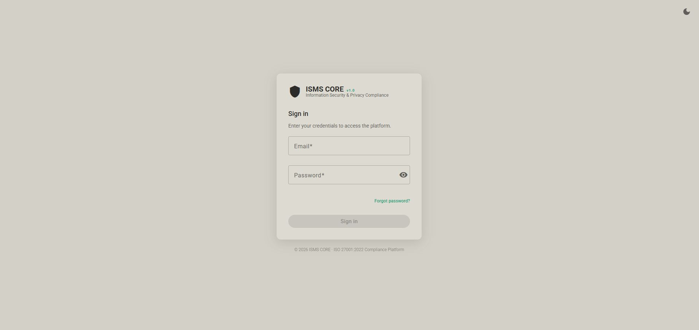</td>
<td align="center"><strong>Home Dashboard</strong><br/>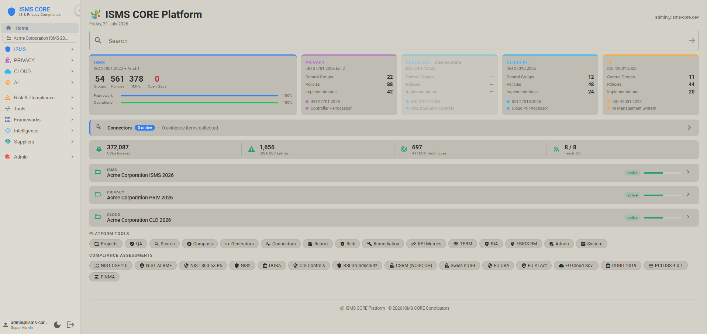</td>
</tr>
<tr>
<td align="center"><strong>Compliance Overview</strong><br/>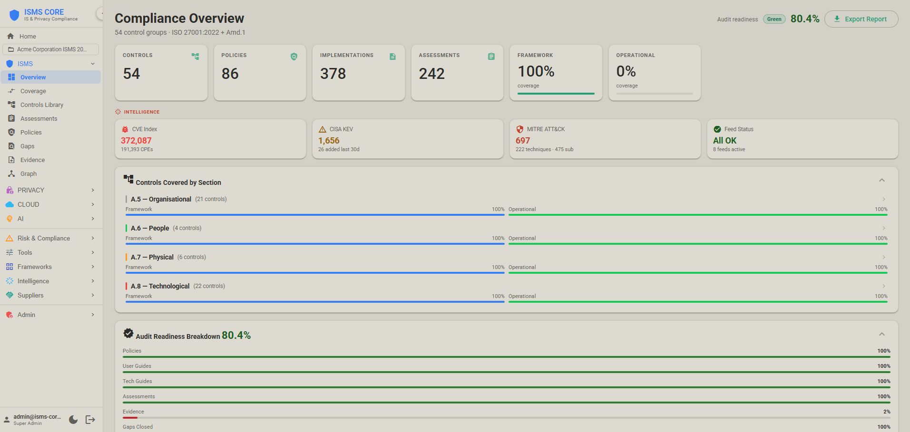</td>
<td align="center"><strong>Connectors — Automated Evidence</strong><br/>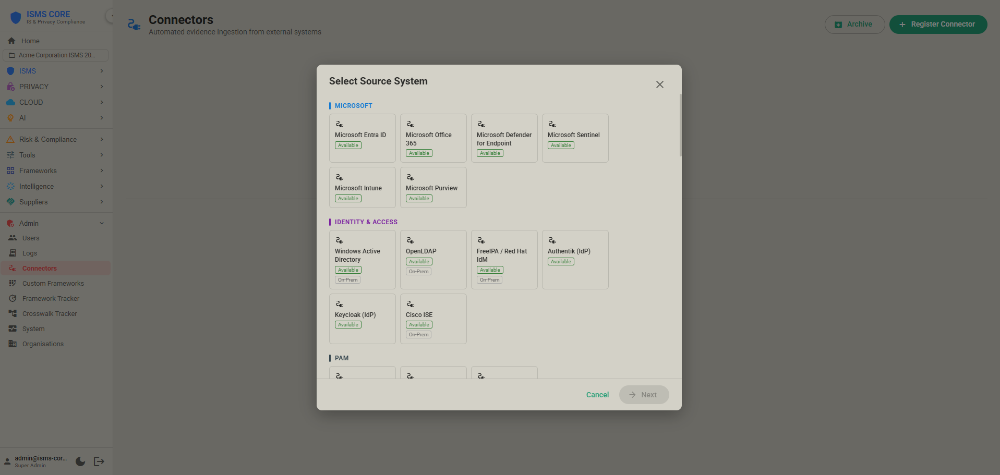</td>
</tr>
<tr>
<td align="center"><strong>ISMS Compass (AI Gap Analysis)</strong><br/>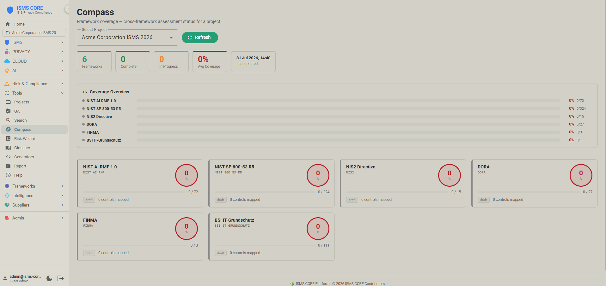</td>
<td align="center"><strong>System Status</strong><br/>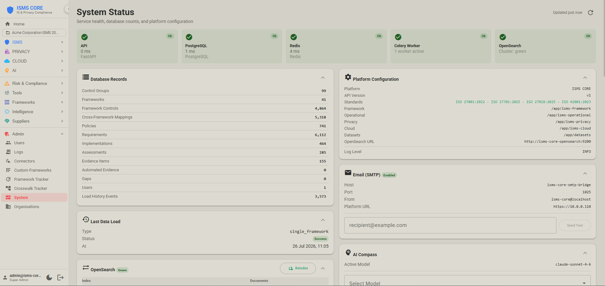</td>
</tr>
<tr>
<td align="center"><strong>Assessments &amp; Collections</strong><br/>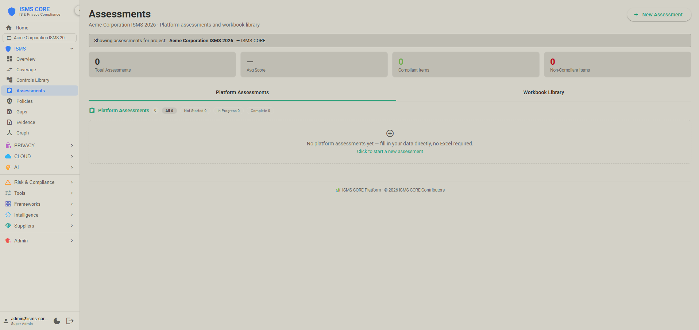</td>
<td align="center"><strong>Gap Register</strong><br/>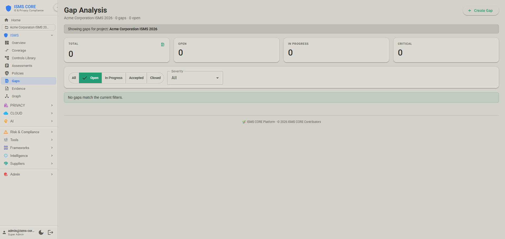</td>
</tr>
<tr>
<td align="center"><strong>NIST CSF 2.0 Assessment</strong><br/>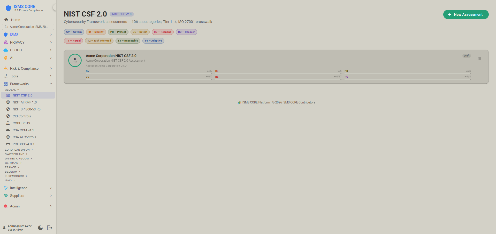</td>
<td align="center"><strong>NIS2 Assessment</strong><br/>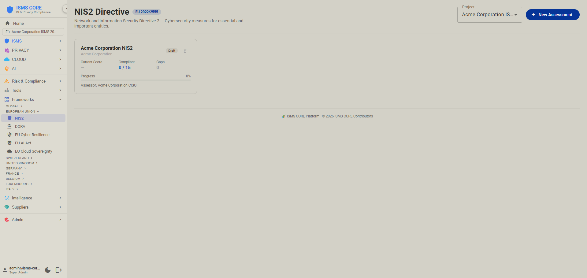</td>
</tr>
<tr>
<td align="center"><strong>DORA Assessment</strong><br/>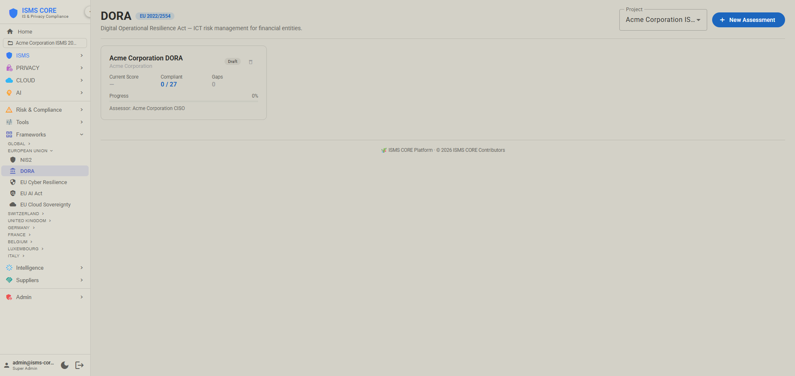</td>
<td align="center"><strong>BSI IT-Grundschutz Assessment</strong><br/>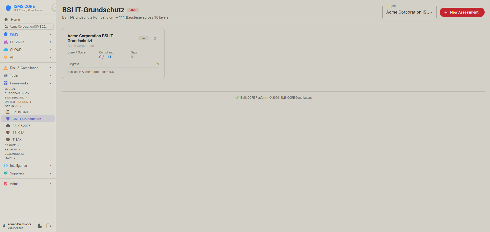</td>
</tr>
<tr>
<td align="center"><strong>Risk Register &amp; Heatmap</strong><br/>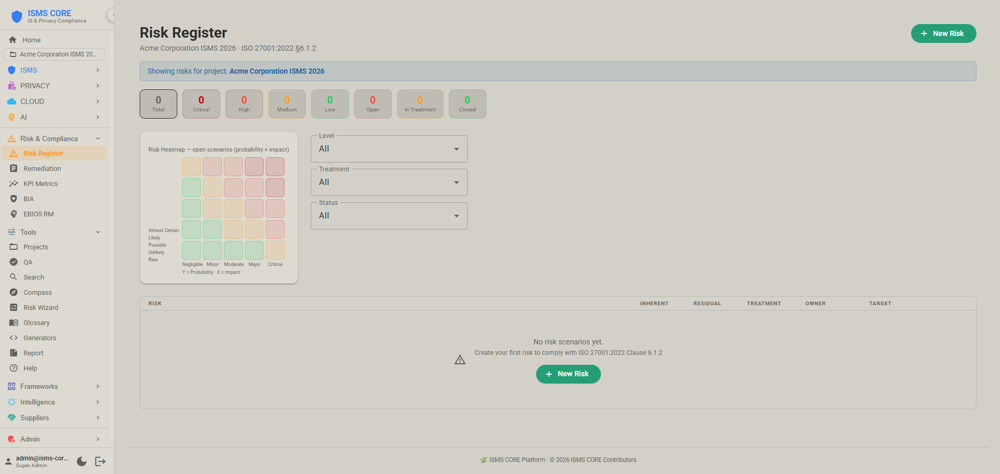</td>
<td align="center"><strong>KPI Metrics &amp; Audit Readiness</strong><br/>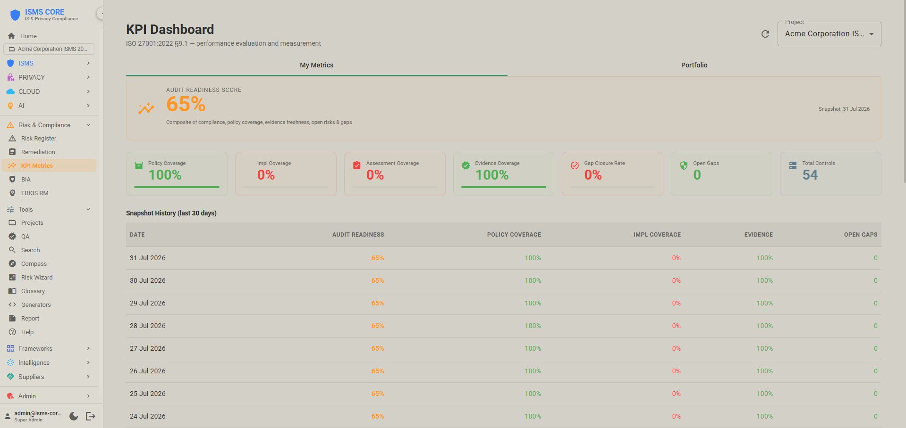</td>
</tr>
<tr>
<td align="center"><strong>EBIOS RM</strong><br/>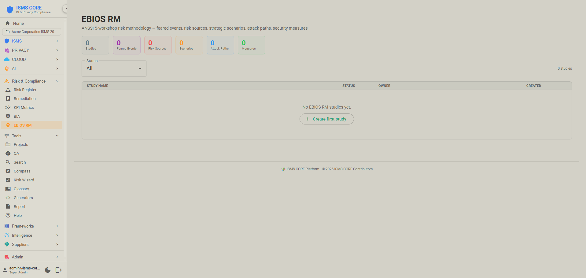</td>
<td align="center"><strong>TPRM — Third-Party Risk</strong><br/>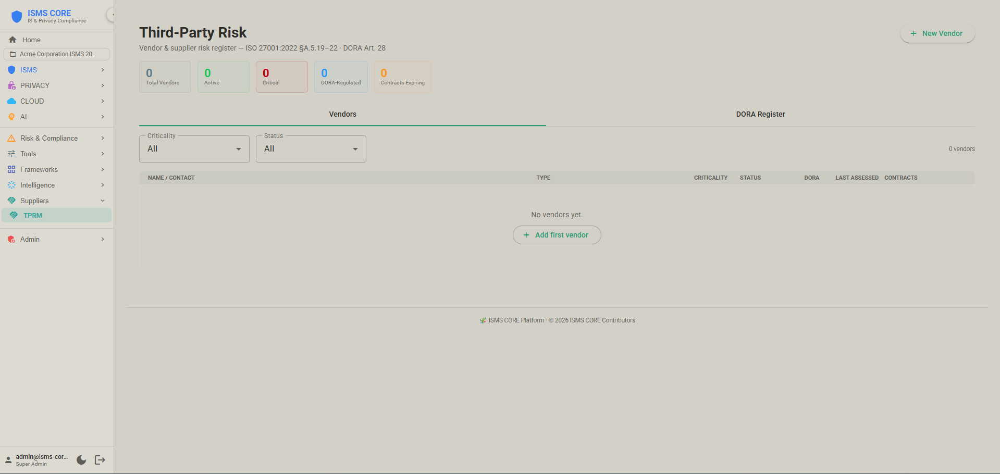</td>
</tr>
<tr>
<td align="center"><strong>MITRE ATT&CK</strong><br/>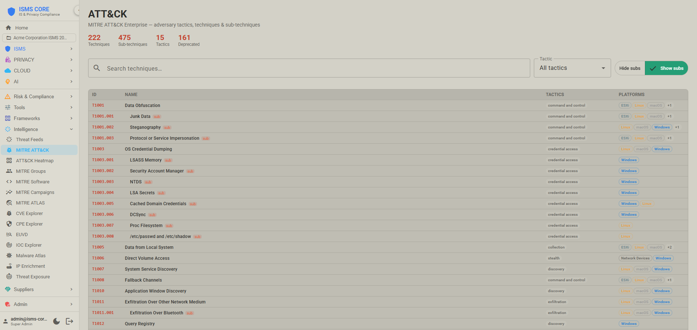</td>
<td align="center"><strong>CVE Explorer</strong><br/>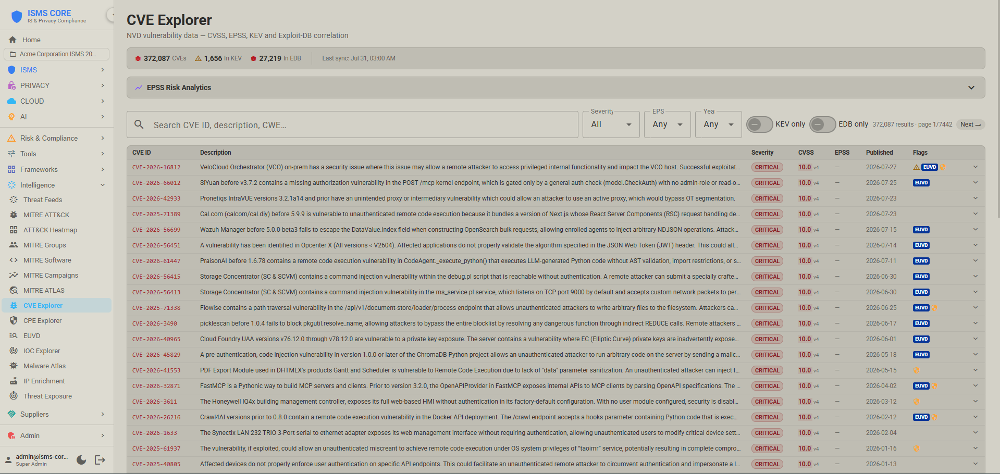</td>
</tr>
</table>

---

## 🔗 Framework Integration

<details>
<summary><strong>Show all 29+ framework integrations and crosswalk mappings</strong></summary>
<br/>

| Framework / Standard | What ISMS CORE provides | Status |
|---|---|---|
| ISO/IEC 27001:2022 | Full Annex A control packs (Framework + Operational) |  |
| ISO/IEC 27002:2022 | Implementation guidance integrated into IMP-TG documents |  |
| ISO/IEC 27701:2025 | Full Privacy Extension Pack — controller, processor, and shared controls |  |
| ISO/IEC 27018:2025 | Full Cloud Extension Pack — 12 Annex A control groups for PII in cloud |  |
| ISO/IEC 42001:2023 | Full AI Extension Pack — 12 AI control groups covering AIMS governance, impact assessment, responsible use, and third-party AI |  |
| NIST CSF 2.0 | Full assessment tool — 106 subcategories, tier 1–4 ratings, XLSX import/export, radar chart. ISO 27001 crosswalk. |  |
| NIST AI RMF 1.0 | Full assessment tool — 72 subcategories, 0–4 maturity; ISO 42001 crosswalk: 32 mappings, EU AI Act: 31 mappings |  |
| NIS2 Directive (EU 2022/2555) | 10 Article 21 measures + 5 Article 23 obligations, maturity 0–4 |  |
| DORA (EU 2022/2554) | 27 articles across 5 pillars (ICT Risk, Incident Reporting, Testing, TPRM, Information Sharing), maturity 0–4 |  |
| CIS Critical Security Controls v8 | 153 safeguards across 18 controls, maturity 0–4 |  |
| BSI IT-Grundschutz Kompendium | All 111 Bausteine across 10 layers, maturity 0–4. Crosswalk: ISO 27001↔BSI (386), ISO 27701↔BSI (101), ISO 27018↔BSI (51) |  |
| CSRM (Swiss NCSC, 2025) | Object-centric module — IT Protection Objects, 20 NIST CSF 2.0 baseline requirements, binary status, 6 Control Objectives |  |
| TISAX / VDA ISA 6.0 | 79 requirements across 9 domains, maturity 0–4 |  |
| Swiss nDSG 2023 | 25 provisions across 6 chapters, maturity 0–4 |  |
| Swiss ISG (SR 128, 2024) | 27 requirements across 8 sections, 24h cyberattack reporting; ISO 27001 crosswalk: 40 mappings |  |
| EU Cyber Resilience Act (2024/2847) | 26 essential requirements across 6 groups, maturity 0–4 |  |
| EU AI Act (2024/1689) | 9 articles — Chapter III Section 2 high-risk system requirements (Art. 8–15) plus Art. 27 fundamental rights impact assessment, maturity 0–4 |  |
| EU Cloud Sovereignty Framework (v1.2.1) | 8 Sovereignty Objectives (SOV-1 to SOV-8), SEAL-0 to SEAL-4 scoring, weighted Sovereignty Score |  |
| COBIT 2019 | 40 governance/management objectives, capability scoring 0–4 |  |
| CyberFundamentals (BE) | 41 NIST CSF 2.0 aligned practices, maturity 0–4; ISO 27001 crosswalk: 107 mappings |  |
| BaFin BAIT (DE) | 23 requirements across 12 modules, maturity 0–4; ISO 27001 crosswalk: 69 mappings |  |
| BSI C5:2026 (DE) | 168 criteria across 17 domains — Cloud Computing Compliance Criteria Catalogue v1.0.1. Used for third-party attestation of cloud service providers in Germany and the EU. Replaces C5:2020. |  |
| BSI C3A (DE) | 30 criterion groups across 6 sovereignty domains (Strategic / Legal / Data / Operational / Supply Chain / Technology) — Criteria enabling Cloud Computing Autonomy v1.0. Companion to C5:2026; presupposes C5 compliance. |  |
| CSSF 20-750 (LU) | 19 requirements across 7 domains, maturity 0–4; ISO 27001 crosswalk: 47 mappings |  |
| ACN Guidelines (IT) | Determinazione obblighi di base (Apr 2025) — 37 measures/87 requirements (Important) or 43 measures/116 requirements (Essential), maturity 0–4; ISO 27001 crosswalk: 43 mappings |  |
| UK NIS Regulations | 13 requirements across 3 objectives, maturity 0–4; ISO 27001 crosswalk: 51 mappings |  |
| UK Operational Resilience | 12 requirements across 4 objectives, maturity 0–4; ISO 27001 crosswalk: 34 mappings |  |
| NCSC CAF v4.0 (UK) | 41 Contributing Outcomes across 14 Principles and 4 Objectives — outcome-based; ISO 27001 crosswalk: 65 mappings |  |
| ReCyF v2.5 — France NIS2 (ANSSI) | 20 Security Objectives across 4 pillars (Gouvernance / Protection / Défense / Résilience) — France's pending NIS2 transposition law; ISO 27001 crosswalk: 50 mappings |  |
| PCI DSS v4.0.1 | 323 sub-requirements across 12 requirements, 6 prioritised milestones, milestone-based scoring; ISO 27001 crosswalk: 39 mappings |  |
| FINMA | 21 requirements across 3 circulars/guidance (2023/1 Operational Risk, 2018/3 Outsourcing, Guidance 03/2024 Cyber Risks), maturity 0–4; ISO 27001 crosswalk: 60 mappings |  |
| NIST SP 800-53 Rev. 5 | Security control cross-mapping |  |
| MITRE ATT&CK v19 | Threat technique mapping (Enterprise / ICS / Mobile) — 697 techniques across 15 tactics, EPSS + CISA KEV correlation. |  |
| MITRE ATLAS | AI/ML adversarial threat techniques |  |
| ENISA EUVD | European Vulnerability Database — exploited + critical CVEs; daily feed; EUVD Explorer + cross-enrichment of NVD CVE index with `in_euvd` flag |  |
| Exploit-DB | Daily exploit database (~52K entries) — cross-referenced to NVD CVE by CVE ID; adds `edb_id`, `edb_verified` (Metasploit module flag), `edb_description` to matching CVEs. EDB/EDB✓ chips in CVE Explorer; EDB-only filter. |  |
| VulnCheck KEV | Daily feed — VulnCheck's own Known Exploited Vulnerabilities catalogue, broader than CISA's (~67% of entries aren't in CISA KEV); adds `in_vulncheck_kev` flag, separate from CISA's `in_kev`, on CVE Explorer. VC-KEV chip; VulnCheck-only filter. Requires `VULNCHECK_API_KEY` (free Community tier). |  |
| CIRCL MISP OSINT Feed | Public MISP feed (Luxembourg) — 6-hourly manifest delta; 100K+ IOCs (IPs, domains, URLs, hashes) cross-enriched with ATT&CK TIDs, Malpedia family slugs, actor slugs at ingest |  |
| Botvrij MISP OSINT Feed | Public MISP feed (Botvrij.eu) — 6-hourly manifest delta; deduplicated against CIRCL by IOC value + source |  |
| AbuseIPDB | Daily blacklist (top 10K confidence=100 IPs); on-demand single-IP enrichment with 24h cache; OpenSearch `ti-abuseipdb-blacklist` index |  |
| Malpedia | Weekly malware knowledge base — families (aliases, ATT&CK TIDs), threat actors (country, motivation); links IOCs to malware + actor attribution |  |
| URLhaus | Daily malware download URL feed (abuse.ch) — URLs, associated payload hashes; `ti-urlhaus` OpenSearch index |  |
| ThreatFox | Daily malware IOC feed (abuse.ch) — IPs, domains, URLs, hashes with confidence scores and malware family labels; requires `THREATFOX_API_KEY` |  |
| SSL Blacklist (SSLBL) | Daily SSL certificate blacklist (abuse.ch) — SHA1 fingerprints of certificates used by malware C2 infrastructure; `ti-sslbl` index |  |
| MalwareBazaar | Daily malware sample hash feed (abuse.ch) — MD5/SHA1/SHA256 hashes with family classification; requires `MALWAREBAZAAR_API_KEY` |  |
| Feodo Tracker | Daily C2 IP blacklist (abuse.ch) — Emotet, QakBot, TrickBot, Dridex botnet command-and-control IPs; confidence 85; `ti-feodotracker` index |  |
| AlienVault OTX | Daily Open Threat Exchange pulses — IOCs with TLP labels (WHITE/GREEN/AMBER/RED), ATT&CK TIDs, and confidence scores derived from pulse subscriber count; requires `OTX_API_KEY` |  |
| Red Flag Domains | Daily suspicious newly-registered domain feed — `ti-red-flag-domains` index |  |
| Stopforumspam | Daily spammer IP/email/username database — `ti-stopforumspam` index |  |
| VirusTotal enrichment | Daily IOC confidence enrichment — queries existing IOCs against VT v3 API, updates confidence scores based on AV engine detection ratios; free tier (~500 req/day); requires `VT_API_KEY` |  |
| GreyNoise enrichment | On-demand IP Enrichment lookup — internet-noise/scanner classification, RIOT (known-legitimate-service) status; free Community tier capped at 50 lookups/week, so manual-lookup only, never a scheduled bulk feed; requires `GREYNOISE_API_KEY` |  |
| EU GDPR / Swiss DSG | Security and privacy control mapping, operational checklists |  |

</details>

---

## ✈️ Philosophy: Not Cargo Cult

> *"The first principle is that you must not fool yourself — and you are the easiest person to fool."*
> — Richard Feynman

| | Cargo Cult | ISMS CORE |
|---|---|---|
| ❌ | Impressive policies nobody reads | ✅ Controls that **actually work** |
| ❌ | Made-up compliance numbers | ✅ Evidence that **proves effectiveness** |
| ❌ | Security theater for audits | ✅ Metrics that **measure real security** |
| ❌ | PowerPoints instead of controls | ✅ Automation that **enforces compliance** |

See [PHILOSOPHY.md](PHILOSOPHY.md) for the full methodology.

---

## 🔬 Quality Assurance

Every control pack undergoes a structured multi-stage validation before promotion to this repository:

```
┌──────────────────┐     ┌───────────────────────┐     ┌──────────────────────┐
│  Claude Code     │────▶│  ISMS QA Engine        │────▶│  The ISMS Core       │
│  (Build + QA)    │     │  Existence + Keyword + │     │  Project (Final)     │
│                  │     │  Semantic 3-layer check │     │                      │
└──────────────────┘     └───────────────────────┘     └──────────────────────┘
```

All 188 Framework generators, 53 Operational policies, 21 Privacy control groups, 12 Cloud control groups, and 12 AI control groups carry `QA_VERIFIED` markers confirming a full QA pass.

See [CONTRIBUTING.md](CONTRIBUTING.md) for detailed QA standards.

---

## 📊 Status at a Glance

| Product | Control groups | Key artifacts | Languages | Version |
|---------|---------------|---------------|-----------|---------|
| 🏗️ Framework | 53 / 53 | 376 IMPs · 188 generators · 188 workbooks | EN FR DE IT |  |
| ⚡ Operational | 53 / 53 | 53 OP-POL · 53 checklist generators | EN FR DE IT |  |
| 🔒 Privacy | 21 / 21 | 23 PRIV-POL · 42 IMPs · 21 generators | EN FR DE IT |  |
| ☁️ Cloud | 16 / 16 | 16 CLD-POL · 32 IMPs · 16 generators | EN FR DE IT |  |
| 🤖 AI | 12 / 12 | 12 AI-POL · 20 IMPs · 10 generators | EN FR DE IT |  |
| 🖥️ Platform | 100 total | 44 connectors · 29 assessments · 4,671 mappings / 59 axes | 8 jurisdictions |  |

---

## 📂 Repository Structure

See [STRUCTURE.md](STRUCTURE.md) for the complete repository map with per-folder and per-artifact-type explanations.

---

## 📚 Documentation

| Document | Description |
|----------|-------------|
| [PARADIGM.md](PARADIGM.md) | 🧭 Product overview and paradigm shift guide — start here |
| [PLATFORM.md](PLATFORM.md) | 🖥️ Platform architecture, features, and full deployment guide (includes Docker Compose quick-start) |
| [STRUCTURE.md](STRUCTURE.md) | 📂 Repository map — all folders and artifact types explained |
| [COMPLIANCE.md](COMPLIANCE.md) | 📋 All 29 compliance assessment modules — coverage notes, gaps, audience |
| [isms-core-framework/CONTROLS.md](isms-core-framework/CONTROLS.md) | 📋 Framework control pack index (53 packs) |
| [isms-core-framework/COVERAGE.md](isms-core-framework/COVERAGE.md) | 🗺️ 93 Annex A controls → 53 pack mapping |
| [isms-core-framework/STACKING.md](isms-core-framework/STACKING.md) | 🔗 Control grouping methodology |
| [PHILOSOPHY.md](PHILOSOPHY.md) | ✈️ Anti-cargo-cult methodology |
| [CONTRIBUTING.md](CONTRIBUTING.md) | 🔧 QA process and standards |
| [SECURITY.md](SECURITY.md) | 🔒 Vulnerability reporting policy |

---

## 🔒 Security

- **Vulnerability reporting:** Report security issues to **info@isms-core.com** (subject: "ISMS CORE Security")
- **Safe usage:** Review scripts before execution. Run in a virtual environment. Treat generated artifacts as sensitive until proven otherwise.
- **No secrets:** Do not commit credentials, tokens, private keys, or customer data to this repository or to generated workbooks.

---

## 📜 License

Two separate works, two licenses:

- **Content packs** (`isms-core-framework/`, `isms-core-operational/`, `isms-core-privacy/`, `isms-core-cloud/`, `isms-core-ai/` — the POL/IMP/SCR compliance documents) are **dual-licensed**:
  - **AGPL-3.0** for open-source use — see [LICENSE](LICENSE)
  - **Commercial license** for organisations that cannot comply with AGPL obligations — **info@isms-core.com**
- **`isms-core-platform/`** (the deployable API/engineering product) is **Apache 2.0** — see [isms-core-platform/LICENSE](isms-core-platform/LICENSE). Distributed as pre-built container images; no commercial license needed.

---

## 📞 Contact

<p align="center">
  <strong>The ISMS Core Project</strong>
</p>

<p align="center">
  <a href="mailto:info@isms-core.com"></a>
  <a href="https://github.com/isms-core-project"></a>
  <a href="https://isms-core.com"></a>
  <a href="https://isms-core.com/platform"></a>
  <a href="https://isms-core.com/frameworks"></a>
</p>

---

<p align="center">
  <strong>Copyright © 2025–2026 The ISMS Core Project. All rights reserved.</strong>
</p>

<p align="center">
  <em>Where bamboo antennas actually work.</em> 🎋
</p>
