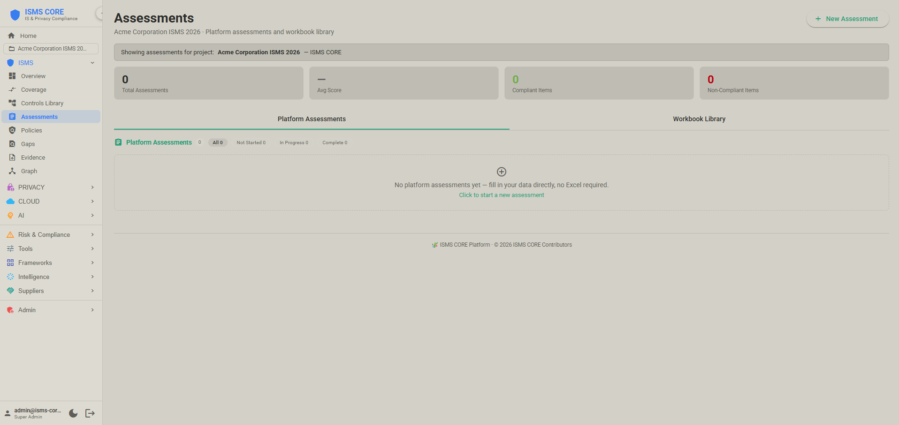
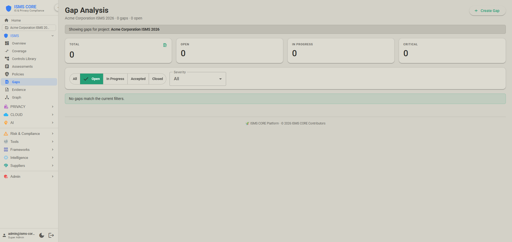
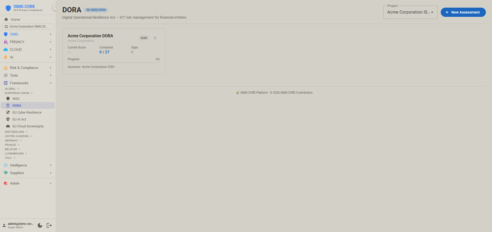
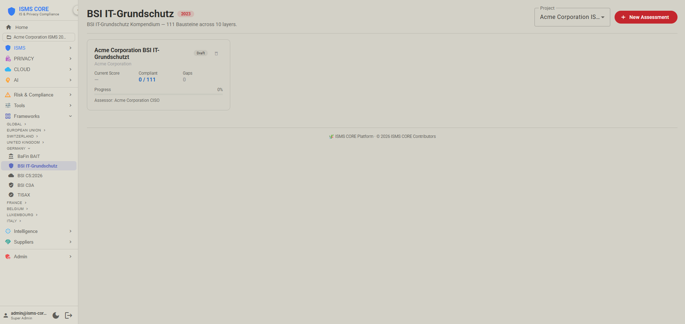
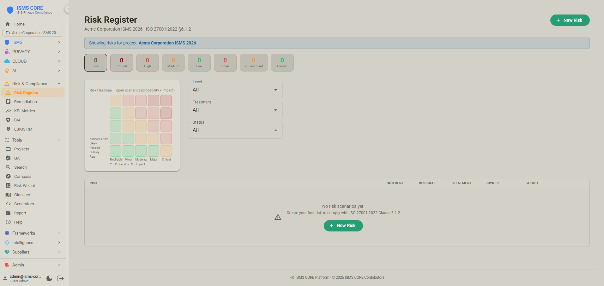
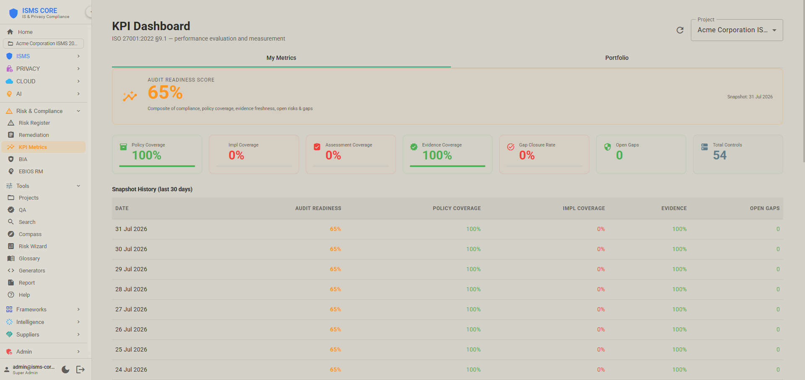
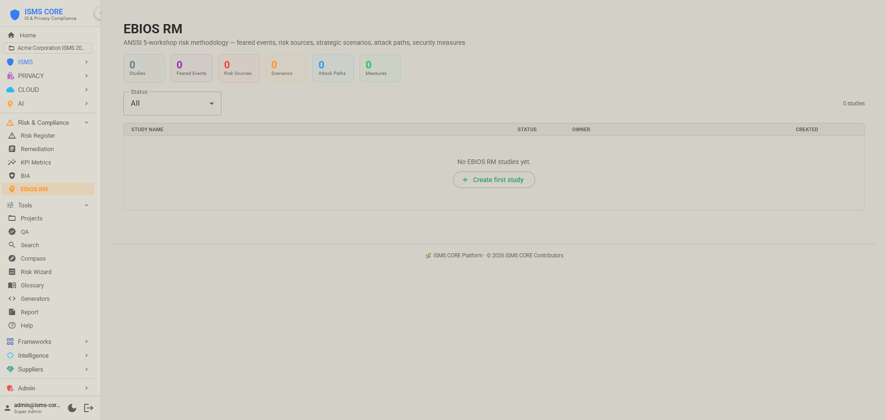
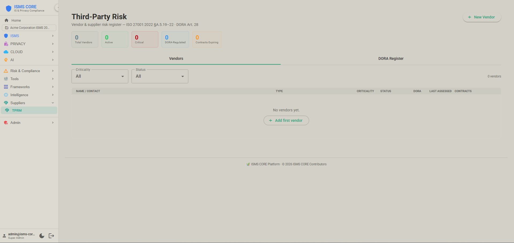
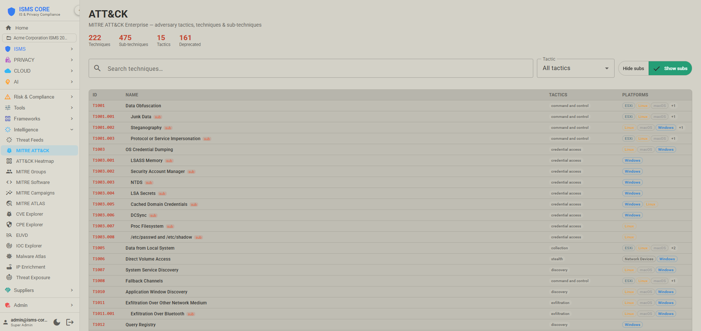
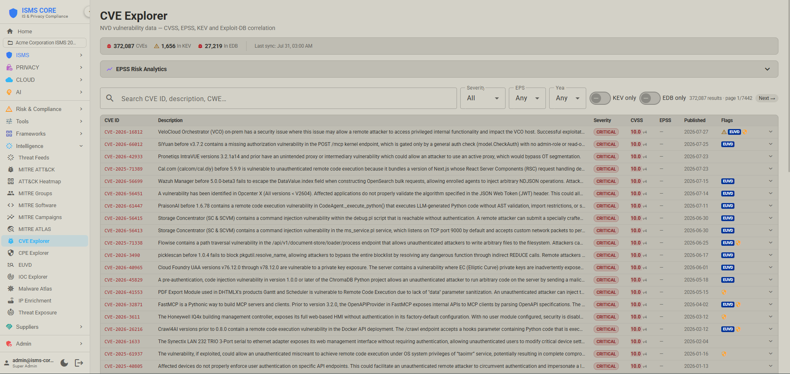

<p align="center">
  
</p>

<h1 align="center">🎋 ISMS CORE Project</h1>

<p align="center"><a href="README.md">English</a> · <strong>繁體中文</strong> · <a href="README.zh-CN.md">简体中文</a></p>

<p align="center">
  <strong>合規營運、風險與證據 — ISO 27001 · ISO 27701 · ISO 27017 · ISO 27018 · ISO 42001</strong>
</p>

<p align="center">
  <a href="https://www.iso.org/standard/27001"></a>
  <a href="https://www.iso.org/standard/71670.html"></a>
  <a href="https://www.iso.org/standard/76559.html"></a>
  <a href="https://www.iso.org/standard/82878.html"></a>
  <a href="https://www.iso.org/standard/81230.html"></a>
  <a href="isms-core-framework/STATUS.md"></a>
  <a href="LICENSE"></a>
  <a href="isms-core-platform/LICENSE"></a>
</p>

<details>
<summary><strong>29 個合規評鑑模組 — 點擊展開</strong></summary>
<br/>
<p align="center">
  <a href="COMPLIANCE.zh-TW.md"></a>
  <a href="COMPLIANCE.zh-TW.md"></a>
  <a href="COMPLIANCE.zh-TW.md"></a>
  <a href="COMPLIANCE.zh-TW.md"></a>
  <a href="COMPLIANCE.zh-TW.md"></a>
  <a href="COMPLIANCE.zh-TW.md"></a>
  <a href="COMPLIANCE.zh-TW.md"></a>
  <a href="COMPLIANCE.zh-TW.md"></a>
  <a href="COMPLIANCE.zh-TW.md"></a>
  <a href="COMPLIANCE.zh-TW.md"></a>
  <a href="COMPLIANCE.zh-TW.md"></a>
  <a href="COMPLIANCE.zh-TW.md"></a>
  <a href="COMPLIANCE.zh-TW.md"></a>
  <a href="COMPLIANCE.zh-TW.md"></a>
  <a href="COMPLIANCE.zh-TW.md"></a>
  <a href="COMPLIANCE.zh-TW.md"></a>
  <a href="COMPLIANCE.zh-TW.md"></a>
  <a href="COMPLIANCE.zh-TW.md"></a>
  <a href="COMPLIANCE.zh-TW.md"></a>
  <a href="COMPLIANCE.zh-TW.md"></a>
  <a href="COMPLIANCE.zh-TW.md"></a>
  <a href="COMPLIANCE.zh-TW.md"></a>
  <a href="COMPLIANCE.zh-TW.md"></a>
  <a href="COMPLIANCE.zh-TW.md"></a>
  <a href="COMPLIANCE.zh-TW.md"></a>
  <a href="COMPLIANCE.zh-TW.md"></a>
  <a href="COMPLIANCE.zh-TW.md"></a>
  <a href="COMPLIANCE.zh-TW.md"></a>
  <a href="COMPLIANCE.zh-TW.md"></a>
  <a href="#-框架整合"></a>
  <a href="COMPLIANCE.zh-TW.md"></a>
</p>
</details>

<p align="center">
  <em>長得快，彎而不折，經久耐用。</em> 🎋
</p>

---

## 🎯 什麼是 ISMS CORE？

ISMS CORE 是一套生產等級的**控制工程**平台，用來建置與營運資訊安全管理系統。它把合規實施當成**工程問題**處理，而不是顧問作業。

> **第一次接觸？** 請先讀 [PARADIGM.zh-TW.md](PARADIGM.zh-TW.md) — 它說明 ISMS CORE 與傳統 ISMS 做法的差異、如何在各產品之間選擇，以及可以預期什麼。

---

## 五項產品。四項標準。一個平台。

<table>
<tr>
<td align="center" valign="top" width="33%">

### 🏗️ [框架](isms-core-framework/)


**完整的工程產品**，供成熟的安全團隊與顧問使用。治理政策、實施指引、評鑑腳本、產出的工作簿 — 每一項控制措施一個完整套件。

**53** 個控制套件 · **93** 項附錄 A 控制措施<br/>
**376** 份 IMP 文件 · **188** 個產生器<br/>
EN · FR · DE · IT


</td>
<td align="center" valign="top" width="33%">

### ⚡ [營運版](isms-core-operational/)


**給中小企業的基礎 ISMS**（10–500 人）。作業政策搭配單表合規檢核表。沒有工程負擔 — 讀政策、跑檢核表，完成。

**53** 個控制群組 · **53** 份 OP-POL 文件<br/>
**53** 個檢核表產生器<br/>
EN · FR · DE · IT


</td>
<td align="center" valign="top" width="34%">

### 🔒 [隱私](isms-core-privacy/)


**隱私資訊管理** — 針對 ISO 27701:2025 的控管者、處理者與共同控制群組。可搭配框架版或營運版使用。

**21** 個控制群組 · **23** 份 PRIV-POL 文件<br/>
**42** 份 IMP 文件 · **21** 個產生器<br/>
EN · FR · DE · IT


</td>
</tr>
<tr>
<td align="center" valign="top" width="33%">

### ☁️ [雲端](isms-core-cloud/)


**PII 保護與雲端安全控制措施** — 供處理 PII 的雲端服務供應商使用的檢核表（ISO 27018:2025 附錄 A），加上 4 項獨立的雲端安全延伸控制措施（ISO 27017:2026）；兩者都是與 ISO 27001 並列的獨立標準。

**16** 個控制群組 · **16** 份 POL 文件<br/>
**32** 份 IMP 文件 · **16** 個產生器<br/>
EN · FR · DE · IT


</td>
<td align="center" valign="top" width="33%">

### 🤖 [AI](isms-core-ai/)


**AI 管理系統** — 涵蓋 AI 開發、部署、衝擊評鑑、負責任使用與第三方 AI 關係的治理政策。

**12** 個 AI 控制群組 · **12** 項 AI-POL 政策<br/>
**20** 份 IMP 文件 · **10** 個檢核表產生器<br/>
EN · FR · DE · IT


</td>
<td align="center" valign="top" width="34%">

### 🖥️ [平台](PLATFORM.zh-TW.md)


**可實際運作的合規管理系統** — 把所有內容產品變成儀表板、缺口追蹤、證據匯入、風險登錄與稽核報告。Docker Compose、10 個服務、自架。

**44** 個連接器 · **29** 個評鑑模組 · **4,671** 個對照物件 / 59 個軸<br/>
8 個國家司法管轄區 · **21+** 個威脅情報來源


</td>
</tr>
</table>

---

## 📦 你會拿到什麼 — 開箱即用

這不是框架參考手冊，也不是檢核表範本庫。**每一個控制套件都附上可直接上線的成品，你打開、調整、發布即可。**

<table>
<tr>
<th width="10%">成品</th>
<th width="7%">格式</th>
<th width="43%">是什麼</th>
<th width="20%">誰來用</th>
<th width="20%">產品</th>
</tr>
<tr>
<td><strong>POL</strong></td>
<td>Markdown</td>
<td>治理政策文件 — 說明該控制措施要求什麼、由誰負責、適用哪些標準。填上組織名稱、CISO 與生效日期後發布。</td>
<td>ISMS 經理 → 董事會／員工</td>
<td>全部五項產品</td>
</tr>
<tr>
<td><strong>IMP-UG</strong></td>
<td>Markdown</td>
<td>實施使用者指南 — ISMS 經理如何實施與操作該控制措施。角色、流程步驟、KPI、審查週期。</td>
<td>ISMS 經理</td>
<td>框架 · 隱私 · 雲端 · AI</td>
</tr>
<tr>
<td><strong>IMP-TG</strong></td>
<td>Markdown</td>
<td>實施技術指南 — 給工程師的逐步操作。指令、組態片段、廠商特定注意事項、強化檢核表。</td>
<td>安全工程師</td>
<td>框架 · 隱私 · 雲端 · AI</td>
</tr>
<tr>
<td><strong>SCR</strong></td>
<td>Python 3.11+</td>
<td>評鑑產生器 — 執行 <code>python3 generate_*.py</code> 產出結構化、已排版的合規證據工作簿。唯一相依套件：<code>openpyxl</code>。</td>
<td>ISMS 經理 → 稽核人員</td>
<td>全部五項產品</td>
</tr>
<tr>
<td><strong>WKBK</strong></td>
<td>Excel (.xlsx)</td>
<td>產出的合規工作簿 — 逐控制措施的評鑑項目、證據狀態、評分與稽核人員備註。由 SCR 產生器產出。可直接交給稽核人員。</td>
<td>稽核人員／控制措施負責人</td>
<td>全部五項產品</td>
</tr>
<tr>
<td><strong>REF</strong></td>
<td>Markdown</td>
<td>自 ISO 標準本文節錄、並對應到本控制措施的參照資料。附與相鄰及相關附錄 A 控制措施的交叉參照。</td>
<td>ISMS 經理／稽核人員</td>
<td>框架</td>
</tr>
<tr>
<td><strong>CTX</strong></td>
<td>Markdown</td>
<td>情境文件，把本控制套件與相鄰及相依的控制套件連結起來 — 用於控制措施堆疊與相依性對應。</td>
<td>ISMS 經理</td>
<td>框架</td>
</tr>
<tr>
<td><strong>FORM</strong></td>
<td>Markdown</td>
<td>可直接使用的範本：證據蒐集表、會議議程、核准紀錄、風險接受表。</td>
<td>ISMS 經理／控制措施負責人</td>
<td>框架</td>
</tr>
</table>

> **範例工作流程 — A.8.24 密碼學的使用：**
> 1. 打開 `POL/` → 組織的密碼學政策，簽核後即可發布
> 2. 打開 `IMP/IMP-UG/` → 如何推動金鑰管理計畫（KPI、審查週期、權責歸屬）
> 3. 打開 `IMP/IMP-TG/` → TLS 組態、憑證生命週期、HSM 建置、廠商注意事項
> 4. 執行 `SCR/generate_a824_*.py` → 產出 `.xlsx` 評鑑工作簿
> 5. 把工作簿交給稽核人員，作為結構化的合規證據

**產生器的前置條件：** Python 3.11+、`pip install openpyxl`

---

## 🧭 適合誰（與不適合誰）

**適合：**
- 正在建置 ISMS、想要**可重複、可稽核證據**的安全團隊
- 偏好**自動化＋測試**、不要「安全表演」的工程師
- 需要**實用、可稽核政策**、不想過度工程化的中小企業
- 處理 PII、需要 **ISO 27701 控管者／處理者控制措施**的組織
- 需要 **ISO 27018 PII 合規**或 **ISO 27017 雲端安全控制措施**的雲端服務供應商
- 開發 AI 系統、需要 **ISO 42001 AIMS 治理**的組織
- 需要**結構化、可追溯控制套件**的顧問與稽核人員

**不適合：**
- 期待「一鍵合規」的人
- 需要 GDPR／DORA／NIS2 法律解釋的場合（請諮詢律師）
- 執行自己沒讀過的腳本（請把它當程式碼看待）

---

## 🚀 快速開始

**前置條件：** Python 3.11+、`pip install openpyxl`

### 框架版 — ISO 27001:2022 完整工程

```bash
# 瀏覽 53 個控制套件
cat isms-core-framework/CONTROLS.md

# 進入某一項控制措施，依序讀 POL → IMP-UG → IMP-TG，然後產出工作簿
cd isms-core-framework/A.8-technological-controls/isms-a.8.24-use-of-cryptography/SCR
python3 generate_a824_1_data_transmission_assessment.py
```

### 營運版 — ISO 27001:2022 中小企業版

```bash
cd isms-core-operational/A.5-organisational-controls/isms-a.5.1-2-information-security-policies/SCR
python3 generate_op_checklist_a512.py
```

### 隱私 — ISO 27701:2025

```bash
cd isms-core-privacy/privacy-controller/priv-a.1.2.2-5-lawful-basis-and-consent/SCR
python3 generate_priv_checklist_a1225.py
```

### 雲端 PII — ISO 27018:2025

```bash
cd isms-core-cloud/iso27018-pii-cloud/cld-a.11-information-security/SCR
python3 generate_cld_checklist_a11.py
```

### 雲端安全 — ISO 27017:2026

```bash
cd isms-core-cloud/iso27017-sec-cloud/cld-sec-a.5.38-shared-roles-responsibilities/SCR
python3 generate_cld_sec_checklist_a538.py
```

### AI — ISO 42001:2023

```bash
# 從 AI 治理基礎政策開始（提供 EN、FR、DE、IT 版本）
cat "isms-core-ai/00-ai-foundation-policies/ai-pol-01-aims-governance-and-decision-making/POL/AI-POL-01 - AIMS Governance and Decision-Making Framework.md"
```

### 平台 — 可運作的合規儀表板

```bash
cd isms-core-platform
cp .env.example .env         # 填入 HOST_IP、密碼、ADMIN_PASSWORD
docker compose up -d             # COMPOSE_PROFILES=opensearch-single 已在 .env.example 設定
bash bootstrap.sh            # 一鍵完成：建立所有控制群組、匯入所有內容
# → 開啟 https://{HOST_IP}
```

完整部署指南、TLS 選項、連接器設定與上線檢核表，請見 [PLATFORM.zh-TW.md](PLATFORM.zh-TW.md)。

---

## 📸 平台畫面

<table>
<tr>
<td align="center"><strong>登入</strong><br/></td>
<td align="center"><strong>首頁儀表板</strong><br/></td>
</tr>
<tr>
<td align="center"><strong>合規概觀</strong><br/></td>
<td align="center"><strong>連接器 — 自動化證據</strong><br/></td>
</tr>
<tr>
<td align="center"><strong>ISMS Compass（AI 缺口分析）</strong><br/></td>
<td align="center"><strong>系統狀態</strong><br/></td>
</tr>
<tr>
<td align="center"><strong>評鑑與集合</strong><br/></td>
<td align="center"><strong>缺口登錄表</strong><br/></td>
</tr>
<tr>
<td align="center"><strong>NIST CSF 2.0 評鑑</strong><br/></td>
<td align="center"><strong>NIS2 評鑑</strong><br/></td>
</tr>
<tr>
<td align="center"><strong>DORA 評鑑</strong><br/></td>
<td align="center"><strong>BSI IT-Grundschutz 評鑑</strong><br/></td>
</tr>
<tr>
<td align="center"><strong>風險登錄表與熱圖</strong><br/></td>
<td align="center"><strong>KPI 指標與稽核準備度</strong><br/></td>
</tr>
<tr>
<td align="center"><strong>EBIOS RM</strong><br/></td>
<td align="center"><strong>TPRM — 第三方風險</strong><br/></td>
</tr>
<tr>
<td align="center"><strong>MITRE ATT&amp;CK</strong><br/></td>
<td align="center"><strong>CVE 瀏覽器</strong><br/></td>
</tr>
</table>

---

## 🔗 框架整合

<details>
<summary><strong>顯示全部 29+ 項框架整合與對照對應</strong></summary>
<br/>

| 框架／標準 | ISMS CORE 提供什麼 | 狀態 |
|---|---|---|
| ISO/IEC 27001:2022 | 完整的附錄 A 控制套件（框架版 + 營運版） |  |
| ISO/IEC 27002:2022 | 實施指引已整合進 IMP-TG 文件 |  |
| ISO/IEC 27701:2025 | 完整的隱私延伸套件 — 控管者、處理者與共同控制措施 |  |
| ISO/IEC 27018:2025 | 完整的雲端延伸套件 — 雲端 PII 的 12 個附錄 A 控制群組 |  |
| ISO/IEC 42001:2023 | 完整的 AI 延伸套件 — 12 個 AI 控制群組，涵蓋 AIMS 治理、衝擊評鑑、負責任使用與第三方 AI |  |
| NIST CSF 2.0 | 完整評鑑工具 — 106 項子類別、等級 1–4 評分、XLSX 匯入／匯出、雷達圖。ISO 27001 對照。 |  |
| NIST AI RMF 1.0 | 完整評鑑工具 — 72 項子類別、0–4 成熟度；ISO 42001 對照：32 組對應，EU AI Act：31 組對應 |  |
| NIS2 指令（EU 2022/2555） | 第 21 條 10 項措施 + 第 23 條 5 項義務，成熟度 0–4 |  |
| DORA（EU 2022/2554） | 5 大支柱下的 27 條條文（ICT 風險、事件通報、測試、TPRM、資訊分享），成熟度 0–4 |  |
| CIS Critical Security Controls v8 | 18 項控制下的 153 項防護措施，成熟度 0–4 |  |
| BSI IT-Grundschutz Kompendium | 10 個層級下的全部 111 個模組，成熟度 0–4。對照：ISO 27001↔BSI（386）、ISO 27701↔BSI（101）、ISO 27018↔BSI（51） |  |
| CSRM（瑞士 NCSC，2025） | 以物件為中心的模組 — IT 防護物件、20 項 NIST CSF 2.0 基線要求、二元狀態、6 項控制目標 |  |
| TISAX / VDA ISA 6.0 | 9 個領域下的 79 項要求，成熟度 0–4 |  |
| 瑞士 nDSG 2023 | 6 章下的 25 項條款，成熟度 0–4 |  |
| 瑞士 ISG（SR 128，2024） | 8 節下的 27 項要求、24 小時網路攻擊通報；ISO 27001 對照：40 組對應 |  |
| EU 網路韌性法（2024/2847） | 6 個群組下的 26 項必要要求，成熟度 0–4 |  |
| EU AI 法（2024/1689） | 9 條條文 — 第三章第二節高風險系統要求（第 8–15 條）加上第 27 條基本權利衝擊評鑑，成熟度 0–4 |  |
| EU 雲端主權框架（v1.2.1） | 8 項主權目標（SOV-1 至 SOV-8）、SEAL-0 至 SEAL-4 評分、加權主權分數 |  |
| COBIT 2019 | 40 項治理／管理目標，能力評分 0–4 |  |
| CyberFundamentals（BE） | 41 項對齊 NIST CSF 2.0 的實務，成熟度 0–4；ISO 27001 對照：107 組對應 |  |
| BaFin BAIT（DE） | 12 個模組下的 23 項要求，成熟度 0–4；ISO 27001 對照：69 組對應 |  |
| BSI C5:2026（DE） | 17 個領域下的 168 項準則 — 雲端運算合規準則目錄 v1.0.1。用於德國與歐盟境內雲端服務供應商的第三方認證。取代 C5:2020。 |  |
| BSI C3A（DE） | 6 個主權領域（策略／法律／資料／營運／供應鏈／技術）下的 30 個準則群組 — 促成雲端運算自主性的準則 v1.0。C5:2026 的配套，以符合 C5 為前提。 |  |
| CSSF 20-750（LU） | 7 個領域下的 19 項要求，成熟度 0–4；ISO 27001 對照：47 組對應 |  |
| ACN 指引（IT） | Determinazione obblighi di base（2025 年 4 月）— 37 項措施／87 項要求（重要）或 43 項措施／116 項要求（關鍵），成熟度 0–4；ISO 27001 對照：43 組對應 |  |
| 英國 NIS 法規 | 3 項目標下的 13 項要求，成熟度 0–4；ISO 27001 對照：51 組對應 |  |
| 英國作業韌性 | 4 項目標下的 12 項要求，成熟度 0–4；ISO 27001 對照：34 組對應 |  |
| NCSC CAF v4.0（UK） | 14 項原則與 4 項目標下的 41 項貢獻成果 — 成果導向；ISO 27001 對照：65 組對應 |  |
| ReCyF v2.5 — 法國 NIS2（ANSSI） | 4 大支柱（治理／保護／防禦／韌性）下的 20 項安全目標 — 法國審議中的 NIS2 轉置法；ISO 27001 對照：50 組對應 |  |
| PCI DSS v4.0.1 | 12 項要求下的 323 項子要求、6 個優先里程碑、以里程碑為基礎的評分；ISO 27001 對照：39 組對應 |  |
| FINMA | 3 份通函／指引（2023/1 作業風險、2018/3 委外、03/2024 網路風險指引）下的 21 項要求，成熟度 0–4；ISO 27001 對照：60 組對應 |  |
| NIST SP 800-53 Rev. 5 | 安全控制措施交叉對應 |  |
| MITRE ATT&CK v19 | 威脅技術對應（Enterprise／ICS／Mobile）— 15 個戰術下的 697 項技術，EPSS + CISA KEV 關聯。 |  |
| MITRE ATLAS | AI/ML 對抗式威脅技術 |  |
| ENISA EUVD | 歐洲弱點資料庫 — 已遭利用與嚴重 CVE；每日更新；EUVD 瀏覽器，並以 `in_euvd` 旗標交叉充實 NVD CVE 索引 |  |
| Exploit-DB | 每日攻擊程式資料庫（約 52K 筆）— 以 CVE ID 交叉參照至 NVD CVE；在相符的 CVE 上加入 `edb_id`、`edb_verified`（Metasploit 模組旗標）、`edb_description`。CVE 瀏覽器中有 EDB/EDB✓ 標籤；支援僅 EDB 篩選。 |  |
| VulnCheck KEV | 每日更新 — VulnCheck 自家的已知遭利用弱點目錄，範圍比 CISA 更廣（約 67% 的項目不在 CISA KEV 中）；在 CVE 瀏覽器上加入 `in_vulncheck_kev` 旗標，與 CISA 的 `in_kev` 分開。VC-KEV 標籤；支援僅 VulnCheck 篩選。需要 `VULNCHECK_API_KEY`（免費 Community 方案）。 |  |
| CIRCL MISP OSINT Feed | 公開 MISP 情報源（盧森堡）— 每 6 小時清單差異；10 萬+ 個 IOC（IP、網域、URL、雜湊），匯入時以 ATT&CK TID、Malpedia 家族代號、行為者代號交叉充實 |  |
| Botvrij MISP OSINT Feed | 公開 MISP 情報源（Botvrij.eu）— 每 6 小時清單差異；以 IOC 值 + 來源與 CIRCL 去重 |  |
| AbuseIPDB | 每日黑名單（信心值 100 的前 1 萬個 IP）；單一 IP 隨選充實，快取 24 小時；OpenSearch `ti-abuseipdb-blacklist` 索引 |  |
| Malpedia | 每週惡意程式知識庫 — 家族（別名、ATT&CK TID）、威脅行為者（國家、動機）；把 IOC 連結到惡意程式與行為者歸因 |  |
| URLhaus | 每日惡意程式下載 URL 情報（abuse.ch）— URL 及對應的酬載雜湊；`ti-urlhaus` OpenSearch 索引 |  |
| ThreatFox | 每日惡意程式 IOC 情報（abuse.ch）— IP、網域、URL、雜湊，附信心分數與惡意程式家族標籤；需要 `THREATFOX_API_KEY` |  |
| SSL Blacklist（SSLBL） | 每日 SSL 憑證黑名單（abuse.ch）— 惡意程式 C2 基礎設施所用憑證的 SHA1 指紋；`ti-sslbl` 索引 |  |
| MalwareBazaar | 每日惡意程式樣本雜湊情報（abuse.ch）— MD5/SHA1/SHA256 雜湊與家族分類；需要 `MALWAREBAZAAR_API_KEY` |  |
| Feodo Tracker | 每日 C2 IP 黑名單（abuse.ch）— Emotet、QakBot、TrickBot、Dridex 殭屍網路的命令控制 IP；信心值 85；`ti-feodotracker` 索引 |  |
| AlienVault OTX | 每日 Open Threat Exchange pulses — 帶 TLP 標示（WHITE/GREEN/AMBER/RED）、ATT&CK TID 的 IOC，以及由 pulse 訂閱人數推得的信心分數；需要 `OTX_API_KEY` |  |
| Red Flag Domains | 每日可疑新註冊網域情報 — `ti-red-flag-domains` 索引 |  |
| Stopforumspam | 每日垃圾訊息 IP／電子郵件／使用者名稱資料庫 — `ti-stopforumspam` 索引 |  |
| VirusTotal 充實 | 每日 IOC 信心度充實 — 以 VT v3 API 查詢既有 IOC，依各家防毒引擎偵測比例更新信心分數；免費方案（約 500 次請求／日）；需要 `VT_API_KEY` |  |
| GreyNoise 充實 | 隨選 IP 充實查詢 — 網際網路噪音／掃描器分類、RIOT（已知合法服務）狀態；免費 Community 方案每週上限 50 次查詢，因此僅供手動查詢，永不排程為批次情報；需要 `GREYNOISE_API_KEY` |  |
| EU GDPR / 瑞士 DSG | 安全與隱私控制措施對應、作業檢核表 |  |

</details>

---

## ✈️ 理念：拒絕貨物崇拜

> *「第一原則是：你不能欺騙自己 — 而你是最容易被自己騙倒的人。」*
> — Richard Feynman

| | 貨物崇拜 | ISMS CORE |
|---|---|---|
| ❌ | 沒人會讀的華麗政策 | ✅ **真正有效**的控制措施 |
| ❌ | 編出來的合規數字 | ✅ **能證明有效性**的證據 |
| ❌ | 應付稽核的安全表演 | ✅ **衡量真實安全**的指標 |
| ❌ | 用簡報代替控制措施 | ✅ **落實合規**的自動化 |

完整方法論請見 [PHILOSOPHY.zh-TW.md](PHILOSOPHY.zh-TW.md)。

---

## 🔬 品質保證

每一個控制套件在晉升進本儲存庫之前，都要經過結構化的多階段驗證：

```
┌─────────────┐     ┌───────────────────┐     ┌────────────────┐
│ Claude Code │     │ ISMS QA 引擎      │     │ ISMS Core 專案 │
│ (建置 + QA) │────▶│ 存在性 + 關鍵詞 + │────▶│ (最終)         │
│             │     │ 語意 三層檢查     │     │                │
└─────────────┘     └───────────────────┘     └────────────────┘
```

全部 188 個框架產生器、53 項營運政策、21 個隱私控制群組、12 個雲端控制群組與 12 個 AI 控制群組，都帶有 `QA_VERIFIED` 標記，確認已通過完整 QA。

詳細 QA 標準請見 [CONTRIBUTING.zh-TW.md](CONTRIBUTING.zh-TW.md)。

---

## 📊 現況一覽

| 產品 | 控制群組 | 主要成品 | 語言 | 版本 |
|---------|---------------|---------------|-----------|---------|
| 🏗️ 框架 | 53 / 53 | 376 份 IMP · 188 個產生器 · 188 本工作簿 | EN FR DE IT |  |
| ⚡ 營運 | 53 / 53 | 53 份 OP-POL · 53 個檢核表產生器 | EN FR DE IT |  |
| 🔒 隱私 | 21 / 21 | 23 份 PRIV-POL · 42 份 IMP · 21 個產生器 | EN FR DE IT |  |
| ☁️ 雲端 | 16 / 16 | 16 份 CLD-POL · 32 份 IMP · 16 個產生器 | EN FR DE IT |  |
| 🤖 AI | 12 / 12 | 12 項 AI-POL · 20 份 IMP · 10 個產生器 | EN FR DE IT |  |
| 🖥️ 平台 | 共 100 | 44 個連接器 · 29 項評鑑 · 4,671 組對應 / 59 個軸 | 8 個司法管轄區 |  |

---

## 📂 儲存庫結構

完整的儲存庫地圖（含逐資料夾與逐成品類型說明）請見 [STRUCTURE.zh-TW.md](STRUCTURE.zh-TW.md)。

---

## 📚 文件

| 文件 | 說明 |
|----------|-------------|
| [PARADIGM.zh-TW.md](PARADIGM.zh-TW.md) | 🧭 產品總覽與範式轉移指南 — 從這裡開始 |
| [PLATFORM.zh-TW.md](PLATFORM.zh-TW.md) | 🖥️ 平台架構、功能與完整部署指南（含 Docker Compose 快速開始） |
| [STRUCTURE.zh-TW.md](STRUCTURE.zh-TW.md) | 📂 儲存庫地圖 — 所有資料夾與成品類型說明 |
| [COMPLIANCE.zh-TW.md](COMPLIANCE.zh-TW.md) | 📋 全部 29 個合規評鑑模組 — 涵蓋範圍、缺口、適用對象 |
| [isms-core-framework/CONTROLS.md](isms-core-framework/CONTROLS.md) | 📋 框架控制套件索引（53 個套件） |
| [isms-core-framework/COVERAGE.md](isms-core-framework/COVERAGE.md) | 🗺️ 93 項附錄 A 控制措施 → 53 個套件的對應 |
| [isms-core-framework/STACKING.md](isms-core-framework/STACKING.md) | 🔗 控制措施分組方法論 |
| [PHILOSOPHY.zh-TW.md](PHILOSOPHY.zh-TW.md) | ✈️ 反貨物崇拜方法論 |
| [CONTRIBUTING.zh-TW.md](CONTRIBUTING.zh-TW.md) | 🔧 QA 流程與標準 |
| [SECURITY.zh-TW.md](SECURITY.zh-TW.md) | 🔒 弱點通報政策 |
| [isms-core-platform/CHANGELOG.md](isms-core-platform/CHANGELOG.md) | 📝 平台版本變更紀錄 |
| [CREDITS.zh-TW.md](CREDITS.zh-TW.md) | 🙏 第三方工具與開源致謝 |

---

## 🔒 安全

- **弱點通報：** 安全問題請寄至 **info@isms-core.com**（主旨：「ISMS CORE Security」）
- **安全使用：** 執行前先閱讀腳本。請在虛擬環境中執行。在證明並非如此之前，請把產出的成品當作機密資料處理。
- **不要放機密：** 請勿把憑證、權杖、私密金鑰或客戶資料提交到本儲存庫或產出的工作簿中。

---

## 📜 授權條款

兩件各自獨立的作品，兩套授權：

- **內容套件**（`isms-core-framework/`、`isms-core-operational/`、`isms-core-privacy/`、`isms-core-cloud/`、`isms-core-ai/` — 即 POL/IMP/SCR 合規文件）採**雙重授權**：
  - 開源使用採 **AGPL-3.0** — 見 [LICENSE](LICENSE)
  - 無法履行 AGPL 義務的組織可採**商業授權** — **info@isms-core.com**
- **`isms-core-platform/`**（可部署的 API／工程產品）採 **Apache 2.0** — 見 [isms-core-platform/LICENSE](isms-core-platform/LICENSE)。以預先建置的容器映像散布；不需要商業授權。

---

## 📞 聯絡我們

<p align="center">
  <strong>The ISMS Core Project</strong>
</p>

<p align="center">
  <a href="mailto:info@isms-core.com"></a>
  <a href="https://github.com/isms-core-project"></a>
  <a href="https://isms-core.com"></a>
  <a href="https://isms-core.com/platform"></a>
  <a href="https://isms-core.com/frameworks"></a>
</p>

---

<p align="center">
  <strong>Copyright © 2025–2026 The ISMS Core Project. All rights reserved.</strong>
</p>

<p align="center">
  <em>在這裡，竹天線真的能用。</em> 🎋
</p>
