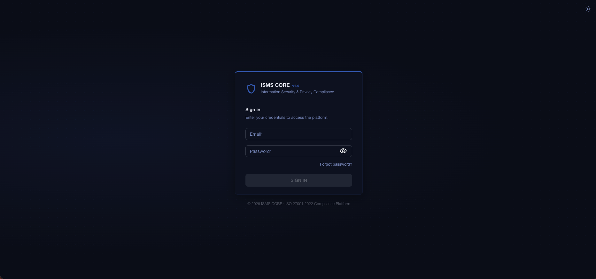

  

<h1 align="center">ISMS CORE Platform — User Manual</h1>

  <strong>Version 1.0 &nbsp;·&nbsp; For ISMS Managers, Auditors, and Control Owners</strong>

  
  

---

> This manual covers the **operational use** of ISMS CORE Platform — what you do in the application day to day. It is not a deployment or developer guide. For installation instructions, see [PLATFORM.md](../PLATFORM.md).

---

## Table of Contents

| # | Chapter | What it covers |
|---|---------|----------------|
| [01](01-introduction.md) | Introduction | What ISMS CORE is, the five products, how the platform fits in |
| [02](02-getting-started.md) | Getting Started | First login, dashboard overview, navigation, product switcher |
| [03](03-control-library.md) | Control Library | Browsing controls, reading scores, understanding coverage |
| [04](04-projects-workspace.md) | Projects Workspace | Creating projects, adding policies, editing documents, document variables, SCR checklists |
| [05](05-policies-documents.md) | Policies & Documents | Policy browser, filtering, full-text search, document types |
| [06](06-compliance-assessments.md) | Compliance Assessments | ISMS / Privacy / Cloud / AI checklists, per-item scoring |
| [07](07-assessment-frameworks.md) | Assessment Frameworks | All 23 frameworks: NIS2, DORA, NIST CSF 2.0, BSI, TISAX, COBIT and more |
| [08](08-gap-management.md) | Gap Management | Creating gaps, assigning owners, SLA tracking, remediation |
| [09](09-evidence-management.md) | Evidence Management | Manual evidence, connector evidence, expiry, verification |
| [10](10-connectors.md) | Automated Evidence Connectors | What connectors do, 44 supported systems, how to configure |
| [11](11-risk-register.md) | Risk Register | Risk scenarios, 5×5 heatmap, treatment workflow, risk acceptance |
| [12](12-bia.md) | Business Impact Analysis | Assets, RTO/RPO/MTPD, impact scoring, recovery testing |
| [13](13-tprm.md) | Third-Party Risk (TPRM) | Vendor register, DORA ICT fields, assessments, contract tracking |
| [14](14-ebios-rm.md) | EBIOS RM | 5-workshop methodology, feared events, attack paths, security measures |
| [15](15-cross-framework-mapping.md) | Cross-Framework Mapping | Coverage matrix, inferred mappings, crosswalk viewer |
| [16](16-threat-intelligence.md) | Threat Intelligence | MITRE ATT&CK, CISA KEV, EPSS, CVE Explorer, A.8.8 KEV audit |
| [17](17-isms-compass.md) | ISMS Compass | AI-powered gap analysis against the ISMS CORE Gold Standard |
| [18](18-qa-engine.md) | QA Engine | Existence checker, corpus validation, multilingual support |
| [19](19-kpi-dashboard.md) | KPI Dashboard | 9 named metrics, sparklines, audit readiness score |
| [20](20-organisations-users.md) | Organisations & Users | RBAC roles, MFA, org settings, multi-tenant administration |
| [21](21-reports-exports.md) | Reports & Exports | What exports are available per section and in what formats |

---

## Who This Manual Is For

| Persona | Primary chapters |
|---------|-----------------|
| **ISMS Manager** | All chapters — this is your day-to-day tool |
| **Auditor** | 03, 05, 06, 07, 09, 15, 18, 19, 21 |
| **Control Owner** | 03, 04, 08, 09, 11 |
| **CISO** | 02, 06, 07, 11, 14, 19 |

---

## A Note on the Five Products

ISMS CORE Platform brings together five product families under one roof. You will see a product switcher at the top of most pages. Each product maps to an ISO standard:

| Product | ISO Standard | What it covers |
|---------|-------------|----------------|
| **ISMS Framework** | ISO 27001:2022 | 54 Annex A control groups — the core |
| **ISMS Operational** | ISO 27001:2022 | Lightweight policies for SMEs |
| **Privacy** | ISO 27701:2025 | 21 privacy control groups (controller + processor) |
| **Cloud** | ISO 27018:2025 | 12 PII-in-cloud control groups |
| **AI** | ISO 42001:2023 + ISO 42005:2025 | 10 AI management system control groups |

---

<strong>Copyright &copy; 2025–2026 Gregory Griffin. All rights reserved.</strong>

